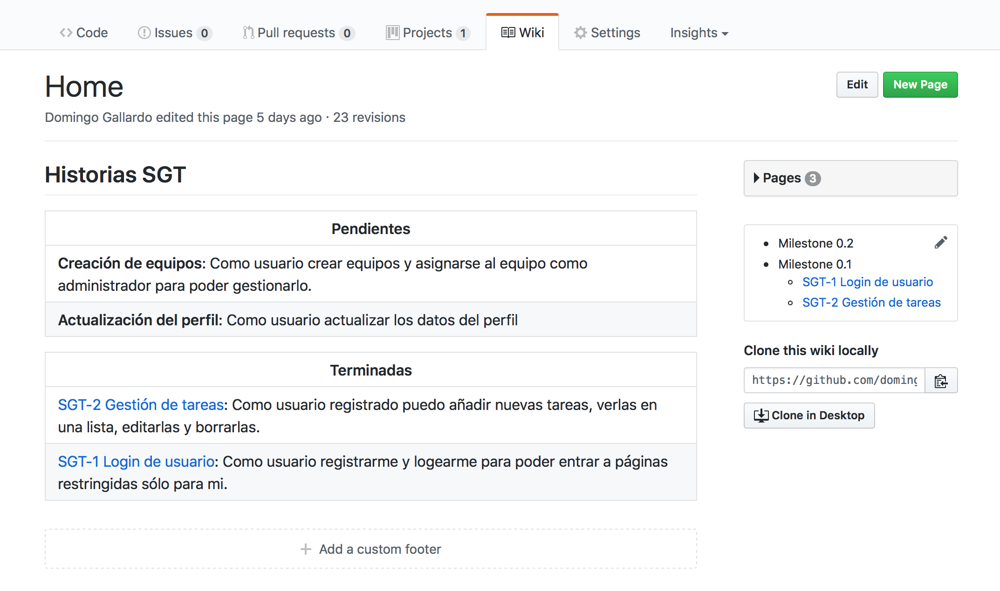
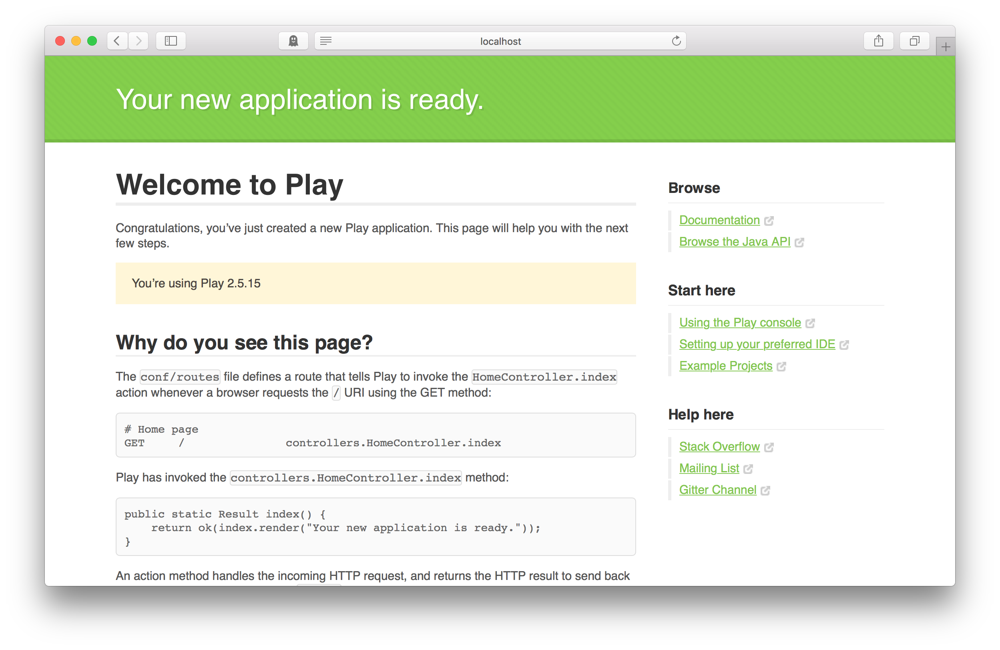

# Práctica 1: Primera aplicación Play Framework Java

-
  [1. Objetivos y conceptos previos](https://github.com/domingogallardo/apuntes-mads/blob/master/practicas/01-introduccion-play/introduccion-play.md#1-objetivos-y-conceptos-previos)
  -
    [1.1. Aplicación a desarrollar](https://github.com/domingogallardo/apuntes-mads/blob/master/practicas/01-introduccion-play/introduccion-play.md#11-aplicación-a-desarrollar)
  -
    [1.2. Arquitectura de la aplicación](https://github.com/domingogallardo/apuntes-mads/blob/master/practicas/01-introduccion-play/introduccion-play.md#12-arquitectura-de-la-aplicación)
  - [1.3. Tecnologías](https://github.com/domingogallardo/apuntes-mads/blob/master/practicas/01-introduccion-play/introduccion-play.md#13-tecnologías)
  - [1.4. Metodología de desarrollo](https://github.com/domingogallardo/apuntes-mads/blob/master/practicas/01-introduccion-play/introduccion-play.md#14-metodología-de-desarrollo)
- [2. Entorno para realizar la práctica](https://github.com/domingogallardo/apuntes-mads/blob/master/practicas/01-introduccion-play/introduccion-play.md#2-entorno-para-realizar-la-práctica)
- [3. Antes de empezar la práctica](https://github.com/domingogallardo/apuntes-mads/blob/master/practicas/01-introduccion-play/introduccion-play.md#3-antes-de-empezar-la-práctica)
- [4. Desarrollo de la práctica](https://github.com/domingogallardo/apuntes-mads/blob/master/practicas/01-introduccion-play/introduccion-play.md#4-desarrollo-de-la-práctica)
  - [4.1. Desarrollo de la primera historia de usuario](https://github.com/domingogallardo/apuntes-mads/blob/master/practicas/01-introduccion-play/introduccion-play.md#41-desarrollo-de-la-primera-historia-de-usuario)
  - [4.2. Algunas indicaciones sobre el desarrollo de la primera funcionalidad](https://github.com/domingogallardo/apuntes-mads/blob/master/practicas/01-introduccion-play/introduccion-play.md#42-algunas-indicaciones-sobre-el-desarrollo-de-la-primera-funcionalidad)
  - [4.3. Finalización de la primera historia de usuario y continuación con la siguiente](https://github.com/domingogallardo/apuntes-mads/blob/master/practicas/01-introduccion-play/introduccion-play.md#43-finalización-de-la-primera-historia-de-usuario-y-continuación-con-la- siguiente)
  - [4.4. Finalización de la segunda historia de usuario](https://github.com/domingogallardo/apuntes-mads/blob/master/practicas/01-introduccion-play/introduccion-play.md#44-finalización-de-la-segunda-historia-de-usuario)
  -
  [4.5. Realización de una tercera historia de usuario (opcional)](https://github.com/domingogallardo/apuntes-mads/blob/master/practicas/01-introduccion-play/introduccion-play.md#45-realización-de-una-tercera-historia-de-usuario-(opcional))
  - [4.6. Finalización de la versión 0.1](https://github.com/domingogallardo/apuntes-mads/blob/master/practicas/01-introduccion-play/introduccion-play.md#46-finalización-de-la-versión-01)
-
  [5. Entrega y evaluación](https://github.com/domingogallardo/apuntes-mads/blob/master/practicas/01-introduccion-play/introduccion-play.md#5-entrega-y-evaluación)


## 1. Objetivos y conceptos previos

En la primera práctica de la asignatura vamos a desarrollar paso a
paso una aplicación web con
_Play Framework_ en Java siguiendo una
estricta metodología de desarrollo usando Git y GitHub.

La práctica tendrá una duración de tres semanas. Será una práctica
guiada que deberás realizar de forma individual, siguiendo las
indicaciones que encontrarás en este documento. Una gran parte del
código, _issues_, PRs, etc. que vas a tener que realizar en la
práctica lo encontrarás en el repositorio
[domingogallardo/mads-todolist-guia](https://github.com/domingogallardo/mads-todolist-guia)
en GitHub.


### 1.1. Aplicación a desarrollar

Al terminar la práctica habrás desarrollado una aplicación para
gestionar listas de tareas pendientes de los usuarios de una
empresa. Se podrán registrar y logear usuarios y los usuarios
registrados podrán añadir, modificar y borrar tareas pendientes de
hacer.

A continuación puedes ver dos de sus pantallas.

<table>
<tr>
<td></td>
</tr>
<tr>
<td align="center"> Pantalla de login </td>
</table>


<table>
<tr>
<td></td>
</tr>
<tr>
<td align="center"> Pantalla con listado de tareas </td>
</table>

Iremos desarrollando las características de la aplicación a lo largo
de las prácticas. La aplicación tiene como nombre clave **SGT**
(_Sistema de Gestión de Tareas_). El nombre común de la aplicación es
**ToDoList**.

### 1.2. Arquitectura de la aplicación

La arquitectura de la aplicación será la típica de una aplicación web
que refuerza una separación entre presentación, controlador, servicio
y persistencia:

- La **capa de presentación** contendrá todas las _vistas_ (páginas
  HTML, CSS).
- La **capa de controlador** gestionará las peticiones HTTP para realizar
  acciones como crear una tarea, logearse, etc.
- La **capa de servicio** proporcionará los métodos Java que implementan
  los métodos de negocio de la aplicación.
- La **capa de persistencia** proporcionara las clases repositorio y
  las entidades persistentes que trabajan con la base de datos.


Vamos a utilizar un enfoque basado en **servicios REST** para definir
las rutas de las peticiones. Por ejemplo, para obtener todas las 
tareas del usuario con identificador `12` utilizaremos la petición:

```
GET /usuarios/12/tareas
```

Pero no implementaremos un servicio REST propiamente dicho, en el que
se devolvería la lista de tareas en formato JSON, sino que
devolveremos páginas HTML que constituyen la interfaz de la
aplicación. Tampoco seremos estrictos en el formato de las
peticiones. Por ejemplo, en lugar de hacer una petición PUT para
modificar un recurso (como deberíamos hacer si siguiéramos la
recomendación REST) vamos a realizar una petición POST
similar a la de su creación. 

Eso sí, el desarrollo se va a basar totalmente en las tecnologías HTTP
y HTML. Es conveniente repasarlas para tener claros los conceptos más
importantes, tanto de HTTP (tipo de petición, códigos de respuesta,
elementos de una petición, cookies, etc.) como de HTML (formularios, CSS, algo
de JavaScript, etc.).

- Un libro imprescindible sobre HTTP que debe estar en la biblioteca de
cualquier informático es el de O'Reilly:
[HTTP - The Definitive Guide](http://shop.oreilly.com/product/9781565925090.do). 
- Para repasar HTML, CSS y JavaScript son muy interesantes los
[tutoriales de Mozilla](https://developer.mozilla.org/en-US/docs/Web/Tutorials).


### 1.3. Tecnologías

Esta práctica servirá para tomar un primer contacto con todas las
tecnologías de desarrollo de aplicaciones web que vamos a utilizar en
la asignatura:

- _Play Framework_ como _framework_ de desarrollo de aplicaciones
  web. Nos permitirá realizar un diseño modular basado en la separación entre
  persistencia, servicio, controlador y presentación.
- JPA (Java Persistence API) como API para gestionar la persistencia
  de la aplicación usando un modelo de entidades persistentes ORM
  (_Object Relational Mapping_). JPA también es conocido como
  _Hibernate_, su implementación más popular.
- Para el diseño de la interfaz de usuario de la aplicación usaremos
  las plantillas de _Play Framework_, en las que se combina HTML y CSS
  con código Scala. Para hacer más atractivo el diseño de las páginas
  HTML vamos a usar el _framework_ CSS Bootstrap. 


#### Play Framework

[Play Framework](https://playframework.com) es un framework de
desarrollo rápido de aplicaciones web disponible en los lenguajes Java
y Scala. Vamos a utilizar la versión Java. El framework proporciona un
soporte de ejecución que tiene como base el servidor
[Netty](http://netty.io). Con este soporte es posible diseñar y poner
en marcha distintos tipos de aplicaciones: servicios HTTP, servicios
HTTP asíncronos basados en websockets, aplicaciones asíncronas basadas
en eventos, etc. Nosotros vamos a implementar una aplicación
tradicional que implementa un servicio HTTP. Vamos a utilizar la
[versión 2.5 en Java](https://www.playframework.com/documentation/2.5.x/JavaHome).

Para entender el funcionamiento de esta primera práctica es necesario
consultar la siguiente documentación del framework:

Sobre el funcionamiento de Play:

- [Using the Play console](https://playframework.com/documentation/2.5.x/PlayConsole)
- [Anatomy of a Play application](https://playframework.com/documentation/2.5.x/Anatomy)

Sobre peticiones y respuestas HTTP:

- [Actions, Controllers and Results](https://www.playframework.com/documentation/2.5.x/JavaActions)
- [HTTP routing](https://www.playframework.com/documentation/2.5.x/JavaRouting)
- [Session and Flash scope](https://www.playframework.com/documentation/2.5.x/JavaSessionFlash)

Sobre plantillas:

- [The template engine](https://www.playframework.com/documentation/2.5.x/JavaTemplates)
- [Common template use cases](https://www.playframework.com/documentation/2.5.x/JavaTemplateUseCases)

Sobre envío de datos de formularios:

- [Handling form submission](https://www.playframework.com/documentation/2.5.x/JavaForms)
- [Rendering an <input> element](https://www.playframework.com/documentation/2.5.x/JavaFormHelpers#Rendering-an-%3Cinput%3E-element)

Sobre el acceso a datos mediante JPA

- [Integrating with JPA](https://www.playframework.com/documentation/2.5.x/JavaJPA)

Sobre la inyección de dependencias

- [Dependency Injection](https://playframework.com/documentation/2.5.x/JavaDependencyInjection)

Sobre los tests en Play:

- [Testing your application](https://playframework.com/documentation/2.5.x/JavaTest)

#### Java Persistence API (JPA)

JPA es el API que utilizaremos para acceder a bases de datos y
gestionar entidades persistentes usando un modelo ORM (_Object
Relational Mapping_). Está integrado en Play, no es necesario instalar
ninguna librería adicional.

JPA también es conocido por el nombre de una de sus implementaciones
más populares, Hibernate. Es una tecnología muy usada y madura en el
mundo Java. Permite gestionar la persistencia directamente con el
modelo de objetos de la aplicación (se denominan _entidades_),
independizándola del modelo relacional basado en tablas y registros.

La implementación de JPA ObjectDB tiene unos tutoriales muy completos y accesibles:

- [JPA Quick tour](http://www.objectdb.com/java/jpa/getting/started)
- [Entity classes](http://www.objectdb.com/java/jpa/entity)
- [Using JPA](http://www.objectdb.com/java/jpa/persistence)
- [JPA Queries](http://www.objectdb.com/java/jpa/query)

No es necesario estudiar todos los tutoriales. El objetivo de las
prácticas no es aprender JPA, sino desarrollar de forma ágil una
aplicación. Vamos a utilizar lo más básico de JPA y en la mayoría de
las ocasiones se va a proporcionar el código necesario. Además, en
caso de duda, siempre podrás realizar preguntas sobre cómo implementar
una determinada funcionalidad en el foro de Moodle.

#### Bootstrap

Para hacer más atractivo el diseño de las páginas HTML vamos a usuar
el framework CSS
[Bootstrap](https://getbootstrap.com/docs/3.3/getting-started/). Es conveniente
tener a mano su documentación, en concreto la lista de componentes:

- [Bootstrap components](https://getbootstrap.com/docs/3.3/components/)


### 1.4. Metodología de desarrollo

En cuanto a la metodología de desarrollo, en esta primera práctica
repasaremos e introduciremos el uso de:

- JUnit y DBUnit para realizar continuamente pruebas unitarias que
  validen el desarrollo.
- [Git](https://git-scm.com) como sistema de control de versiones que nos permitirá
  registrar paso a paso los cambios realizados en el desarrollo,
  realizando e integrando ramas de _features_ en las que
  desarrollaremos pequeños incrementos que añadirán poco a poco las
  funcionalidades necesarias en la aplicación.
- [GitHub](https://github.com) como servicio en el que publicaremos los cambios e
  integraremos las ramas usando _pull requests_ (PRs). Utilizaremos un
  gran número de características de GitHub para realizar el
  seguimiento del desarrollo del proyecto: _issues_, _labels_,
  _milestones_, etc.

#### Git

Git es el sistema de control de versiones más utilizado en la
actualidad. Es muy flexible, distribuido, adaptable a múltiples flujos
de trabajo e ideal para una metodología de desarrollo en
equipo. Suponemos que ya tienes cierta experiencia con su uso. Puedes
usar los siguientes enlaces para repasar su funcionamiento.

- [Resumen de comandos de Git](comandos-git.md): Resumen de comandos
  principales para empezar a trabajar con Git.
- [Atlassian Git Tutorials](https://www.atlassian.com/git/tutorials/):
  Tutoriales muy orientados al uso de Git con gran cantidad de
  ejemplos. Es recomendable repasar los tutoriales básicos (_Getting
  Started_) y los tutoriales _Syncing_ y _Using Branches_ en el
  apartado _Collaborating_.
- [Libro de Scott Chacon](https://git-scm.com/book/en/v2): Completo
  manual con todos los detalles de todos los comandos de Git.

Cuando utilicemos git es muy importante realizar unos mensajes de
_commit_ claros. Un mensaje de _commit_ es la forma de comunicar a los
compañeros del equipo qué cambios se han introducido en la aplicación
y ponerlos en contexto (explicar por qué se han hecho, dar algún
detalle de implementación, etc.). El post
[How to Write a Git Commit Message](http://chris.beams.io/posts/git-commit/)
explica muy bien esto.


#### Flujo de trabajo

Desarrollaremos la aplicación de forma iterativa, utilizando
inicialmente un flujo de trabajo Git denominado _feature branch_
(consultar la
[guía de GitHub](https://guides.github.com/introduction/flow/)) en el
que cada característica nueva se implementa en una rama separada que
después se mezcla con la rama principal de desarrollo. Más adelante
veremos otros flujo de trabajo. Puedes ver una introducción a
distintos flujos de trabajo básicos con Git en este
[documento de Atlassian](https://www.atlassian.com/git/tutorials/comparing-workflows).

Para implementar este flujo de trabajo utilizaremos todos los
instrumentos de GitHub que facilitan la comunicación entre los
miembros del equipo:

- **Issues** (_incidencias_): GitHub permite abrir _issues_
  (incidencias o tareas), asignarlos a personas, realizar comentarios,
  asignar etiquetas y cerrarlos cuando la implementación ha
  terminado. Consultar
  [Mastering Issues](https://guides.github.com/features/issues/).

  Dividiremos las características a desarrollar en un conjunto de
  _issues_ que se implementarán en ramas y convertiremos en _pull
  requests_ que los cerrarán.
  
  

  
- **Pull Requests**: Un _pull request_ permite avisar al equipo de que
  se va a integrar una rama con un desarrollo nuevo en la rama
  principal. Cuando creamos un PR, GitHub crea una página en la que se
  pueden realizar comentarios, revisiones de código o definir
  políticas de aceptación del PR. Consultar
  [About pull requests](https://help.github.com/articles/about-pull-requests/).
  
  Implementaremos cada _issue_ en una rama separada de git y la
  integraremos en la rama `master` haciendo un _pull request_. Cuando
  se mezcle el PR en `master` el _issue_ se cerrará.
  
  

- **Tablero de proyecto**: Un tablero de proyecto nos ayudará a hacer
  un seguimiento de en qué estado se encuentra cada _issue_ o PR:
  cuáles han sido implementados, cuáles faltan por asignar,
  implementar, probar, etc. Vamos a utilizar la funcionalidad propia
  de GitHub llamada _project_. Consultar
  [project boards](https://help.github.com/articles/tracking-the-progress-of-your-work-with-project-boards/).

  
  
- **Wiki**: Por último, GitHub ofrece una wiki en que utilizaremos
  para documentar las nuevas _features_ o funcionalidades a
  implementar. Consultar [documenting your projects on GitHub](https://guides.github.com/features/wikis/).

  

  La documentación en la Wiki, en los _issues_, en los PRs y en el
  propio `README.md` del proyecto hay que escribirla en **Markdown**,
  un lenguaje de marcado muy popular y sencillo de dominar. Si no has
  trabajado todavía con él puedes leer estas
  [guías de GitHub](https://help.github.com/categories/writing-on-github/).

Existen herramientas y servicios más avanzados para gestionar todos
estos elementos del desarrollo. Por ejemplo [Jira](https://www.atlassian.com/software/jira),
[YouTrack](https://www.jetbrains.com/youtrack/),
[Confluence](https://www.atlassian.com/software/confluence) o incluso
[Trello](https://www.atlassian.com/software/trello). Pero lo que nos
ofrece GitHub es suficiente para lo que vamos a realizar en la
asignatura y tiene la ventaja de estar integrado en una misma
plataforma.


## 2. Entorno para realizar la práctica

En las máquinas de los laboratorios de la EPS están instaladas en
Linux las herramientas necesarias para su desarrollo. También las
puedes instalar en cualquier sistema operativo:
   
- [Atom](https://atom.io), editor de código. También puedes editar
  Markdow en él y previsualizar el documento resultante.
- [Git](https://git-scm.com/downloads)
- [Docker](https://www.docker.com/community-edition), para ejecutar la
   imagen (similar a una máquina virtual) que contiene Java y Play
   Framework.

[Docker](https://docs.docker.com) es una tecnología que ha tenido una
gran expansión en los últimos años. Permite construir máquinas
virtuales ligeras que utilizan el mismo sistema operativo de la
máquina host. Estas máquinas virtuales se denominan _contenedores_ y,
al compartir el propio sistema operativo en el que se están
ejecutando, su gestión (construcción, arranque, parada, etc.) es
muchísimo más rápida que las máquinas virtuales tradicionales.

Utilizaremos la imagen Docker
[domingogallardo/playframework](https://hub.docker.com/r/domingogallardo/playframework/),
que lanza el comando `sbt` necesario para compilar y ejecutar
aplicaciones Play.

Para lanzar esta imagen tenemos que ejecutar el siguiente comando,
estando en el directorio de la aplicación Play:

<pre><code>$ <b>cd /path/to/my/play/project</b>
$ <b>docker run --rm  -it -v "${PWD}:/code" -p 80:9000 domingogallardo/playframework</b>
</code></pre>

El comando `docker` buscará la imagen `domingogallardo/playframework`
en local y la descargará si no la encuentra. Después la ejecutará
montando el directorio actual en el directorio `/code` y mapeando el
puerto 80 de la máquina host en el puerto 9000 del contenedor. Por
último, lanzará de forma interactiva el comando `sbt` estando en el
directorio del proyecto Play. Como este directorio está montado en el
contenedor podrás editar y modificar los programas en la máquina host
y compilarlos y ejecutarlos desde el comando `sbt` en el contenedor.

Cada máquina docker se define con un fichero `Dockerfile`. Puedes
mirar el fichero `Dockerfile` de la imagen de la asignatura en
[este enlace](https://github.com/domingogallardo/playframework/blob/master/Dockerfile). Más
adelante estudiaremos más sobre Docker.


## 3. Antes de empezar la práctica

1. Lee el apartado 1 y visita todos los enlaces que se incluyen. El
   objetivo no es que estudies todos los enlaces, sino que te hagas
   una idea de qué puedes encontrar en cada uno, para poder después
   encontrar más información cuando la necesites.

2. Instala el software mencionado en el apartado 2 para configurar el
   entorno de desarrollo en el que vamos a realizar la práctica.

   Inicializa tu nombre de usuario y tu correo en Git. El nombre de
   usuario será el nombre que aparecerá en los _commits_. Pon tu nombre
   y apellido.
   
   <pre><code>$ <b>git config --global user.name "Pepe Perez"</b>
   $ <b>git config --global user.email pepe.perez@example.com</b>
   </code></pre>

3. Descarga la imagen de Docker para poder compilar y ejecutar los
   proyectos Play:

   <pre><code>$ <b>docker pull domingogallardo\playframework</b>
   $ <b>docker image ls</b>
   REPOSITORY                      TAG                 IMAGE ID            CREATED             SIZE
   domingogallardo/playframework   latest              95c1eb17ecb4        5 weeks ago         530MB
   </code></pre>

4. Crea una cuenta en GitHub. Puedes usar el nombre de usuario que
   quieras (o usar el que ya tienes), pero **escribe correctamente tu
   nombre y apellidos en el perfil** usando la opción _Settings >
   Profile_ y actualizando el campo _Name_.
   
5. Una vez logeado en GitHub, copia el enlace con una invitación que
   compartiremos en el foro de Moodle. Con esa invitación se creará
   automáticamente el repositorio `todolist-2017-<usuario>` en la
   organización [mads-ua](https://github.com/mads-ua). Es un
   repositorio privado al que tienes acceso tú y el
   profesor. Contiene el código inicial de un proyecto base Play (es
   una copia de
   [domingogallardo/play-proyecto-inicial-2017](https://github.com/domingogallardo/play-proyecto-inicial-2017)). 

   Es importante que tengas en cuenta que este repositorio no reside
   en tu cuenta, sino en la organización `mads-ua`. Puedes acceder a
   él desde el _dashboard_ de GitHub que aparece cuando te logeas:
   
   

   También el profesor te invitará a formar parte de la organización y
   recibirás un mensaje de correo electrónico en el que deberás
   aceptar esta invitación. También se puede aceptar la invitación
   accediendo a <https://github.com/mads-ua>.
   
4. Descarga el proyecto y comprueba que se compila y ejecuta
   correctamente con la imagen de Docker:
   
   <pre><code>$ <b>git clone https://github.com/mads-ua/todolist-2017-<usuario>.git</b>
   $ <b>cd todolist-2017-usuario</b>
   $ <b>docker run --rm  -it -v "${PWD}:/code" -p 80:9000 domingogallardo/playframework</b>
   [info] Loading project definition from /code/project
   [info] Updating {file:/code/project/}code-build...
   [info] Resolving org.fusesource.jansi#jansi;1.4 ...
   [info] Done updating.
   [info] Set current project to play-java (in build file:/code/)
   [play-java] $ <b>test</b>
   ...
   [info] Passed: Total 3, Failed 0, Errors 0, Passed 3
   [success] Total time: 58 s, completed Aug 24, 2017 10:43:59 AM   
   [play-java] $ <b>run</b>
   </code></pre>
   
   Comprueba que la aplicación está funcionando en <http://localhost>
   en la máquina host.
   
   
   
   Para salir del comando `run` de `sbt` debemos hacer `CTRL+d`. Podemos
   lanzar cualquier otro comando de sbt (consultar
   [Using the SBT console](https://playframework.com/documentation/2.5.x/PlayConsole).  
   
   Para salir del contenedor haremos `CTRL+c`.

6. Por último, realiza un primer _commit_ en la rama `master` en el que
   cambies el nombre del proyecto y la versión actual.

   - Utiliza _Atom_. Escoge la opción _File > Add Project Folder..._
     para añadir al menú lateral izquierdo el directorio donde se
     encuentra el proyecto y seleccionar fácilmente los ficheros
     necesarios.
   
   - Cambia en `build.sbt` el nombre del proyecto a
     `mads-todolist-2017` y la versión a `0.1-SNAPSHOT`. El sufijo
     `SNAPSHOT` indica _en desarrollo_. Al final de la práctica 1
     terminaremos esta versión `0.1` y se eliminará el sufijo.

   - Realiza el commit en `master` y publícalo en el repositorio:
   
   <pre><code>$ <b>git add build.sbt</b>
   $ <b>git commit -m "Cambiado el nombre del proyecto y la versión"</b>
   $ <b>git push</b>
   </code></pre>

   Consulta en GitHub que el _commit_ se ha subido.
   
   De esta forma habrás comprobado que tienes permiso de escritura en
   el repositorio y que ya puedes comenzar a realizar la práctica.
   
   Si ahora vuelves a lanzar la máquina Docker en el proyecto, verás
   que ha cambiado el nombre del proyecto:
   
   <pre><code>$ <b>docker run --rm  -it -v "${PWD}:/code" -p 80:9000 domingogallardo/playframework</b>
   ...
   $ [info] Set current project to mads-todolist-2017 (in build file:/code/)
   [mads-todolist-2017] $ 
   </code></pre>

## 4. Desarrollo de la práctica

En esta primera práctica vamos a desarrollar las siguientes dos
historias de usuario o _features_:

- SGT-1: Login de usuarios
- SGT-2: Gestión de tareas

Puedes encontrar todos los detalles en la wiki del proyecto
[mads-todolist-guia](https://github.com/domingogallardo/mads-todolist-guia).

La práctica va a consistir en una recreación en tu proyecto de todos
los elementos del proyecto guía: wiki, _issues_ y PRs (con sus _commits_
en los que se desarrolla paso a paso cada _issue_) o tablero del
proyecto. Hasta llegar a la aplicación final.

Vamos a ello paso a paso.

### 4.1. Desarrollo de la primera historia de usuario

Veamos paso a paso el desarrollo de la primera historia de usuario en
la que crearemos el login y el registro de usuarios.

#### 1. Creación de la wiki

- Crea en la página _Home_ de la wiki un listado de las historias de
  usuario pendientes. Copia las cuatro historias de usuario que
  aparecen en la guía. Crea el menú lateral de la wiki con un ítem
  `Milestone 0.1` vacío.

  Esta wiki será nuestro _backlog_ del proyecto (usando la terminología de Scrum).
  

#### 2. Creación del tablero del proyecto

- Crea en el repositorio el _proyecto_ con el nombre `SGT` y la
  descripción: `Sistema de Gestión de Tareas (TodoList)`. Añade en él
  las columnas: _Pendientes_, _En marcha_, _En PR_, _Terminado_. En
  las dos primeras columnas se incluirán _issues_ abiertos y en las
  dos últimas _pull requests_.


#### 3. Descripción de la primera historias de usuario

- Añade en la wiki una página con la descripción de la primera
  historia de usuario (_SGT-1 Login_), enlázala desde la página
  principal y añádela en el menú lateral, dentro del _Milestone 0.1_.
  
- Copia en la página la misma descripción que en la guía
  ([enlace](https://github.com/domingogallardo/mads-todolist-guia/wiki/SGT-1-Login-de-usuario)),
  quitando los enlaces a los _issues_ y dejándolos cómo ítems
  pendientes de terminar.
  
  Esta descripción de la historia es una descripción desde el punto de
  vista del _product owner_, pero también contiene los enlaces a
  los _issues_ que se van desarrollando para implementarla. 

- Al crear un _issue_ añadiremos en la página de la historia de
  usuario el enlace. Cuando cerremos el _issue_ (porque se ha mezclado
  el PR en `master`) lo marcaremos como terminado en la página
  añadiendo un _tick_.

#### 4. Creación de los primeros _issues_

- Busca en el repositorio guía los _issues_ de la primera historia de
  usuario y créalos en tu repositorio.

- Busca en el repositorio guía los _issues_ de la primera historia de
  usuario y créalos en tu repositorio. Escribe la descripción que hay
  en la guía y en la descripción añade un enlace a la historia de
  usuario. Crea también el _label_ correspondiente a
  la historia de usuario y asígnaselo a cada _issue_. Añade a los
  _issues_ el _Milestone 0.1_.

- Una vez terminada la creación de cada _issue_ añádelo en la columna
  _Pendientes_ del tablero.
  
#### 5. Desarrollo del primer _issue_

- Escoge el primer _issue_ a desarrollar
  [Crear proyecto, modelo JPA Usuario y UsuarioRepository](https://github.com/domingogallardo/mads-todolist-guia/issues/1). Asígnatelo
  a ti mismo y muévelo a la columna _En marcha_.
  
- Crea la rama en la que vas a desarrollar el _issue_ y súbela a
  GitHub:
  
  <pre><code>$ <b>git checkout -b modelo-usuario</b>
  <b>$ git push -u origin modelo-usuario</b>
  </code></pre>
  
- Añade un comentario al _issue_ con un enlace a la rama que acabas de
  subir.
  
#### 6. Desarrollo del primer _commit_

Para completar el _issue_ tendremos que desarrollar el código que lo
implementa. Recuerda que hay que hacerlo en pequeños _commits_. Cada
_commit_ va a consistir en un pequeño desarrollo que avanza hacia la
terminación del _issue_. En cada _commit_ el código debe compilar
correctamente y, si es posible, debe incluir algún test para comprobar
también su correcto funcionamiento. 

En algunos _commits_ se añadirán características funcionales (vistas
HTML o rutas HTTP) que no tendrán tests asociados. Pero **deberás
realizar pruebas manuales antes de realizar el _commit_** para
comprobar que funcionan correctamente. Play tiene formas de realizar
pruebas funcionales automatizadas de estos elementos (puedes consultar
la página sobre tests que indicamos en el apartado 1). Pero no las
vamos a utilizar, por simplificar el desarrollo de la práctica.

Vamos a reproducir en nuestro proyecto exactamente los mismos _commits_
que se han realizado en el proyecto guía.

La lista de _commits_ que se desarrollan en un _issue_ se pueden
encontrar fácilmente en el PR que cierra el _issue_.

- Busca en el hilo del _issue_ el PR que lo cierra. En este caso es el
  [PR #5](https://github.com/domingogallardo/mads-todolist-guia/pull/5)
  (GitHub va asignando números correlativos a los _issues_ y PR que
  vamos creando; este PR tiene el #5 porque antes se han creado 4
  _issues_).

  Verás ordenados de arriba (primero) a abajo (último) los _commits_ que
  contiene el PR.
  
  

- Vemos que el primer _commit_ es _**Creado modelo de usuario
  inicial**_. Tienes que realizar el código de ese _commit_ en tu
  proyecto. Puedes consultar el código desarrollado en un _commit_
  pinchando en él. Verás los cambios que el _commit_ ha introducido. En
  este caso:
  
  ```diff
  +++ app/models/Usuario.java
  @@ -0,0 +1,13 @@
  +package models;
  +
  +public class Usuario {
  +   public String login;
  +   public String email;
  +   public String password;
  +   public String nombre;
  +
  +   public Usuario(String login, String email) {
  +      this.login = login;
  +      this.email = email;
  +   }
  +}
  +++ test/models/UsuarioTest.java
  @@ -0,0 +1,19 @@
  +import org.junit.*;
  +import static org.junit.Assert.*;
  +
  +import models.Usuario;
  +
  +public class UsuarioTest {
  +
  +   @Test
  +   public void testCrearUsuario() {
  +      // Los parámetros del constructor son los campos obligatorios
  +      Usuario usuario = new Usuario("pepitoperez", "pepitoperez@gmail.com");
  +      usuario.nombre = "Pepito Pérez Fernández";
  +      usuario.password = "123456789";
  +      assertEquals("pepitoperez", usuario.login);
  +      assertEquals("pepitoperez@gmail.com", usuario.email);
  +      assertEquals("Pepito Pérez Fernández", usuario.nombre);
  +      assertEquals("123456789", usuario.password);
  +   }
  +}
  ```

  En el _commit_ se han creado los ficheros `app/models/Usuario.java` y
  `test/models/UsuarioTest.java`. 
  
- Escribe en tu proyecto el mismo código que hay en el _commit_, creando
  y modificando los ficheros necesarios.

  **No te limites a copiar y pegar: piensa en lo que hace el código e
  intenta entenderlo**. Si no lo entiendes repasa la documentación que
  hemos indicado en el apartado 1.

- Compila el código y comprueba que no contiene errores. El comando
  `clean` sirve para eliminar todos los ficheros compilados y forzar
  una compilación completa de nuevo. Lo usamos para que lo conozcas,
  pero no es necesario usarlo generalmente, sólo si hay algún error
  que se arregla recompilando todo el proyecto.

  <pre><code>[mads-todolist-2017] $ <b>clean</b>
  [success] Total time: 1 s, completed Aug 26, 2017 5:03:47 PM
  [mads-todolist-2017] $ <b>compile</b>
  [info] Updating {file:/code/}root...
  [info] Resolving jline#jline;2.14.3 ...
  [info] Done updating.
  [info] Compiling 7 Scala sources and 11 Java sources to /code/target/scala-2.11/classes...
  [success] Total time: 26 s, completed Aug 26, 2017 5:04:15 PM
  </code></pre>

- Si el código contiene un test ejecútalo con el comando `test` desde
  el _shell_ de `sbt`:
  
  <pre><code>[mads-todolist-2017] $ <b>test</b>
  [info] Done updating.
  ...
  [info] Test UsuarioTest.testCrearUsuario started
  [info] Test run finished: 0 failed, 0 ignored, 1 total, 0.007s
  [info] Passed: Total 4, Failed 0, Errors 0, Passed 4
  [success] Total time: 63 s, completed Aug 26, 2017 4:08:32 PM
  [mads-todolist-2017] $ 
  </code></pre>
  
  También puedes ejecutar los tests de un único fichero de test con el
  comando `testOnly`:
  
  <pre><code>[mads-todolist-2017] $ <b>testOnly UsuarioTest</b>
  [info] Test run started
  [info] Test UsuarioTest.testCrearUsuario started
  [info] Test run finished: 0 failed, 0 ignored, 1 total, 0.05s
  [info] Passed: Total 1, Failed 0, Errors 0, Passed 1
  [success] Total time: 8 s, completed Aug 26, 2017 4:10:28 PM
  [mads-todolist-2017] $ 
  </pre></code>
  
- Una vez que has compilado y probado correctamente el código, realiza
  el _commit_ en tu proyecto (escribe la misma descripción que en la
  guía) y súbelo a GitHub:
  
  <pre><code>$ <b>git add *</b>
  $ <b>git status</b>
  On branch master
  Changes to be committed:
    (use "git reset HEAD <file>..." to unstage)

    	new file:   app/models/Usuario.java
    	new file:   test/models/UsuarioTest.java
  $ <b>git commit -m "Creado modelo de usuario inicial"</b>
  $ <b>git push</b>
  </code></pre>

- Una vez realizado el _commit_ es el momento de probar cambios en el
  código para entender mejor lo que está haciendo. Puedes introducir
  cambios, realizar pruebas y descartarlos (volviendo al estado del
  _commit_) con los siguientes comandos git:
  
  <pre><code>$ <b>git reset --hard HEAD</b>
  $ <b>git clean -fd</b> # necesario sólo si has creado algún fichero
  </code></pre>

#### 7. Desarrollo de los siguientes _commits_

- Añade el código de los siguientes 5 _commits_. Escribe el código de
  cada uno, pruébalo y entiéndelo, realiza el commit y súbelo a GitHub.

#### 8. Creación del _pull request_

- Cuando hayamos terminado todos los _commits_, creamos un _pull
  request_ en GitHub para realizar la integración de la rama con
  `master`. Se puede crear el PR de varias formas, desde la página
  principal del proyecto en GitHub o desde la pantalla de ramas.
  
  
  
- Escribe como nombre del PR el mismo nombre que el _issue_ y en la
  descripción escribe número del _issue_ precedido de alguna de las
  [palabras claves](https://help.github.com/articles/closing-issues-using-keywords/)
  que permite cerrar el _issue_ al realizar el PR (`close`, `fix` o
  `solve`):
   
  ```
  Closes #1
  ```

  De esta forma asociamos el PR con el _issue_ y cuando mezclemos el
  PR también cerraremos el _issue_. En el _issue_ aparecerá
  automáticamente la relación con el PR.

  
  
- En el PR añade los mismos atributos que el _issue_: asignado,
  etiqueta con la historia de usuario y milestone. Elimina la etiqueta
  y el milestone del _issue_, porque ya van a estar en el PR asociado.

- En el tablero del proyecto, elimina el _issue_ de la columna _En
  marcha_ y añade el PR en la columna _En PR_.
  
#### 9. Integración de la rama con el _issue_ en `master`, aceptando el PR.
 
- Antes de realizar la integración en remoto habría que comprobar que
  funciona en un entorno local de test que funciona
  correctamente. Podría haber habido algún cambio en `master` (la
  integración de algunos otros _issues_ que se hayan realizado en
  paralelo) que entra en conflicto con nuestro _issue_. Ahora no es el
  caso, porque no se ha desarrollado ningún otro _issue_ en
  paralelo. Lo dejamos para una futura práctica.
       
- La integración se puede hacer usando los comandos de git para hacer
  un _merge_ en local y después hacer un _push_ de `master` o se puede
  hacer desde la web de GitHub. Para simplificar vamos a utilizar esta
  segunda opción. Más adelante probaremos la otra.
       
  Confirmamos el `merge` del PR en GitHub y comprobamos que se ha
  cerrado el _issue_. 
  
  
  Eliminamos la rama remota, usando la opción que
  proporciona GitHub. Y movemos la tarjeta del PR a la columna
  `Terminados`.
       
- Descargamos la integración remota en `master` al repositorio local y
  borramos la rama local del _issue_:
       
  <pre><code>$ <b>git checkout master</b>
  $ <b>git remote show origin</b> # para comprobar estado de repositorio remoto
  $ <b>git pull</b>
  $ <b>git branch -d crear-modelo-usuario</b>
  $ <b>git remote prune origin</b> # para borrar la referencia a la rama remota
  </code></pre>

#### 10. Realización del resto de _issues_ de la funcionalidad

- Realizamos el mismo proceso anterior para los demás _issues_ de la
  funcionalidad:
  
  - Crear acciones, vistas y métodos de servicio para el registro de un nuevo usuario
  - Login de usuarios registrados
  - Autenticación

- Como ya se ha comentado antes, el objetivo es que utilices los
  _issues_ y los _commits_ para aprender una metodología básica de
  desarrollo y para aprender Play. La mejor forma de aprender un
  _framework_ es probando código escrito en él. Además, al hacerlo
  _commit_ a _commit_ la cantidad de código a analizar cada vez es
  pequeña y con una unidad lógica.

- En muchos _commits_ no existirá un test (en aquellos en los que se
  está creando la interfaz de usuario), pero tendrás que probar la
  nueva interfaz (ruta o vista) añadida. Por ejemplo, el _commit_
  [Ejemplo de controller y vista](https://github.com/domingogallardo/mads-todolist-guia/pull/6/commits/5c12909a8ac0fe2b4ef5499942665358efa6e763)
  en el segundo _issue_, en el que se crea un sencillo ejemplo de
  controlador y vista:
  
  ```diff
  +++ app/controllers/UsuarioController.java
  @@ -0,0 +1,12 @@
  +package controllers;
  +
  +import play.mvc.*;
  +
  +import views.html.*;
  +
  +public class UsuarioController extends Controller {
  +
  +   public Result saludo(String mensaje) {
  +      return ok(saludo.render("El mensaje que he recibido es: " + mensaje));
  +   }
  +}
  +++ app/views/saludo.scala.html
  @@ -0,0 +1,5 @@
  +@(mensaje: String)
  +
  +@main("Saludo") {
  +    <h1><em>@mensaje</em></h1>
  +}
  +++ conf/routes
  @@ -9,5 +9,11 @@ GET     /count                      controllers.CountController.count
   # An example controller showing how to write asynchronous code
   GET     /message                    controllers.AsyncController.message
  +
  +# Nuestra aplicación
  +
  +GET     /saludo/:msg            controllers.UsuarioController.saludo(msg: String)
  +
  +
   # Map static resources from the /public folder to the /assets URL path
   GET     /assets/*file               controllers.Assets.versioned(path="/public", file: Asset)
  ```  
  
  
  Para comprobar el funcionamiento de este commit tendremos que lanzar
  la aplicación y probar que funciona la ruta que se acaba de añadir:

  <pre><code>$ <b>docker run -it --rm -v ${PWD}:/code -p 80:9000 domingogallardo/playframework</b>
  [mads-todolist-2017] $ <b>run</b>
  </code></pre>

  Para probar la ruta

   ```
   GET     /saludo/:msg  controllers.UsuarioController.saludo(msg: String)`
   ```

   accederemos a la URL <http://localhost/saludo/Hola>. Play obtiene
   la cadena `Hola` de la petición y la pasa como parámetro al
   controlador `UsuarioController.saludo`.

### 4.2. Algunas indicaciones sobre el desarrollo de la primera funcionalidad

#### _Commit_ "Versión inicial registro usuario"

Este es otro ejemplo de un _commit_ que no tiene test, pero que se
debe probar realizando una prueba manual.

- Para probarlo abrimos la URL <http://localhost/registro> y probamos a
  introducir los datos de un nuevo usuario.

- Puede ser que sea necesario hacer un `clean` antes del `run`.

- Los datos del usuario añadido se guardan en la base de datos `H2` en
  memoria. Esa base de datos mantendrá los datos mientras que el
  comando `sbt` esté en marcha. Por ejemplo, puedes parar el `run` con
  `CTRL+d`, ejecutar un `test` para probar algún cambio y volver a
  ejecutar `run` y los datos seguirán estando en la BD.


#### _Commit_ "Añadido Bootstrap"

En el _commit_ `Añadido Bootstrap` debes descargar e incluir en la
aplicación el framework CSS _Bootstrap_ y _JQuery_:

- Descarga la versión 3.3.7 (bootstrap-3.3.7-dist.zip) de Bootstrap de
  <https://github.com/twbs/bootstrap/releases> y mueve los ficheros al
  directorio `public/bootstrap` de la aplicación Play.

- Descarga la versión 2.2.4 de jquery
  <https://github.com/jquery/jquery/releases> y copia el fichero
  `dist/jquery.min.js` en el directorio `public/javascripts` de la
  aplicación Play.

#### Error java.lang.OutOfMemoryError

En algún momento, al ejecutar la aplicación play, puede que aparezca un error
como el siguiente:

```
Caused by: java.lang.OutOfMemoryError: Metaspace
```

Es debido a que la imagen Docker se ha quedado sin memoria. Apágala
haciendo `CTRL+C` y vuélvela a lanzar con el comando `docker run`.


### 4.3. Finalización de la primera historia de usuario y continuación con la siguiente

- Una vez que hemos terminado la primera historia de usuario (todos
  sus _issues_) debemos modificar la página principal de la wiki (el
  _backlog_) quitando la historia de la lista de pendientes y
  pasándola a una lista de historias terminadas.

  

- Elaboramos la descripción de la siguiente historia de usuario,
  creando una página para ella en la que añadimos los detalles, sus
  condiciones de satisfacción necesarias para que la demos por
  terminada y un listado tentativo de _issues_ a realizar. En este
  caso el listado de _issues_ será el definitivo (estamos copiando la
  guía) pero en el desarrollo real de una historia de usuario es
  normal que esa lista de _issues_ o tareas sea sólo una propuesta inicial
  que irá cambiando.

- Realizamos el desarrollo de la segunda historia de usuario siguiendo
  la misma metodología que en la primera historia. Creamos los
  _issues_ en GitHub, ahora con una nueva etiqueta con el nombre de la
  segunda funcionalidad. Para cada _issue_ hacemos el mismo proceso
  que hemos seguido anteriormente:
  
  1. Nos asignamos el _issue_.
  2. Creamos una rama en la que se desarrolle el _issue_, la subimos
     a GitHub. Añadimos el enlace a la rama en la descripción del _issue_.
  3. Movemos el _issue_  a `En marcha` en el tablero. Añadimos un
     enlace al _issue_ en la descripción de la historia de usuario.
  4. Desarrollamos los _commits_, los probamos y los subimos a GitHub.
  5. Cuando el _issue_ está terminado creamos un _pull request_
     asociado. Lo añadimos en el tablero y quitamos el _issue_.
  6. Mezclamos el PR, eliminamos la rama en remoto y en local y
     descargamos la mezcla en `master`. Al cerrar el PR se cerrará
     también el _issue_. Movemos el PR a `Terminado` en el tablero.


### 4.4. Finalización de la segunda historia de usuario

Al terminar la segunda historia de usuario el proyecto debe funcionar
perfectamente y el repositorio GitHub debe estar tal y como está el
repositorio guía.

- Todos los _issues_ y PR deben estar cerrados. 
- Todos los PR deben estar en la columna de `Terminado`. Debe haber 10 PRs.
- En el milestone 0.1 deben aparecer los PRs realizados.
- Los 23 tests del proyecto deben pasar correctamente.
- Las historias implementadas deben funcionar correctamente.

### 4.5. Realización de una tercera historia de usuario (opcional)

Realiza una tercera historia de usuario sencilla propuesta por ti
siguiendo la metodología anterior. 

No debería ser muy larga, dos o tres _issues_ como máximo. Por
ejemplo, la de actualización del perfil o una ampliación de los datos
de las tareas, añadiendo una descripción. O alguna otra que se te
ocurra.

No escojas la historia `Creación de equipos` porque la desarrollaremos
en la práctica 2.


### 4.6. Finalización de la versión 0.1

Una vez terminada la práctica, creamos un _release_.

- Cuando hayas integrado el último PR, haz un commit en
  `master` en el que modifiques la versión del proyecto en el fichero
  `build.sbt`:

  ```
  version := "0.1"
  ```

  Publica directamente el commit en `master` (sin hacer PR).
  
- Añade en GitHub el _tag_ con el número de versión:
  - Pincha enlace `releases` en la página principal
  - Añade una nueva versión: `v0.1` y pulsa el botón para publicar el
    _release_. Esto creará la etiqueta y la versión en GitHub.

- Por último, cambia la versión actual (en `build.sbt` en `master`) a
  `0.2-SNAPSHOT` haciendo y publicando un nuevo commit. De esta forma,
  indicamos que ahora en `master` se está desarrollando la versión
  0.2.


## 5. Entrega y evaluación

- La práctica tiene una duración de 3 semanas y debe estar terminada
  el martes 3 de octubre.
- La parte obligatoria puntúa sobre 7 y la opcional sobre 3 puntos.
- La calificación de la práctica tiene un peso de un 8% en la nota
  final de la asignatura. 
- Para realizar la entrega se debe subir a Moodle un ZIP que contenga
  todo el proyecto, incluyendo la historia Git. Para ello comprime tu
  directorio local del proyecto **después de haber hecho un
  `clean`**. Debes dejar también en Moodle la URL del repositorio en
  GitHub.

Para la evaluación se tendrá en cuenta:

- Desarrollo continuo (los _commits_ deben realizarse a lo largo de
  las 3 semanas y no dejar todo para la última semana).
- Correcto desarrollo de la metodología.
- Corrección del código en las características adicionales desarrolladas.


