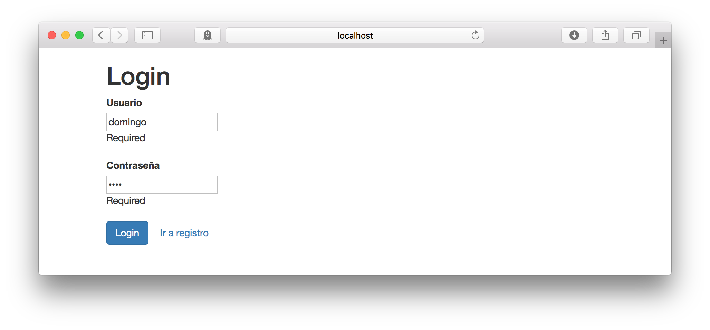
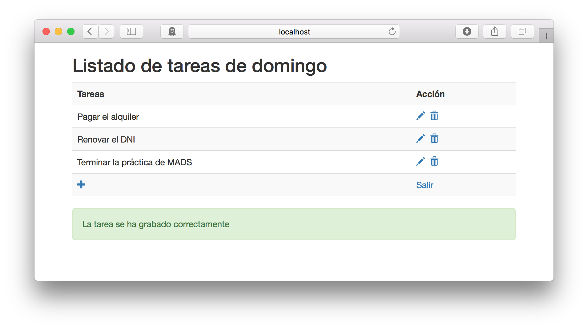
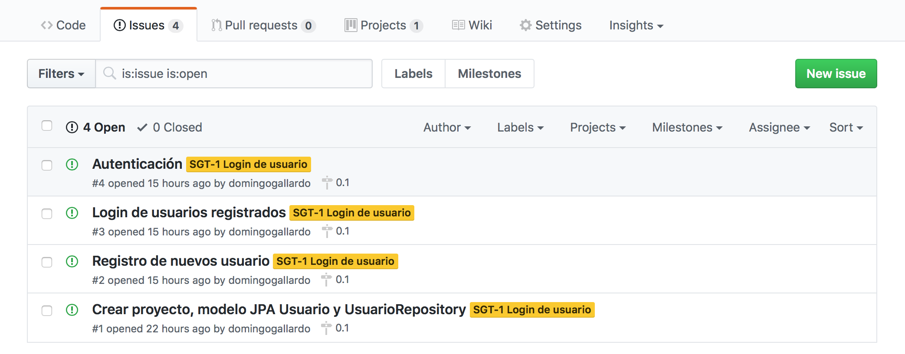
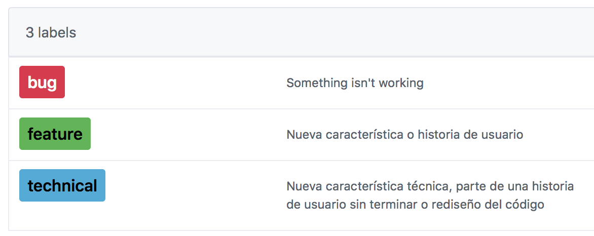
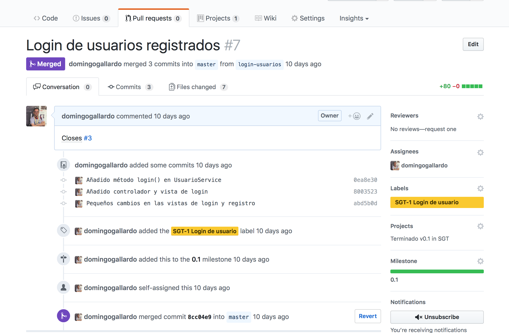
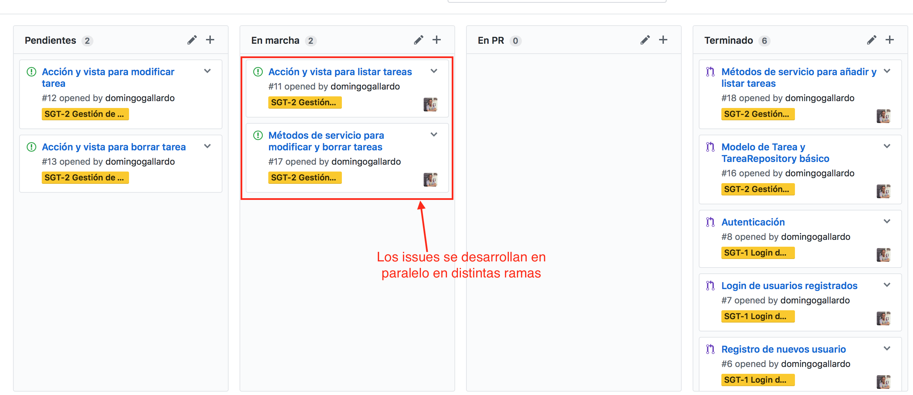
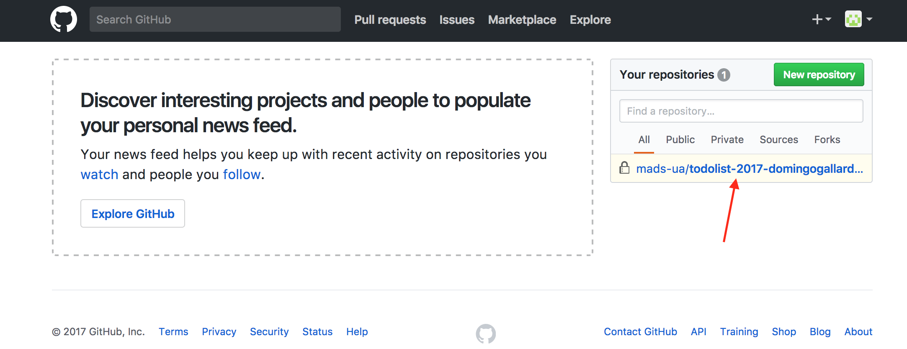
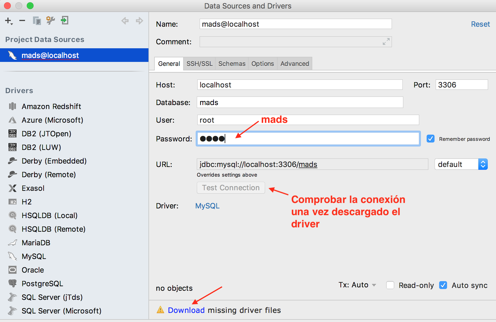

# Práctica 1: Primera aplicación Play Framework Java

- [1. Objetivos](#1-objetivos)
  - [1.1. Aplicación a desarrollar](#11-aplicación-a-desarrollar)
  - [1.2. Metodología de desarrollo](#12-metodología-de-desarrollo)
- [2. Entorno para realizar la práctica](#2-entorno-para-realizar-la-práctica)
- [3. Antes de empezar la práctica](#3-antes-de-empezar-la-práctica)
- [4. Desarrollo de la práctica](#4-desarrollo-de-la-práctica)

<!-- 
- [4.1. Desarrollo de la primera historia de usuario](#41-desarrollo-de-la-primera-historia-de-usuario)
  - [4.2. Algunas indicaciones sobre el desarrollo de la primera funcionalidad](#42-algunas-indicaciones-sobre-el-desarrollo-de-la-primera-funcionalidad)
  - [4.3. Finalización de la primera historia de usuario y continuación con la siguiente](#43-finalización-de-la-primera-historia-de-usuario-y-continuación-con-la-siguiente)
  - [4.4. Finalización de la segunda historia de usuario](#44-finalización-de-la-segunda-historia-de-usuario)
  - [4.5. Realización de una tercera historia de usuario (opcional)](#45-realización-de-una-tercera-historia-de-usuario-opcional)
  - [4.6. Finalización de la versión 0.1](#46-finalización-de-la-versión-01)
- [5. Entrega y evaluación](#5-entrega-y-evaluación)
-->

## 1. Objetivos

En la primera práctica de la asignatura vamos a tomar contacto con el
_framework_ de desarrollo de aplicaciones web en Java _Play
Framework_, trabajando sobre la aplicación inicial
[domingogallardo/mads-todolist-inicial](https://github.com/domingogallardo/mads-todolist-inicial).

La práctica tendrá una duración de tres semanas. Deberás realizarla de
forma individual, siguiendo las indicaciones que encontrarás en este
documento. Tendrás que desarrollar código y trabajar en GitHub
desarrollando _issues_, _pull requests_, _releases_ y actualizando la
wiki del proyecto.

Antes de comenzar la práctica debes leer la [introducción a Play
Framework para las prácticas de MADS](./intro-play-teoria.md).

### 1.1. Aplicación inicial

La aplicación inicial es una aplicación para
gestionar listas de tareas pendientes de los empleados de una
empresa. Se pueden registrar y logear usuarios y los usuarios
registrados pueden añadir, modificar y borrar tareas pendientes de
hacer.

También tiene unas funcionalidades iniciales básicas relacionadas con
la gestión de equipos de usuarios, de las que sólo se ha implementado
el esqueleto, sin apenas interfaz de usuario.

A continuación puedes ver dos de las pantallas de la aplicación.

<table>
<tr>
<td></td>
</tr>
<tr>
<td align="center"> Pantalla de login </td>
</table>


<table>
<tr>
<td></td>
</tr>
<tr>
<td align="center"> Pantalla con listado de tareas </td>
</table>

Iremos desarrollando características adicionales de la aplicación a lo
largo de las prácticas. El nombre de la aplicación es **ToDo List**.


### 1.2. Metodología de desarrollo

En cuanto a la metodología de desarrollo, en esta primera práctica
repasaremos e introduciremos el uso de:

- [Git](https://git-scm.com) como sistema de control de versiones que nos permitirá
  registrar paso a paso los cambios realizados en el desarrollo,
  realizando e integrando ramas de _features_ en las que
  desarrollaremos pequeños incrementos que añadirán poco a poco las
  funcionalidades necesarias en la aplicación.
- [GitHub](https://github.com) como servicio en el que publicaremos los cambios e
  integraremos las ramas usando _pull requests_ (PRs). Utilizaremos un
  gran número de características de GitHub para realizar el
  seguimiento del desarrollo del proyecto: _issues_, _labels_,
  _milestones_, etc.
- JUnit y DBUnit para realizar continuamente pruebas unitarias que
  validen el desarrollo.

#### Git

Git es el sistema de control de versiones más utilizado en la
actualidad. Es muy flexible, distribuido, adaptable a múltiples flujos
de trabajo e ideal para una metodología de desarrollo en
equipo. Suponemos que ya tienes cierta experiencia con su uso. Puedes
usar los siguientes enlaces para repasar su funcionamiento.

- [Resumen de comandos de Git](comandos-git.md): Resumen de comandos
  principales para empezar a trabajar con Git.
- [Atlassian Git Tutorials](https://www.atlassian.com/git/tutorials/):
  Tutoriales muy orientados al uso de Git con gran cantidad de
  ejemplos. Es recomendable repasar los tutoriales básicos (_Getting
  Started_) y los tutoriales _Syncing_ y _Using Branches_ en el
  apartado _Collaborating_.
- [Libro de Scott Chacon](https://git-scm.com/book/en/v2): Completo
  manual con todos los detalles de todos los comandos de Git.

Cuando utilicemos git es muy importante realizar unos mensajes de
_commit_ claros. Un mensaje de _commit_ es la forma de comunicar a los
compañeros del equipo qué cambios se han introducido en la aplicación
y ponerlos en contexto (explicar por qué se han hecho, dar algún
detalle de implementación, etc.). El post
[How to Write a Git Commit Message](http://chris.beams.io/posts/git-commit/)
explica muy bien esto.


#### Flujo de trabajo

Desarrollaremos la aplicación de forma iterativa, utilizando
inicialmente un flujo de trabajo Git denominado _feature branch_
(consultar la
[guía de GitHub](https://guides.github.com/introduction/flow/)) en el
que cada característica nueva se implementa en una rama separada que
después se mezcla con la rama principal de desarrollo. Más adelante
veremos otros flujos de trabajo. Puedes ver una introducción a
distintos flujos de trabajo básicos con Git en este
[documento de Atlassian](https://www.atlassian.com/git/tutorials/comparing-workflows).

Para implementar este flujo de trabajo utilizaremos todos los
instrumentos de GitHub que facilitan la comunicación entre los
miembros del equipo:

- **Issues** (_incidencias_): GitHub permite abrir _issues_
  (incidencias o tareas), asignarlos a personas, realizar comentarios,
  asignar etiquetas y cerrarlos cuando la implementación ha
  terminado. Consultar
  [Mastering Issues](https://guides.github.com/features/issues/).

  

  Definiremos distintos tipos de _issues_ en función de su
  propósito: _feature_, _bug_ y _technical_.
  
  
  
  Cada _issue_ se desarrollará en una rama de Git y se integrará en la
  rama _master_ haciendo un _pull request_.


- **Pull Requests**: Un _pull request_ permite avisar al equipo de que
  se va a integrar en la rama principal una rama con un desarrollo
  nuevo. Cuando creamos un PR, GitHub crea una página en la que se
  pueden realizar comentarios, revisiones de código o definir
  políticas de aceptación del PR. Consultar
  [About pull requests](https://help.github.com/articles/about-pull-requests/).
  
  Implementaremos cada _issue_ en una rama separada de git y la
  integraremos en la rama `master` haciendo un _pull request_. Cuando
  se mezcle el PR en `master` el _issue_ se cerrará.
  
  

  Más adelante añadiremos otra rama de largo recorrido `releases` para
  incluir en ella las _releases_ del proyecto.

- **Milestones** y **Releases**: Etiquetaremos cada _issue_ con el
  _milestone_ en el que queremos que se lance. Para identificar el
  _milestone_ usaremos el [versionado semántico](https://semver.org):
  MAJOR.MINOR.PATCH. 
  
  
  
  Usaremos la funcionalidad de GitHub _Releases_ para etiquetar los
  commits en los que queramos marcar una versión nueva del
  proyecto. Podemos añadir información sobre las novedades de la versión
  (normalmente serán enlaces a los _issues_ y _pull requests_ de ese
  _milestone_).
  
  

- **Tablero de proyecto**: Un tablero de proyecto nos ayudará a hacer
  un seguimiento de en qué estado se encuentra cada _issue_ o PR:
  cuáles han sido implementados, cuáles faltan por asignar,
  implementar, probar, etc. Vamos a utilizar la funcionalidad propia
  de GitHub llamada _Projects_. Consultar
  [project boards](https://help.github.com/articles/tracking-the-progress-of-your-work-with-project-boards/).

  
  
  
- **Wiki**: Por último, GitHub ofrece una wiki en que utilizaremos
  para documentar las nuevas _features_ (también llamadas
  funcionalidades o historias de usuario) a implementar. Consultar
  [documenting your projects on GitHub](https://guides.github.com/features/wikis/).

  La documentación en la Wiki, en los _issues_, en los PRs y en el
  propio `README.md` del proyecto hay que escribirla en **Markdown**,
  un lenguaje de marcado muy popular y sencillo de dominar. Si no has
  trabajado todavía con él puedes leer estas
  [guías de GitHub](https://help.github.com/categories/writing-on-github/).

Existen herramientas y servicios más avanzados para gestionar todos
estos elementos del desarrollo. Por ejemplo [Jira](https://www.atlassian.com/software/jira),
[YouTrack](https://www.jetbrains.com/youtrack/),
[Confluence](https://www.atlassian.com/software/confluence) o incluso
[Trello](https://www.atlassian.com/software/trello). Pero lo que nos
ofrece GitHub es suficiente para lo que vamos a realizar en la
asignatura y tiene la ventaja de estar integrado en una misma
plataforma.


## 2. Entorno para realizar la práctica

En las máquinas de los laboratorios de la EPS están instaladas en
Linux las herramientas necesarias para su desarrollo. También las
puedes instalar en cualquier sistema operativo:
   
- [IntelliJ IDEA](https://www.jetbrains.com/idea/) IDE para trabajar en el desarrollo del
  proyecto. Es de pago, pero puedes conseguir una licencia educativa
  en
  [https://www.jetbrains.com/student/](https://www.jetbrains.com/student/). Para
  poder compilar el proyecto Play en IntelliJ y disfrutar de
  todas las ventajas del IDE (autocompletar código o ejecutar los tests
  directamente desde el IDE) es necesario disponer del JDK Java 8.
- [Git](https://git-scm.com/downloads)
- [Docker](https://www.docker.com/community-edition), para ejecutar la
   imagen (similar a una máquina virtual) que contiene Java y Play
   Framework.

[Docker](https://docs.docker.com) es una tecnología que ha tenido una
gran expansión en los últimos años. Permite construir máquinas
virtuales ligeras que utilizan el mismo sistema operativo de la
máquina host. Estas máquinas virtuales se denominan _contenedores_ y,
al compartir el propio sistema operativo en el que se están
ejecutando, su gestión (construcción, arranque, parada, etc.) es
muchísimo más rápida que las máquinas virtuales tradicionales.

Utilizaremos la imagen Docker
[domingogallardo/playframework](https://hub.docker.com/r/domingogallardo/playframework/),
que lanza el comando `sbt` necesario para compilar y ejecutar
aplicaciones Play.

Para lanzar esta imagen tenemos que ejecutar el siguiente comando,
estando en el directorio de la aplicación Play:

```text
$ cd /path/to/my/play/project
$ docker run --rm  -it -v "${PWD}:/code" -p 9000:9000 domingogallardo/playframework
```

El comando `docker run` buscará la imagen
`domingogallardo/playframework` en local y la descargará si no la
encuentra. Después la ejecutará montando el directorio actual en el
directorio `/code` y mapeando el puerto 80 de la máquina host en el
puerto 9000 del contenedor. La imagen está configurada para lanzar el
comando `sbt` sobre el directorio `code`. Como en este directorio está
montado el directorio de la máquina _host_ en donde tienes el
proyecto, podrás editar y modificar los ficheros en la propia máquina
_host_ y compilarlos y ejecutarlos desde el comando `sbt` en el
contenedor.

Cada máquina docker se define con un fichero `Dockerfile`. Puedes
mirar el fichero `Dockerfile` de la imagen de la asignatura en
[este enlace](https://github.com/domingogallardo/playframework/blob/master/Dockerfile). Más
adelante en la asignatura estudiaremos más sobre Docker.

## 3. Antes de empezar la práctica

1. Descarga e instala el software indicado en el apartado anterior.

2. Inicializa tu nombre de usuario y tu correo en Git. El nombre de
   usuario será el nombre que aparecerá en los _commits_. Pon tu nombre
   y apellido.
   
   ```text
   $ git config --global user.name "Pepe Perez"
   $ git config --global user.email pepe.perez@example.com<
   ```

3. Descarga la imagen de Docker para poder compilar y ejecutar los
   proyectos Play:

   ```text
   $ docker pull domingogallardo/playframework
   $ docker image ls
   REPOSITORY                      TAG                 IMAGE ID            CREATED             SIZE
   domingogallardo/playframework   latest              95c1eb17ecb4        5 weeks ago         530MB
   ```

4. Crea una cuenta en GitHub. Puedes usar el nombre de usuario que
   quieras (o usar el que ya tienes), pero **escribe correctamente tu
   nombre y apellidos en el perfil** usando la opción _Settings >
   Profile_ y actualizando el campo _Name_.
   
5. Una vez logeado en GitHub, copia el enlace con una invitación que
   compartiremos en el foro de Moodle. Con esa invitación se creará
   automáticamente el repositorio `todolist-2018-<usuario>` en la
   organización [mads-ua-18](https://github.com/mads-ua-18). Es un
   repositorio privado al que tienes acceso tú y el
   profesor. Contiene el código inicial de un proyecto base Play (es
   una copia del repositorio
   [domingogallardo/mads-todolist-inicial](https://github.com/domingogallardo/mads-todolist-inicial))
   en la que se han comprimido todos los commits en uno.

   Es importante que tengas en cuenta que el repositorio recién creado
   no reside en tu cuenta, sino en la organización `mads-ua`. Puedes
   acceder a él desde el _dashboard_ de GitHub que aparece cuando te
   logeas:
   
   

   También el profesor te invitará a formar parte de la organización y
   recibirás un mensaje de correo electrónico en el que deberás
   aceptar esta invitación. También se puede aceptar la invitación
   accediendo a <https://github.com/mads-ua-18>.
   
6. Descarga el proyecto y comprueba que se compila y ejecuta
   correctamente con la imagen de Docker y usando la base de datos de
   memoria (muy útil para pruebas y lanzar los tests).
   
   ```text 
   $ git clone https://github.com/mads-ua/todolist-2018-usuario.git
   $ cd todolist-2018-usuario
   $ docker run --rm  -it -v "${PWD}:/code" -p 9000:9000 domingogallardo/playframework
   [info] Loading project definition from /code/project
   [info] Updating {file:/code/project/}code-build...
   [info] Resolving org.fusesource.jansi#jansi;1.4 ...
   [info] Done updating.
   [info] Set current project to play-java (in build file:/code/)
   [mads-todolist-inicial] $ test
   ...
   [info] Passed: Total 35, Failed 0, Errors 0, Passed 35
   [success] Total time: 35 s, completed Sep 4, 2018 9:34:04 AM
   [mads-todolist-inicial] $ run
   ```
   
   Comprueba que la aplicación está funcionando en <http://localhost:9000>
   en la máquina host.
   
   
   
   Para salir del comando `run` de `sbt` debemos hacer `CTRL+d`. Podemos
   lanzar cualquier otro comando de sbt (consultar
   [Using the SBT console](https://playframework.com/documentation/2.5.x/PlayConsole).  
   
   Para salir del contenedor podemos escribir el comando `exit` o hacer `CTRL+c`.

7. Prueba que la aplicación funciona correctamente trabajando con la
   base de datos MySQL (el funcionamiento real de la aplicación y para
   hacer pruebas de integración).

   Lanza MySQL con Docker:
   
   ```text
   $ docker run -d --rm -p 3316:3306 --name play-mysql -e MYSQL_ROOT_PASSWORD=mads -e MYSQL_DATABASE=mads mysql:5
   ```

   **Importante** En los laboratorios de la EPS está instalada la
   imagen 5.7.18 de MySQL. Hay que definir explícitamente esa versión
   en el comando docker, escribiendo `mysql:5.7.18`.

   Lanza la aplicación con docker, definiendo ahora en variables de
   entorno la URL, el usuario y la contraseña con la que debe
   conectarse la aplicación a la base de datos. Usamos la opción
   `link` de docker para definir el nombre lógico del contenedor al
   que debe conectarse la aplicación.

   ```text
   $ docker run --link play-mysql --rm -it -p 9000:9000 -e \
   DB_URL="jdbc:mysql://play-mysql:3306/mads" -e DB_USER_NAME="root" -e \
   DB_USER_PASSWD="mads" -v "${PWD}:/code" domingogallardo/playframework
   ```

   Y desde la consola sbt modificamos la preferencia `config.file`
   para que la aplicación utilice la configuración definida en el
   fichero `conf/develop-mysql.conf`.

   ```text
   [mads-todolist-inicial] $ set javaOptions += "-Dconfig.file=conf/develop-mysql.conf"
   [mads-todolist-inicial] $ run
   ```

   Prueba que la aplicación funciona correctamente. Puedes comprobar
   las tablas y los datos almacenados en la base de datos conectándote
   a la base de datos en el puerto 3316 desde cualquier cliente
   MySQL. Por ejemplo, la consola MySQL de IntelliJ:
   
   

   Es posible examinar el esquema de la base de datos:

   

   Y examinar tablas en concreto:

   

8. Con todo lo hecho hasta ahora ya hemos comprobado que la aplicación
   se compila correctamente y se ejecuta sin problema en las dos
   configuraciones más importantes con las que trabajaremos: base de
   datos en memoria y base de datos MySQL.

   Para el desarrollo de la práctica que viene a continuación es
   fundamental que entiendas el funcionamiento de Play Framework. Lo
   explicaremos rápidamente en la clase de teoría usando el documento
   [introducción a Play Framework para las prácticas de
   MADS](./intro-play-teoria.md). Pero es imprescindible que hagas tú
   un esfuerzo descargando, probando y modificando las dos
   aplicaciones: `domingogallardo/play-proyecto-inicial` y
   `domingogallardo/mads-todolist-inicial` (es la aplicación que se ha
   copiado en tu repositorio).
   
   Puedes trabajar en estos proyectos sin miedo de estropearlos. Es
   más, cuanto más los estropees mejor, porque es la forma de
   aprender. No deberás entregar nada de estos proyectos.

## 4. Desarrollo de la práctica

En esta primera práctica vamos a desarrollar las siguientes dos
historias de usuario o _features_:

1. Página _Acerca de_
2. Barra de menú
3. Página listado de equipos
4. Página descripción de equipo

La práctica va a consistir en la realización en tu proyecto de todos
los elementos necesarios para implementar estas _features_ : wiki,
_issues_, _pull requests_ (con sus _commits_ en los que se desarrolla paso a paso
cada _issue_) y tablero del proyecto. 

Haremos paso a paso la primera característica, creando la primera
versión 1.0.0 de la aplicación. Las siguientes características las
deberás desarrollar tu mismo y entregar la versión 1.1.0.

### 4.1. Versión 1.0.0 ###

La versión 1.0.0 será la versión inicial de la
aplicación. Desarrollaremos en esta versión la primera característica:
**Página _Acerca de_**.

#### 4.1.1. Wiki ####

Utilizaremos la Wiki del proyecto GitHub para documentar las
características a desarrollar en la aplicación. Deberá haber una
página para cada característica. La página principal de la Wiki será
el _backlog_ del proyecto y deberá tener los enlaces a todas las
características desarrolladas y pendientes de desarrollar.

Añade la página principal, en la que organizarás el listado de
_features_ desarrolladas en proyecto. Un posible ejemplo de
organización es el siguiente:


Añade una página con la descripción de la característica **Página
_Acerca de_**:


#### 4.1.2. Tablero del proyecto ####

Configura el tablero del proyecto, poniendo como nombre `ToDoList` y
seleccionando como plantilla `Automated kanban`. Elimina las tarjetas
en la columna `To do` y añade la columna `In pull request` entre `In
progress` y `Done`.


En las columnas deberán aparecer los _issues_ y _pull requests_ del
proyecto. GitHub permite automatizar el movimiento de las tarjetas de
una columna a otra. A continuación mostramos la configuración que
usaremos:


Deberemos mover manualmente las tarjetas en algún caso, porque GitHub
no podrá detectar las condiciones. En resumen, las condiciones de las
fichas que habrá en cada columna son las siguientes:

- Columna `To do`: Nuevos _issues_ añadidos al proyecto. GitHub lo
  detecta automáticamente.
- Columna `In progress`: _Issues_ que se han comenzado a implementar
  (se ha creado una rama su desarrollo). Manual.
- Columna `In pull request`: _Pull request_ creados. GitHub lo detecta
  automáticamente. Cuando se incluya el _pull request_ de un _issue_
  deberemos eliminar el _issue_ del tablero (ya que está su _pull
  request_ asociado).
- Columna `Done`: _Pull requests_ cerrados. GitHub lo detecta automáticamente.

#### 4.1.3. Issues ####

Añade el primer _issue_, correspondiente a la _feature_ a desarrollar
**Página _Acerca de_**. Añade las etiquetas que inicialmente vamos a
usar (ver la imagen) y el _milestone_ 1.0.0.


Añade el _issue_ al tablero (desde la página del _issue_) y
automáticamente se añadirá en la columna `To do`.


#### 4.1.4. Desarrollo ####

Para desarrollar el _issue_ abriremos una rama en Git, realizaremos
commits sobre ella hasta estar terminado y después crearemos un _pull
request_ en GitHub para realizar la integración con la rama `master`.

Mueve en el tablero la tarjeta con el _issue_ a la columna `In
progress`.


Empezamos el desarrollo importando el proyecto en IntelliJ y creando
dos pestañas en el panel `Terminal`: una para lanzar el proyecto con
Docker y trabajar con Sbt y la otra para trabajar con Git.


Creamos la rama en la que desarrollaremos la _feature_ y la subimos a
GitHub (en el panel `Git`):

```text
$ git checkout -b acerca-de
Switched to a new branch 'acerca-de'
$ git push -u origin acerca-de
Username for 'https://github.com': domingogallardo2
Password for 'https://domingogallardo2@github.com': 
Total 0 (delta 0), reused 0 (delta 0)
To https://github.com/mads-ua-18/todolist-2018-domingogallardo2.git
 * [new branch]      acerca-de -> acerca-de
Branch 'acerca-de' set up to track remote branch 'acerca-de' from 'origin'.
```

##### Primer commit #####

Hacemos un primer commit.

Cambia en `build.sbt` el nombre del proyecto a `mads-todolist-<tu-nombre>` y
la versión a `1.0.0-SNAPSHOT`. El sufijo `SNAPSHOT` indica _en
desarrollo_. Cuando hagamos el _release_ de la versión 1.0.0
eliminaremos el sufijo.

Realiza el commit y súbelo a GitHub:
   
```text
$ git add build.sbt
$ git status
On branch acerca-de
Your branch is up to date with 'origin/acerca-de'.

Changes to be committed:
  (use "git reset HEAD <file>..." to unstage)

        modified:   build.sbt

$ git commit -m "Cambiado el nombre del proyecto y empezamos versión 1.0.0"
[acerca-de f6180cc] Cambiado el nombre del proyecto y empezamos versión 1.0.0
 1 file changed, 2 insertions(+), 2 deletions(-)
$ git push
Enumerating objects: 5, done.
Counting objects: 100% (5/5), done.
Delta compression using up to 4 threads.
Compressing objects: 100% (3/3), done.
Writing objects: 100% (3/3), 367 bytes | 367.00 KiB/s, done.
Total 3 (delta 2), reused 0 (delta 0)
remote: Resolving deltas: 100% (2/2), completed with 2 local objects.
To https://github.com/mads-ua-18/todolist-2018-domingogallardo2.git
   6767016..a332017  acerca-de -> acerca-de
```

Consulta en GitHub que el _commit_ se ha subido en GitHub:


   
De esta forma habrás comprobado que tienes permiso de escritura en
el repositorio y que ya puedes comenzar a realizar la práctica.
   
Si ahora vuelves a lanzar la máquina Docker en el proyecto, verás
que ha cambiado el nombre del proyecto (en el panel `Sbt`):
   
```text
$ docker run --rm  -it -v "${PWD}:/code" -p 9000:9000 domingogallardo/playframework
[info] Loading project definition from /code/project
[info] Set current project to mads-todolist-dgallardo (in build file:/code/)
[mads-todolist-dgallardo] $ 
```

##### Segundo commit #####

En el segundo commit incluiremos el desarrollo de los elementos
necesarios para la página _acerca de_:

- Ruta
- Acción en controller
- Vista

Realiza los siguientes cambios.

**Fichero `conf/routes`**:

```diff
GET     /equipos/addUsuario         controllers.EquipoController.formularioAddUsuarioEquipo()
POST    /equipos/addUsuario         controllers.EquipoController.addUsuarioEquipo()

+ GET     /about                      controllers.HomeController.about()

# Map static resources from the /public folder to the /assets URL path
GET     /assets/*file               controllers.Assets.versioned(path="/public", file: Asset)
```

**Fichero `app/controllers/HomeController.java`**:


```diff
    public Result index() {
        return ok(index.render("Your new application is ready."));
    }

+   public Result about() {
+       return ok(about.render());
+   }
}
```


**Fichero `app/views/about.scala.html`**:

```diff
+ @main("Acerca de") {
+      <h1>ToDo List</h1>
+      <ul>
+          <li>Desarrollada por Domingo Gallardo</li>
+          <li>Versión 1.0.0 (en desarrollo)</li>
+          <li>Fecha de release: pendiente de release</li>
+      </ul>
+ }
```

Prueba la página accediendo a la url <http://localhost:9000/about>.


Por último, confirma el commit en la rama y súbelo a GitHub. En el
panel `Git`:

```text
$ git add .
$ git status

On branch acerca-de
Your branch is up to date with 'origin/acerca-de'.

Changes to be committed:
  (use "git reset HEAD <file>..." to unstage)

        modified:   app/controllers/HomeController.java
        new file:   app/views/about.scala.html
        modified:   conf/routes
$ git commit -m "Añadida ruta, vista y controller 'about'"
[acerca-de 2831312] Añadida ruta, vista y controller 'about'
 3 files changed, 14 insertions(+)
 create mode 100644 app/views/about.scala.html
$ git push
```


##### Tercer commit #####

En el tercer commit pondremos un enlace a la página _acerca de_ en la página de
login de la aplicación.

Realiza el siguiente cambio:

**Fichero `app/views/formLogin.scala.html`**:

```diff
            <a class="btn btn-link" href="@routes.UsuarioController.registroUsuario()">Ir a registro</a>
        </p>
+       <p><a class="btn btn-link" href="@routes.HomeController.about()">Acerca de</a></p>
     }
```

Prueba que funciona correctamente, haz el commit y súbelo a GitHub:

```text
$ git commit -am "Añadido enlace a página 'about' en página 'login'"[acerca-de 672c28f] Añadido enlace a página 'about' en página 'login'
1 file changed, 1 insertion(+)
$ git push
```


#### 4.1.5. Pull request ####

Una vez terminada la implementación de la _feature_ en la rama,
creamos un _pull request_ en GitHub para indicar que estamos listos
para mezclar la rama con la _feature_ con la rama principal de
desarrollo (_master_).

Más adelante añadiremos al _pull request_ una comprobación automática
de las pruebas y una revisión de código por parte de compañeros del
equipo. Por ahora haremos nosotros ambas tareas.

Vamos a verlo paso a paso.

Empezamos por mezclar la rama de forma local con `master`, antes de
hacer el _pull request_ en GitHub, para probar que no se ha roto nada
(todos los tests deben seguir pasando) y que los tests que hemos
añadido también funcionan correctamente (en este caso no hemos añadido
ninguno).

En el panel `Git`:

```text
$ git checkout master
Switched to branch 'master'
Your branch is up to date with 'origin/master'.
$ git merge acerca-de 
Updating 6767016..672c28f
Fast-forward
 app/controllers/HomeController.java | 4 ++++
 app/views/about.scala.html          | 8 ++++++++
 app/views/formLogin.scala.html      | 1 +
 build.sbt                           | 4 ++--
 conf/routes                         | 2 ++
 5 files changed, 17 insertions(+), 2 deletions(-)
 create mode 100644 app/views/about.scala.html
```

En el panel `Sbt`:

```text
[mads-todolist-dgallardo] $ test
...
[info] Passed: Total 35, Failed 0, Errors 0, Passed 35
[success] Total time: 71 s, completed Sep 6, 2018 10:04:55 AM
[mads-todolist-dgallardo] $ 
```

Una vez que hemos comprobado que todo funciona bien, deshacemos el
merge que acabamos de realizar en la rama `master`, ya que
actualizaremos después la rama con el resultado del _pull request_ en
GitHub:

```text
$ git reset --hard origin/master
HEAD is now at 6767016 Commit inicial
$ git checkout acerca-de 
Switched to branch 'acerca-de'
Your branch is up to date with 'origin/acerca-de'.
```

Ya podemos crear el _pull request_ en GitHub. 

Accede a la rama y comprueba que están todos los cambios pulsando
`Compare`. Pulsa después el botón `New pull request` para crear el
_pull request_.


Introduce el nombre del _pull request_, el comentario, el _milestone_
y la etiqueta. Copia los datos del _issue_, y en el comentario escribe

```text
Closes #1
```

De esta forma, cuando se cierre el _pull request_ se cerrará
automáticamente el _issue_. El número `#1` lo convierte GitHub en un
enlace al _issue_ correspondiente. De esta forma podemos examinar el
_issue_ resuelto por el PR.


Añade también el PR al tablero del proyecto. Se colocará
automáticamente la columna `In pull request`. Entra en el proyecto y
archiva la tarjeta con el _issue_, ya que la actividad de desarrollar
la _feature_ queda representada por el _pull request_.

En este momento se debería hacer una revisión del código del pull
request y comprobar de forma automática que la integración con
_master_ no introduce errores en los tests. Lo haremos en siguientes
prácticas.

GitHub informa de que no hay conflictos con la rama `master` y que es
posible hacer el merge. Pulsa el botón de `Merge` y confírmalo. Borra
la rama en GitHub, pulsando el botón correspondiente.


Por último, este _merge_ lo has hecho en GitHub, debes integrarlo en tu
repositorio local. En la pestaña de Git:

```text
$ git fetch
remote: Counting objects: 1, done.
remote: Total 1 (delta 0), reused 0 (delta 0), pack-reused 0
Unpacking objects: 100% (1/1), done.
From https://github.com/mads-ua-18/todolist-2018-domingogallardo2
   6767016..9527ae2  master     -> origin/master
$ git pull
Updating 6767016..9527ae2
Fast-forward
 app/controllers/HomeController.java | 4 ++++
 app/views/about.scala.html          | 8 ++++++++
 app/views/formLogin.scala.html      | 1 +
 build.sbt                           | 4 ++--
 conf/routes                         | 2 ++
 5 files changed, 17 insertions(+), 2 deletions(-)
 create mode 100644 app/views/about.scala.html
$ git branch -d acerca-de 
Deleted branch acerca-de (was 672c28f).
$ git remote prune origin
Pruning origin
URL: https://github.com/mads-ua-18/todolist-2018-domingogallardo2.git
 * [pruned] origin/acerca-de
$ git log --oneline --graph --all
*   9527ae2 (HEAD -> master, origin/master, origin/HEAD) Merge pull request #2 from mads-ua-18/acerca-de
|\  
| * 672c28f Añadido enlace a página 'about' en página 'login'
| * 3fdfb83 Añadida ruta, vista y controller 'about'
| * a332017 Cambiado el nombre del proyecto y empezamos versión 1.0.0
|/  
* 6767016 Commit inicial
```

Comprobamos también la historia de _commits_ en GitHub. Aparecerá el
_commit_ de _merge_ introducido por el _pull request_.


De esta forma hemos cerrado el PR e integrado su código en la rama
principal de desarrollo. En el tablero de proyecto debe haber cambiado
la tarjeta con el PR a la columna `Done`.


#### 4.1.6. Versión 1.0.0 ####

Por último creamos el _release_ 1.0.0. Haremos un commit directamente
sobre la rama `master` (más adelante explicaremos una forma más
elaborada de hacer un _release_, cuando expliquemos el flujo de
trabajo de GitFlow).


Crea un commit con la confirmación del número de versión y fecha en
los ficheros `build.sbt` y `about.scala.html`

**Fichero `build.sbt`**:

```diff
 name := """mads-todolist-dgallardo"""
 
-version := "1.0.0-SNAPSHOT"
+version := "1.0.0"
 
 lazy val root = (project in file(".")).enablePlugins(PlayJava)
 
```

**Fichero `app/views/about.scala.html`**:

```diff
    <h1>ToDo List</h1>
        <ul>
            <li>Desarrollada por Domingo Gallardo</li>
-           <li>Versión 1.0.0 (en desarrollo)</li>
-           <li>Fecha de release: pendiente de release</li>
+           <li>Versión 1.0.0</li>
+           <li>Fecha de release: 6/9/2018</li>
        </ul>
}
```

Añadimos el commit y lo subimos a GitHub

```text
$ git add .
$ git commit -m "Cambio de versión a 1.0.0"
[master 61d4ac8] Cambio de versión a 1.0.0
 2 files changed, 3 insertions(+), 3 deletions(-)
$ git push
```

Y, por último, creamos la versión 1.0.0 en GitHub pulsando en el
enlace `release` en la página principal (pestaña `Code`).


Un _release_ en GitHub se guarda como una una etiqueta Git, junto con
información asociada. Se suelen indicar las nuevas _features_ añadidas
en el _release_ mediante enlaces a los _pull requests_
añadidos. También añadiremos enlaces a la página de la Wiki en la que
se describe la característica.


El resultado será:


<!--


### 4.1. Desarrollo de la primera historia de usuario

Veamos paso a paso el desarrollo de la primera historia de usuario en
la que crearemos el login y el registro de usuarios.

#### 1. Creación de la wiki

- Crea en la página _Home_ de la wiki un listado de las historias de
  usuario pendientes. Copia las cuatro historias de usuario que
  aparecen en la guía. Crea el menú lateral de la wiki con un ítem
  `Milestone 0.1` vacío.

  Esta wiki será nuestro _backlog_ del proyecto (usando la terminología de Scrum).
  

#### 2. Creación del tablero del proyecto

- Crea en el repositorio el _proyecto_ con el nombre `SGT` y la
  descripción: `Sistema de Gestión de Tareas (TodoList)`. Añade en él
  las columnas: _Pendientes_, _En marcha_, _En PR_, _Terminado_. En
  las dos primeras columnas se incluirán _issues_ abiertos y en las
  dos últimas _pull requests_.


#### 3. Descripción de la primera historias de usuario

- Añade en la wiki una página con la descripción de la primera
  historia de usuario (_SGT-1 Login_), enlázala desde la página
  principal y añádela en el menú lateral, dentro del _Milestone 0.1_.
  
- Copia en la página la misma descripción que en la guía
  ([enlace](https://github.com/domingogallardo/mads-todolist-guia/wiki/SGT-1-Login-de-usuario)),
  quitando los enlaces a los _issues_ y dejándolos cómo ítems
  pendientes de terminar.
  
  Esta descripción de la historia es una descripción desde el punto de
  vista del _product owner_, pero también contiene los enlaces a
  los _issues_ que se van desarrollando para implementarla. 

- Al crear un _issue_ añadiremos en la página de la historia de
  usuario el enlace. Cuando cerremos el _issue_ (porque se ha mezclado
  el PR en `master`) lo marcaremos como terminado en la página
  añadiendo un _tick_.

#### 4. Creación de los primeros _issues_

- Busca en el repositorio guía los _issues_ de la primera historia de
  usuario y créalos en tu repositorio. Escribe la descripción que hay
  en la guía y en la descripción añade un enlace a la historia de
  usuario. Crea también el _label_ correspondiente a
  la historia de usuario y asígnaselo a cada _issue_. Añade a los
  _issues_ el _Milestone 0.1_.

- Una vez terminada la creación de cada _issue_ añádelo en la columna
  _Pendientes_ del tablero.
  
#### 5. Desarrollo del primer _issue_

- Escoge el primer _issue_ a desarrollar
  [Crear proyecto, modelo JPA Usuario y UsuarioRepository](https://github.com/domingogallardo/mads-todolist-guia/issues/1). Asígnatelo
  a ti mismo y muévelo a la columna _En marcha_.
  
- Crea la rama en la que vas a desarrollar el _issue_ y súbela a
  GitHub:
  
  <pre><code>$ <b>git checkout -b modelo-usuario</b>
  <b>$ git push -u origin modelo-usuario</b>
  </code></pre>
  
- Añade en GitHub un comentario al _issue_ con un enlace a la rama que
  acabas de subir.
  
#### 6. Desarrollo del primer _commit_

Para completar el _issue_ tendremos que desarrollar el código que lo
implementa. Recuerda que hay que hacerlo en pequeños _commits_. Cada
_commit_ va a consistir en un pequeño desarrollo que avanza hacia la
terminación del _issue_. En cada _commit_ el código debe compilar
correctamente y, si es posible, debe incluir algún test para comprobar
también su correcto funcionamiento. 

En algunos _commits_ se añadirán características funcionales (vistas
HTML o rutas HTTP) que no tendrán tests asociados. Pero **deberás
realizar pruebas manuales antes de realizar el _commit_** para
comprobar que funcionan correctamente. Play tiene formas de realizar
pruebas funcionales automatizadas de estos elementos (puedes consultar
la página sobre tests que indicamos en el apartado 1). Pero no las
vamos a utilizar, por simplificar el desarrollo de la práctica.

Vamos a reproducir en nuestro proyecto exactamente los mismos _commits_
que se han realizado en el proyecto guía.

La lista de _commits_ que se desarrollan en un _issue_ se pueden
encontrar fácilmente en el PR que cierra el _issue_.

- Busca en el hilo del _issue_ el PR que lo cierra. En este caso es el
  [PR #5](https://github.com/domingogallardo/mads-todolist-guia/pull/5)
  (GitHub va asignando números correlativos a los _issues_ y PR que
  vamos creando; este PR tiene el #5 porque antes se han creado 4
  _issues_).

  Verás ordenados de arriba (primero) a abajo (último) los _commits_ que
  contiene el PR.
  
  

- Vemos que el primer _commit_ es _**Creado modelo de usuario
  inicial**_. Tienes que realizar el código de ese _commit_ en tu
  proyecto. Puedes consultar el código desarrollado en un _commit_
  pinchando en él. Verás los cambios que el _commit_ ha introducido. En
  este caso:
  
  ```diff
  +++ app/models/Usuario.java
  @@ -0,0 +1,13 @@
  +package models;
  +
  +public class Usuario {
  +   public String login;
  +   public String email;
  +   public String password;
  +   public String nombre;
  +
  +   public Usuario(String login, String email) {
  +      this.login = login;
  +      this.email = email;
  +   }
  +}
  +++ test/models/UsuarioTest.java
  @@ -0,0 +1,19 @@
  +import org.junit.*;
  +import static org.junit.Assert.*;
  +
  +import models.Usuario;
  +
  +public class UsuarioTest {
  +
  +   @Test
  +   public void testCrearUsuario() {
  +      // Los parámetros del constructor son los campos obligatorios
  +      Usuario usuario = new Usuario("pepitoperez", "pepitoperez@gmail.com");
  +      usuario.nombre = "Pepito Pérez Fernández";
  +      usuario.password = "123456789";
  +      assertEquals("pepitoperez", usuario.login);
  +      assertEquals("pepitoperez@gmail.com", usuario.email);
  +      assertEquals("Pepito Pérez Fernández", usuario.nombre);
  +      assertEquals("123456789", usuario.password);
  +   }
  +}
  ```

  En el _commit_ se han creado los ficheros `app/models/Usuario.java` y
  `test/models/UsuarioTest.java`. 
  
- Escribe en tu proyecto el mismo código que hay en el _commit_, creando
  y modificando los ficheros necesarios.

  **No te limites a copiar y pegar: piensa en lo que hace el código e
  intenta entenderlo**. Si no lo entiendes repasa la documentación que
  hemos indicado en el apartado 1.

- Compila el código y comprueba que no contiene errores. El comando
  `clean` sirve para eliminar todos los ficheros compilados y forzar
  una compilación completa de nuevo. Lo usamos para que lo conozcas,
  pero no es necesario usarlo generalmente, sólo si hay algún error
  que se arregla recompilando todo el proyecto.

  <pre><code>[mads-todolist-2017] $ <b>clean</b>
  [success] Total time: 1 s, completed Aug 26, 2017 5:03:47 PM
  [mads-todolist-2017] $ <b>compile</b>
  [info] Updating {file:/code/}root...
  [info] Resolving jline#jline;2.14.3 ...
  [info] Done updating.
  [info] Compiling 7 Scala sources and 11 Java sources to /code/target/scala-2.11/classes...
  [success] Total time: 26 s, completed Aug 26, 2017 5:04:15 PM
  </code></pre>

- Si el código contiene un test ejecútalo con el comando `test` desde
  el _shell_ de `sbt`:
  
  <pre><code>[mads-todolist-2017] $ <b>test</b>
  [info] Done updating.
  ...
  [info] Test UsuarioTest.testCrearUsuario started
  [info] Test run finished: 0 failed, 0 ignored, 1 total, 0.007s
  [info] Passed: Total 4, Failed 0, Errors 0, Passed 4
  [success] Total time: 63 s, completed Aug 26, 2017 4:08:32 PM
  [mads-todolist-2017] $ 
  </code></pre>
  
  También puedes ejecutar los tests de un único fichero de test con el
  comando `testOnly`:
  
  <pre><code>[mads-todolist-2017] $ <b>testOnly UsuarioTest</b>
  [info] Test run started
  [info] Test UsuarioTest.testCrearUsuario started
  [info] Test run finished: 0 failed, 0 ignored, 1 total, 0.05s
  [info] Passed: Total 1, Failed 0, Errors 0, Passed 1
  [success] Total time: 8 s, completed Aug 26, 2017 4:10:28 PM
  [mads-todolist-2017] $ 
  </pre></code>
  
- Una vez que has compilado y probado correctamente el código, realiza
  el _commit_ en tu proyecto (escribe la misma descripción que en la
  guía) y súbelo a GitHub:
  
  <pre><code>$ <b>git add *</b>
  $ <b>git status</b>
  On branch master
  Changes to be committed:
    (use "git reset HEAD <file>..." to unstage)

    	new file:   app/models/Usuario.java
    	new file:   test/models/UsuarioTest.java
  $ <b>git commit -m "Creado modelo de usuario inicial"</b>
  $ <b>git push</b>
  </code></pre>

- Una vez realizado el _commit_ es el momento de probar cambios en el
  código para entender mejor lo que está haciendo. Puedes introducir
  cambios, realizar pruebas y descartarlos (volviendo al estado del
  _commit_) con los siguientes comandos git:
  
  <pre><code>$ <b>git reset --hard HEAD</b>
  $ <b>git clean -fd</b> # necesario sólo si has creado algún fichero
  </code></pre>

#### 7. Desarrollo de los siguientes _commits_

- Añade el código de los siguientes 5 _commits_. Escribe el código de
  cada uno, pruébalo y entiéndelo, realiza el commit y súbelo a GitHub.

#### 8. Creación del _pull request_

- Cuando hayamos terminado todos los _commits_, creamos un _pull
  request_ en GitHub para realizar la integración de la rama con
  `master`. Se puede crear el PR de varias formas, desde la página
  principal del proyecto en GitHub o desde la pantalla de ramas.
  
  
  
- Escribe como nombre del PR el mismo nombre que el _issue_ y en la
  descripción escribe número del _issue_ precedido de alguna de las
  [palabras claves](https://help.github.com/articles/closing-issues-using-keywords/)
  que permite cerrar el _issue_ al realizar el PR (`close`, `fix` o
  `solve`):
   
  ```
  Closes #1
  ```

  De esta forma asociamos el PR con el _issue_ y cuando mezclemos el
  PR también cerraremos el _issue_. En el _issue_ aparecerá
  automáticamente la relación con el PR.

  
  
- En el PR añade los mismos atributos que el _issue_: asignado,
  etiqueta con la historia de usuario y milestone. Elimina la etiqueta
  y el milestone del _issue_, porque ya van a estar en el PR asociado.

- En el tablero del proyecto, elimina el _issue_ de la columna _En
  marcha_ y añade el PR en la columna _En PR_.
  
#### 9. Integración de la rama con el _issue_ en `master`, aceptando el PR.
 
- Antes de realizar la integración en remoto habría que comprobar que
  funciona correctamente en un entorno local de test. Podría haber
  habido algún cambio en `master` (la integración de algunos otros
  _issues_ que se hayan realizado en paralelo) que entra en conflicto
  con nuestro _issue_. Ahora no es el caso, porque no se ha
  desarrollado ningún otro _issue_ en paralelo. Lo dejamos para una
  futura práctica.
       
- La integración se puede hacer usando los comandos de git para hacer
  un _merge_ en local y después hacer un _push_ de `master` o se puede
  hacer desde la web de GitHub. Para simplificar vamos a utilizar esta
  segunda opción. Más adelante probaremos la otra.
       
  Confirmamos el `merge` del PR en GitHub y comprobamos que se ha
  cerrado el _issue_. 
  
  
  Eliminamos la rama remota, usando la opción que
  proporciona GitHub. Y movemos la tarjeta del PR a la columna
  `Terminados`.
       
- Descargamos la integración remota en `master` al repositorio local y
  borramos la rama local del _issue_:
       
  <pre><code>$ <b>git checkout master</b>
  $ <b>git remote show origin</b> # para comprobar estado de repositorio remoto
  $ <b>git pull</b>
  $ <b>git branch -d crear-modelo-usuario</b> # se borra la rama integrada 
  $ <b>git remote prune origin</b> # se borra la referencia a la rama remota
  </code></pre>

#### 10. Realización del resto de _issues_ de la funcionalidad

- Realizamos el mismo proceso anterior para los demás _issues_ de la
  funcionalidad:
  
  - Crear acciones, vistas y métodos de servicio para el registro de un nuevo usuario
  - Login de usuarios registrados
  - Autenticación

- Como ya se ha comentado antes, el objetivo es que utilices los
  _issues_ y los _commits_ para aprender una metodología básica de
  desarrollo y para aprender Play. La mejor forma de aprender un
  _framework_ es probando código escrito en él. Además, al hacerlo
  _commit_ a _commit_ la cantidad de código a analizar cada vez es
  pequeña y con una unidad lógica.

- En muchos _commits_ no existirá un test (en aquellos en los que se
  está creando la interfaz de usuario), pero tendrás que probar la
  nueva interfaz (ruta o vista) añadida. Por ejemplo, el _commit_
  [Ejemplo de controller y vista](https://github.com/domingogallardo/mads-todolist-guia/pull/6/commits/5c12909a8ac0fe2b4ef5499942665358efa6e763)
  en el segundo _issue_, en el que se crea un sencillo ejemplo de
  controlador y vista:
  
  ```diff
  +++ app/controllers/UsuarioController.java
  @@ -0,0 +1,12 @@
  +package controllers;
  +
  +import play.mvc.*;
  +
  +import views.html.*;
  +
  +public class UsuarioController extends Controller {
  +
  +   public Result saludo(String mensaje) {
  +      return ok(saludo.render("El mensaje que he recibido es: " + mensaje));
  +   }
  +}
  +++ app/views/saludo.scala.html
  @@ -0,0 +1,5 @@
  +@(mensaje: String)
  +
  +@main("Saludo") {
  +    <h1><em>@mensaje</em></h1>
  +}
  +++ conf/routes
  @@ -9,5 +9,11 @@ GET     /count                      controllers.CountController.count
   # An example controller showing how to write asynchronous code
   GET     /message                    controllers.AsyncController.message
  +
  +# Nuestra aplicación
  +
  +GET     /saludo/:msg            controllers.UsuarioController.saludo(msg: String)
  +
  +
   # Map static resources from the /public folder to the /assets URL path
   GET     /assets/*file               controllers.Assets.versioned(path="/public", file: Asset)
  ```  
  
  
  Para comprobar el funcionamiento de este commit tendremos que lanzar
  la aplicación y probar que funciona la ruta que se acaba de añadir:

  <pre><code>$ <b>docker run -it --rm -v ${PWD}:/code -p 9000:9000 domingogallardo/playframework</b>
  [mads-todolist-2017] $ <b>run</b>
  </code></pre>

  Para probar la ruta

   ```
   GET     /saludo/:msg  controllers.UsuarioController.saludo(msg: String)`
   ```

   accederemos a la URL <http://localhost:9000/saludo/Hola>. Play obtiene
   la cadena `Hola` de la petición y la pasa como parámetro al
   controlador `UsuarioController.saludo`.

### 4.2. Algunas indicaciones sobre el desarrollo de la primera funcionalidad

#### _Commit_ "Versión inicial registro usuario"

Este es otro ejemplo de un _commit_ que no tiene test, pero que se
debe probar realizando una prueba manual.

- Para probarlo abrimos la URL <http://localhost:9000/registro> y probamos a
  introducir los datos de un nuevo usuario.

- Puede ser que sea necesario hacer un `clean` antes del `run`.

- Los datos del usuario añadido se guardan en la base de datos `H2` en
  memoria. Esa base de datos mantendrá los datos mientras que el
  comando `sbt` esté en marcha. Por ejemplo, puedes parar el `run` con
  `CTRL+d`, ejecutar un `test` para probar algún cambio y volver a
  ejecutar `run` y los datos seguirán estando en la BD.


#### _Commit_ "Añadido Bootstrap"

En el _commit_ `Añadido Bootstrap` debes descargar e incluir en la
aplicación el framework CSS _Bootstrap_ y _JQuery_:

- Descarga la versión 3.3.7 (bootstrap-3.3.7-dist.zip) de Bootstrap de
  <https://github.com/twbs/bootstrap/releases> y mueve los ficheros al
  directorio `public/bootstrap` de la aplicación Play.

- Descarga la versión 2.2.4 de jquery
  <https://github.com/jquery/jquery/releases> y copia el fichero
  `dist/jquery.min.js` en el directorio `public/javascripts` de la
  aplicación Play.

#### Error java.lang.OutOfMemoryError

En algún momento, al ejecutar la aplicación play, puede que aparezca un error
como el siguiente:

```
Caused by: java.lang.OutOfMemoryError: Metaspace
```

Es debido a que la imagen Docker se ha quedado sin memoria. Apágala
haciendo `CTRL+C` y vuélvela a lanzar con el comando `docker run`.


### 4.3. Finalización de la primera historia de usuario y continuación con la siguiente

1. Una vez que hemos terminado la primera historia de usuario (todos
  sus _issues_) debemos modificar la página principal de la wiki (el
  _backlog_) quitando la historia de la lista de pendientes y
  pasándola a una lista de historias terminadas.

  

2. Elaboramos la descripción de la siguiente historia de usuario,
  creando una página para ella en la que añadimos los detalles, sus
  condiciones de satisfacción necesarias para que la demos por
  terminada y un listado tentativo de _issues_ a realizar. En este
  caso el listado de _issues_ será el definitivo (estamos copiando la
  guía) pero en el desarrollo real de una historia de usuario es
  normal que esa lista de _issues_ o tareas sea sólo una propuesta inicial
  que irá cambiando.

3. Realizamos el desarrollo de la segunda historia de usuario
   siguiendo la misma metodología que en la primera historia. Creamos
   los _issues_ en GitHub, ahora con una nueva etiqueta con el nombre
   de la segunda funcionalidad. Para cada _issue_ hacemos el mismo
   proceso que hemos seguido anteriormente:
  
    1. Nos asignamos el _issue_.
    2. Creamos una rama en la que se desarrolle el _issue_, la subimos
       a GitHub. Añadimos el enlace a la rama en la descripción del
       _issue_.
    3. Movemos el _issue_  a `En marcha` en el tablero. Añadimos un
       enlace al _issue_ en la descripción de la historia de usuario.
    4. Desarrollamos los _commits_, los probamos y los subimos a GitHub.
    5. Cuando el _issue_ está terminado creamos un _pull request_
       asociado. Lo añadimos en el tablero y quitamos el _issue_.
    6. Mezclamos el PR, eliminamos la rama en remoto y en local y
       descargamos la mezcla en `master`. Al cerrar el PR se cerrará
       también el _issue_. Movemos el PR a `Terminado` en el tablero.


### 4.4. Finalización de la segunda historia de usuario

Al terminar la segunda historia de usuario el proyecto debe funcionar
perfectamente y el repositorio GitHub debe estar tal y como está el
repositorio guía.

- Todos los _issues_ y PR deben estar cerrados. 
- Todos los PR deben estar en la columna de `Terminado`. Debe haber 10 PRs.
- En el milestone 0.1 deben aparecer los PRs realizados.
- Los 23 tests del proyecto deben pasar correctamente.
- Las historias implementadas deben funcionar correctamente.

### 4.5. Realización de una tercera historia de usuario (opcional)

Realiza una tercera historia de usuario sencilla propuesta por ti
siguiendo la metodología anterior. 

No debería ser muy larga, dos o tres _issues_ como máximo. Por
ejemplo, la de actualización del perfil o una ampliación de los datos
de las tareas, añadiendo una descripción. O alguna otra que se te
ocurra.

No escojas la historia `Creación de equipos` porque la desarrollaremos
en la práctica 2.


### 4.6. Finalización de la versión 0.1

Una vez terminada la práctica, creamos un _release_.

- Cuando hayas integrado el último PR, haz un commit en
  `master` en el que modifiques la versión del proyecto en el fichero
  `build.sbt`:

  ```
  version := "0.1"
  ```

  Publica directamente el commit en `master` (sin hacer PR).
  
- Añade en GitHub el _tag_ con el número de versión:
  - Pincha enlace `releases` en la página principal
  - Añade una nueva versión: `v0.1` y pulsa el botón para publicar el
    _release_. Esto creará la etiqueta y la versión en GitHub.

- Por último, cambia la versión actual (en `build.sbt` en `master`) a
  `0.2-SNAPSHOT` haciendo y publicando un nuevo commit. De esta forma,
  indicamos que ahora en `master` se está desarrollando la versión
  0.2.


## 5. Entrega y evaluación

- La práctica tiene una duración de 3 semanas y debe estar terminada
  el martes 3 de octubre.
- La parte obligatoria puntúa sobre 7 y la opcional sobre 3 puntos.
- La calificación de la práctica tiene un peso de un 8% en la nota
  final de la asignatura. 
- Para realizar la entrega se debe subir a Moodle un ZIP que contenga
  todo el proyecto, incluyendo la historia Git. Para ello comprime tu
  directorio local del proyecto **después de haber hecho un
  `clean`**. Debes dejar también en Moodle la URL del repositorio en
  GitHub.

Para la evaluación se tendrá en cuenta:

- Desarrollo continuo (los _commits_ deben realizarse a lo largo de
  las 3 semanas y no dejar todo para la última semana).
- Correcto desarrollo de la metodología.
- Corrección del código en las características adicionales desarrolladas.


-->
