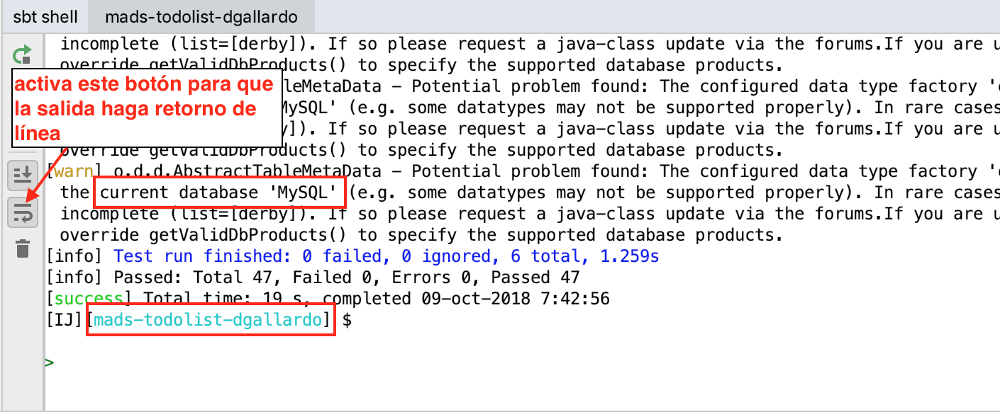
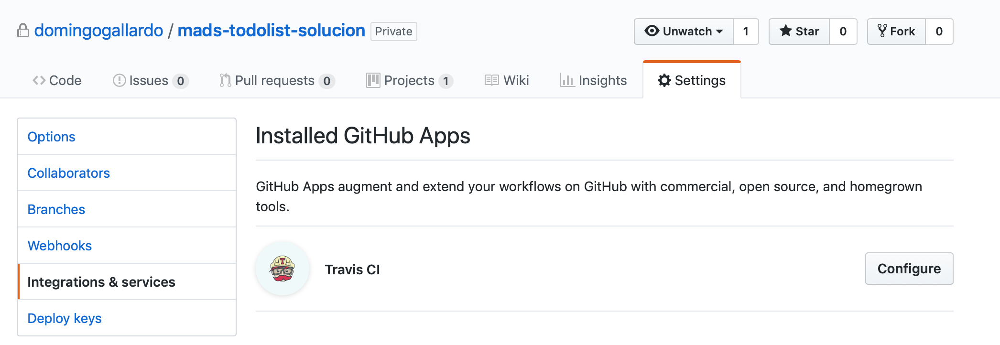
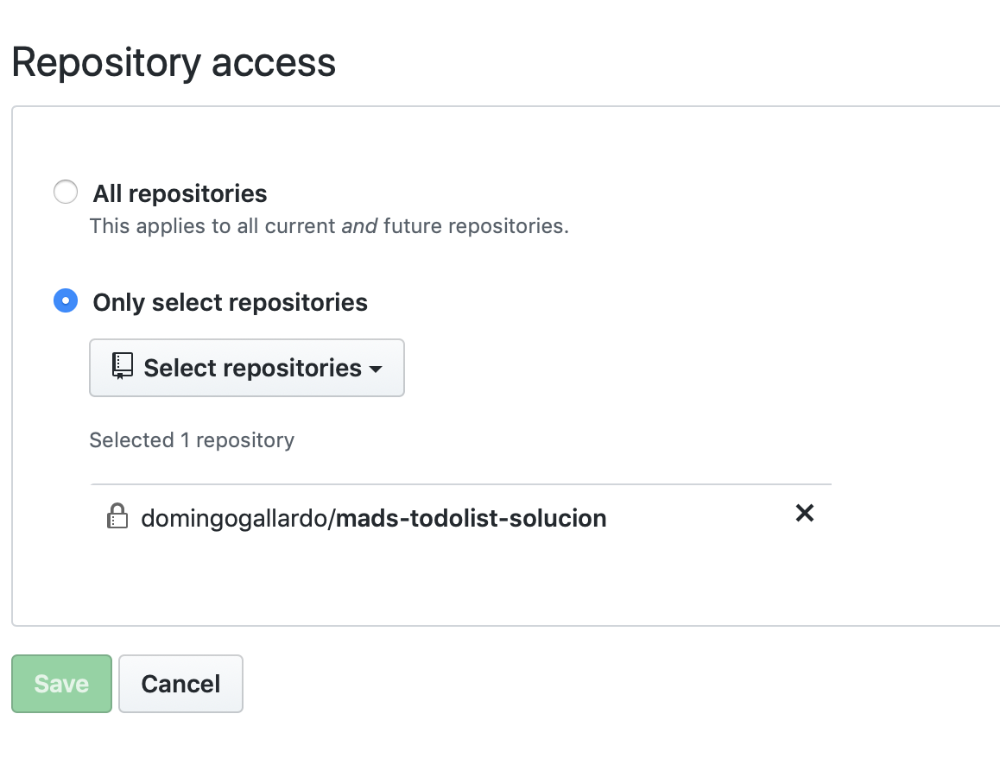
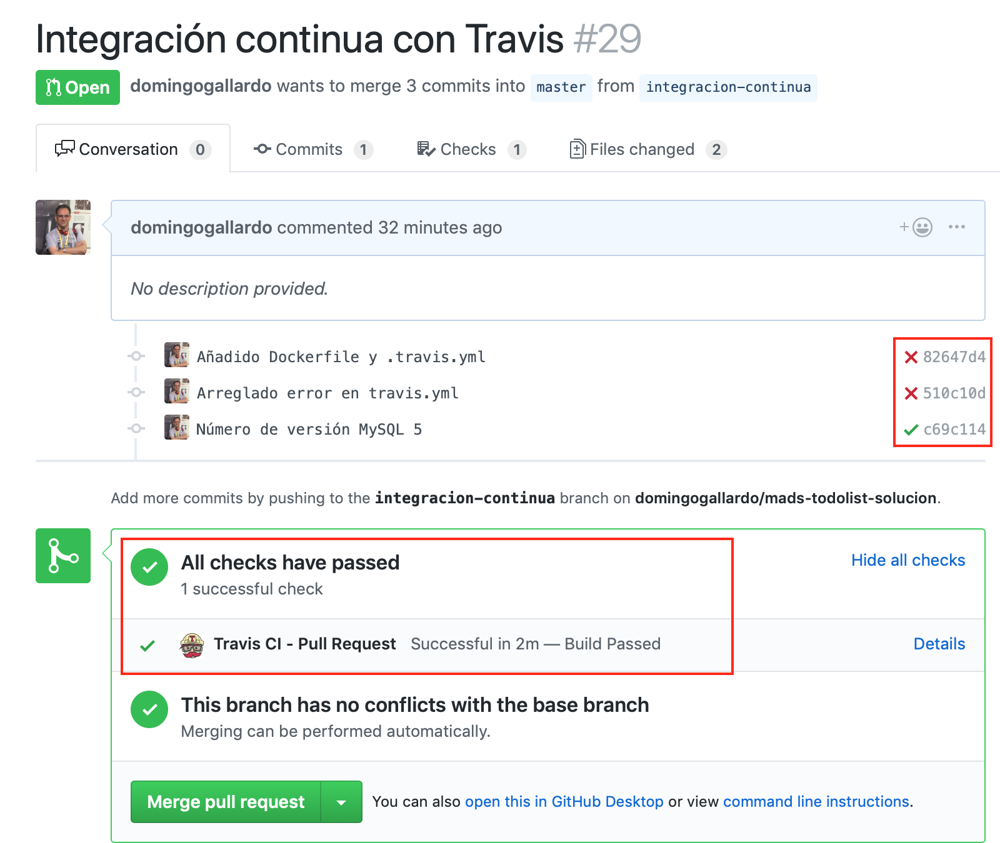
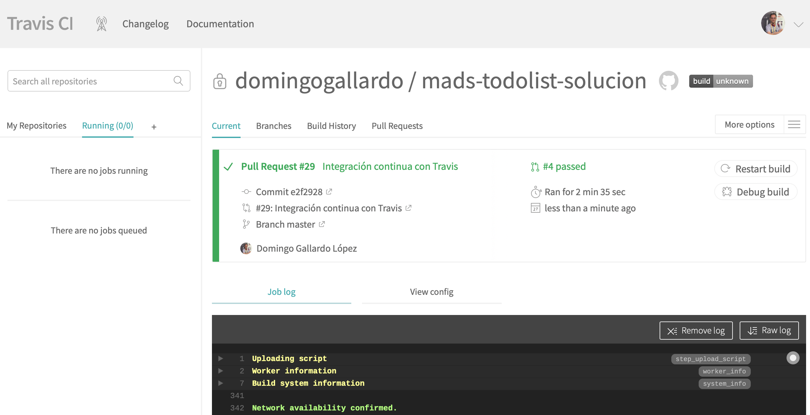
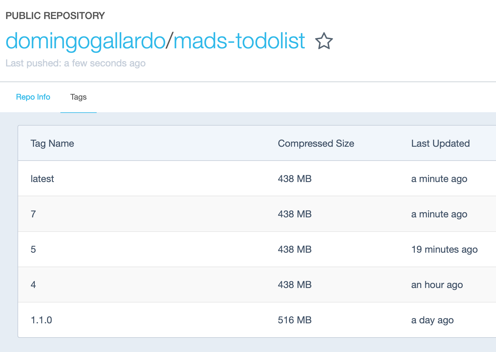

# Práctica 2: Integración con Travis y TDD

En esta práctica 2 de la asignatura realizaremos dos tareas principales:

- Configuraremos un sistema de integración continua conectando el
  repositorio de GitHub con Travis.
- Añadiremos una nueva funcionalidad usando la práctica XP de TDD
  (_Test Driven Design_).

Debes realizar todas las acciones indicadas en los apartados con el título
`Pasos a seguir en la práctica`.

## Configuración de la aplicación ##

Hasta ahora hemos trabajado con la aplicación en una configuración
local con nuestro ordenador de desarrollo. Pero el objetivo final es
poner la aplicación en producción, en un servidor en Internet y usando
una base de datos de producción.

Vamos a ver en este apartado cómo definir distintas configuraciones de
ejecución de la aplicación. En concreto veremos dos configuraciones,
una para realizar los tests en integración continua y otra de _stage_
y producción.

La primera configuración la usaremos en esta práctica para hacer
integración continua usando Travis y más adelante (en la práctica 3)
veremos cómo usar la configuración de producción para ejecutar la
práctica en un servicio de hosting.


### Ficheros de configuración de la aplicación ###

Ya hemos comentado que la configuración de la aplicación se define en
el fichero `conf/application.conf`. Ahí se definen distintas
propiedades de la ejecución de la aplicación que se pueden modificar
(puerto en el que se lanza la aplicación, base de datos con la que
conectarse, etc.).

La propiedad Java `config.file` permite definir un fichero de
configuración distinto del de por defecto. Se puede configurar en las
`javaOptions` de `sbt`:

```text
[mads-todolist-dgallardo] $ set javaOptions += "-Dconf.file=conf/<FICHERO-CONF>.conf"
```

Vamos a utilizar dos ficheros de configuración distintos:

- Fichero `conf/develop-mysql.conf`: para lanzar las pruebas de integración.
- Fichero `conf/production.conf`: para ejecutar la aplicación en producción.

**Fichero `conf/develop-mysql.conf`**:

```text
include "application.conf"

db.default.driver=com.mysql.jdbc.Driver
db.default.url=${?DB_URL}
db.default.username=${?DB_USER_NAME}
db.default.password=${?DB_USER_PASSWD}
```

**Fichero `conf/production.conf`**:

```text
include "application.conf"

play.crypto.secret="abcdefghijkl"

jpa.default = production

db.default.driver=com.mysql.jdbc.Driver
db.default.url=${?DB_URL}
db.default.username=${?DB_USER_NAME}
db.default.password=${?DB_USER_PASSWD}
```


Ambos ficheros incluyen el fichero `application.conf` en el que se
definen las siguientes propiedades relacionadas con la base de datos:

**Fichero `conf/application.conf**:

```text
# Default persistenceUnit for JPA
jpa.default = develop

db {
  # You can declare as many datasources as you want.
  # By convention, the default datasource is named `default`

  # https://www.playframework.com/documentation/latest/Developing-with-the-H2-Database
  # Memory H2 database
  default.driver = org.h2.Driver
  default.url = "jdbc:h2:mem:play;MODE=MYSQL"
  #default.username = sa
  #default.password = ""
  # Definimos el nombre JNDI de la BD que va a usar la aplicación
  default.jndiName=DBTodoList

  # You can turn on SQL logging for any datasource
  # https://www.playframework.com/documentation/latest/Highlights25#Logging-SQL-statements
  # default.logSql=true
}
```


### Fichero de configuración de JPA ###

Vemos en los ficheros anteriores que la diferencia fundamental es el valor de la
propiedad `jpa.default`. En esta propiedad se define el nombre de la
unidad de persistencia que se va a usar en JPA. Las unidades de
persistencia están definidas en el fichero
`conf/META-INF/persistence.xml`.


**Fichero `conf/META-INF/persistence.xml**:

```xml
<!-- MySQL Persistence Unit - Develop: hbm2ddl.auto = UPDATE -->

<persistence-unit name="develop" transaction-type="RESOURCE_LOCAL">
   <provider>org.hibernate.jpa.HibernatePersistenceProvider</provider>
   <non-jta-data-source>DBTodoList</non-jta-data-source>
   <class>models.Usuario</class>
   <class>models.Tarea</class>
   <class>models.Equipo</class>
   <class>models.Admin</class>
   <properties>
        <property name="hibernate.dialect" value="org.hibernate.dialect.MySQL5Dialect"/>
        <property name="hibernate.hbm2ddl.auto" value="update"/>
   </properties>
</persistence-unit>

<!-- MySQL Persistence Unit - Production: hbm2ddl.auto = VALIDATE -->

<persistence-unit name="production" transaction-type="RESOURCE_LOCAL">
   <provider>org.hibernate.jpa.HibernatePersistenceProvider</provider>
   <non-jta-data-source>DBTodoList</non-jta-data-source>
   <class>models.Usuario</class>
   <class>models.Tarea</class>
   <class>models.Equipo</class>
   <class>models.Admin</class>
   <properties>
      <property name="hibernate.dialect" value="org.hibernate.dialect.MySQL5Dialect"/>
      <property name="hibernate.hbm2ddl.auto" value="validate"/>
   </properties>
</persistence-unit>
```

La diferencia fundamental entre ambas unidades de persistencia es el
valor de la propiedad `hibernate.hbm2ddl.auto`, que define cómo
gestiona JPA el mapeo entre las entidades Java y las tablas físicas de
la base de datos.

En la unidad de persistencia `develop` hemos usado el valor
`update`. Esto significa que JPA actualizará la base de datos,
modificando su esquema, para hacerlo corresponder con las entidades
definidas en la aplicación. Si en alguna entidad añadimos algún
atributo, el esquema de la base de datos se actualizará, añadiendo un
campo en la tabla correspondiente.

En la unidad de persistencia `production` hemos usado el valor
`validate`. En este caso JPA comprobará si el esquema de la base de
datos se corresponde con las entidades de la aplicación. Si no es así,
se lanzará una excepción y JPA dejará de funcionar.

El primer valor es muy útil para el realizar el desarrollo y los tests
de integración de la aplicación. Pero no se debe usar en producción
porque no queremos que la base de datos de producción (donde están
todos los datos introducidos por los usuarios finales) se modifique
tan fácilmente. Cualquier modificación de la base de datos de
producción debe realizarse mediante un proceso que garantice la
posibilidad de la vuelta atrás y la recuperación de posibles errores
que se puedan cometer.

### Variables de entorno ###

En ambos ficheros se usan variables de entorno para definir los
valores de la URL de la conexión a la base de datos y el usuario y
contraseña de esa conexión.

Los valores de esas variables se pueden definir de dos formas para
que sean visibles dentro de `sbt`:

- En el shell en el que se lanza el comando `sbt`
  
        ```text
        $ export DB_URL="jdbc:mysql://localhost:3316/mads"
        $ export DB_USER_NAME=root
        $ export DB_USER_PASSWD=mads
        $ sbt '; set javaOptions += \"-Dconfig.file=conf/develop-mysql.conf\"; test'
        ```
    
    En la última línea vemos cómo es posible lanzar `sbt` junto con
    unos comandos que se lanzarán dentro del propio `sbt`.
    
- Desde dentro del propio `sbt` con `set javaOptions`:

        ```text
        [mads-todolist-dgallardo] $ set javaOptions += "-Dconfig.file=conf/develop-mysql.conf"
        [mads-todolist-dgallardo] $ set javaOptions += "-DDB_URL=jdbc:mysql://localhost:3316/mads"
        [mads-todolist-dgallardo] $ set javaOptions += "-DDB_USER_NAME=root"
        [mads-todolist-dgallardo] $ set javaOptions += "-DDB_USER_PASSWD=mads"
        [mads-todolist-dgallardo] $ test
        ```


### Pasos a seguir en la práctica ###

- Ejecuta los tests de la práctica usando el fichero de
configuración `develop-mysql.conf` para que los realice usando la base
de datos MySQL (que deberás tener activa).

- Captura la pantalla en la que aparezca el resultado de los tests y el
nombre de la base de datos `MySQL`. Por ejemplo, si ejecutas `sbt`
desde IntelliJ, la pantalla resultante deberá ser como la siguiente:




## Construcción y publicación de la imagen docker ##

Para facilitar la ejecución de la aplicación en diferentes entornos,
vamos a generar y publicar una imagen docker de la misma.

### Alta en Docker Hub ###

Crea una cuenta en [docker hub](https://hub.docker.com). La utilizarás
para subir allí, utilizando tu _Docker ID_, la image docker de tu
práctica.


### Construcción de la imagen docker ###

Empezamos construyendo la imagen docker en local y comprobando que
funciona correctamente.


#### Comando `stage` de `sbt` ####

El comando `stage` de `sbt` genera un comando ejecutable con el que se puede
lanzar la aplicación sin usar `sbt`. Genera un script con el nombre de
la aplicación en el directorio `target/universal/stage/bin`.

```
[mads-todolist-dgallardo] $ stage
```

El script generado lanza la aplicación en modo producción. En este modo es
necesario definir la variable `play.http.secret.key` con una cadena inicial.

```
$ target/universal/stage/bin/mads-todolist-dgallardo -Dplay.http.secret.key=abcdefghijk
```


Al lanzar el comando generado por `sbt stage` es posible definir el
fichero de configuración que va a usar la ejecución de la
aplicación. Esta va a ser la característica clave que nos va a
permitir usar distintas configuraciones.

```
$ target/universal/stage/bin/mads-todolist-dgallardo -Dconfig.file=conf/<FICHERO-CONF>.conf
```

#### Fichero Dockerfile ####

El fichero `Dockerfile` es el fichero en el que se definen las
instrucciones para construir la imagen. Docker lo ejecuta paso a
paso para ir creando una imagen de una máquina virtual con los
elementos necesarios para ejecutar nuestra aplicación.

Debemos colocar el fichero `Dockerfile` en la raíz del proyecto.

**Fichero `Dockerfile`**:

```dockerfile
FROM domingogallardo/playframework
WORKDIR /app
COPY . /app
RUN sbt clean stage

EXPOSE 9000
ENV CONFIG_FILE=conf/application.conf
ENV SECRET=abcdefghijk

CMD target/universal/stage/bin/mads-todolist-2017 -Dplay.crypto.secret=$SECRET -Dconfig.file=$CONFIG_FILE
```

La línea `FROM` indica la imagen docker base sobre la que se construye
la aplicación.

La línea `WORKDIR` indica el directorio en el que se van a ejecutar
todos los comandos `COPY`, `RUN` o `CMD`. Si el directorio no existe en
la imagen, se crea. En este caso creamos el directorio `/app` en el
que se va a compilar la aplicación.

El comando `COPY` copia el directorio actual (y sus subdirectorios) en
el directorio `/app` de la máquina Docker. De esta forma copiamos
el fuente de la aplicación Play.

El comando `RUN` ejecuta lo que hay a continuación dentro de la
máquina virtual en el proceso de construcción de la imagen. En este
caso se lanza `sbt clean stage` para compilar el proyecto y generar el
ejecutable (que se guardará en el directorio
`target/universal/stage/bin/NOMBRE_PROYECTO`).

Los siguientes comandos ya son para cuando se ejecuta el
contenedor. El comando `EXPOSE` define un puerto a mapear con la
máquina host. En este caso el puerto 9000, que es en el que se lanza
la aplicación. El comando `ENV` define valores por defecto de
variables de entorno. Estas variables pueden ser sobreescritas con el
parámetro `-e` en un `docker run`. En nuestro caso definimos el
fichero de configuración por defecto y la palabra `SECRET` por
defecto.

Por último, `CMD` define el comando que se ejecuta en el contenedor
cuando se realiza un `docker run`. En nuestro caso llamamos a la
aplicación pasando como parámetro el fichero de configuración y la
palabra `SECRET`.

#### Comando `docker build` ####

Una vez creado el fichero `Dockerfile` ya podemos hacer un
`docker build` para construir la imagen con nuestra aplicación. Como nombre de la imagen usaremos
`<usuario-docker>/mads-todolist:1.1.0`. Docker identifica el número que
hay después de los dos puntos como el número de versión.

```
$ cd mads-todolist-guia
$ docker build -t <DOCKER-ID>/mads-todolist:1.1.0 .
```

#### Ejecución de la imagen docker ####

Una vez construida la imagen es posible usarla para ejecutar la
aplicación de muchas maneras. En todas ellas se lanzará la imagen
usando el comando `docker run`. 

Lo más sencillo es ejecutar la aplicación trabajando con la base de
datos en memoria:

```
$ docker run -d --rm -p 9000:9000 domingogallardo/mads-todolist:1.1.0
```

También podemos lanzar la aplicación para que trabaje con MySQL,
definiendo las variables de entorno necesarias.

```
$ docker run --link db-mysql --rm -d -p 9000:9000 \
     -e DB_URL="jdbc:mysql://db-mysql:3306/mads" -e DB_USER_NAME="root" \
     -e DB_USER_PASSWD="mads" -e CONFIG_FILE="conf/develop-mysql.conf" domingogallardo/mads-todolist:1.1.0
```

El comando se conecta con el contenedor `db-mysql` en el que hemos
lanzado la base de datos MySQL:

```
$ docker run -d -p 3316:3306 --name db-mysql -e MYSQL_ROOT_PASSWORD=mads -e MYSQL_DATABASE=mads mysql:5
```


Si en algún momento nos encontramos con un error podemos ver el log
del contenedor (si estamos depurando es convieniente lanzar la aplicación sin el flag
`--rm` para poder examinar el contenedor):

```
$ docker container ls -a
CONTAINER ID        IMAGE                                STATUS              PORTS                               NAMES
19986a063c03        domingogallardo/mads-todolist:1.1.0  Up 2 minutes        0.0.0.0:9000->9000/tcp              zen_payne
$ docker container logs 19986a063c03
[info] application - Creating Pool for datasource 'default'
[info] p.a.d.HikariCPConnectionPool - datasource [default] bound to JNDI as DBTodoList
[info] p.a.d.DefaultDBApi - Database [default] connected at jdbc:mysql://play-mysql:3306/mads
[info] application - ApplicationTimer demo: Starting application at 2018-10-06T11:57:24.119Z
[info] play.api.Play - Application started (Prod)
[info] p.c.s.NettyServer - Listening for HTTP on /0.0.0.0:9000
```

#### Lanzamiento de tests ####

Podemos también ejecutar los tests haciendo que el contenedor ejecute el comando
`bash` con `sbt test`:

```
$ docker run --rm domingogallardo/mads-todolist:1.1.0 /bin/bash -c "sbt test"
```

Para los tests de integración con la base de datos real MySQL:

```
$ docker run --link db-mysql --rm -e DB_URL="jdbc:mysql://db-mysql:3306/mads" \
     -e DB_USER_NAME="root" -e DB_USER_PASSWD="mads" domingogallardo/mads-todolist:1.1.0 \
     /bin/bash -c "sbt '; set javaOptions += \"-Dconfig.file=conf/develop-mysql.conf\"; test'"
```

#### Subida a docker hub ####

Una vez construida la imagen se puede subir a Docker Hub haciendo
`docker push` (después de autenticarse con `docker login`). Tardará
bastante la primera vez. En las siguientes compilaciones ya no tardará
tanto, porque sólo se subirá la parte que cambia de la máquina.

```
$ docker login
Username: <docker-id>
Password: <contraseña>
$ docker push domingogallardo/mads-todolist:1.1.0
```

Allí estará disponible para descargarla y ejecutarla desde cualquier servidor.

#### La etiqueta latest ####

Utilizando la etiqueta `latest` marcamos una imagen como la imagen por
defecto que se descarga si no se proporciona un número de versión.

```
$ docker image ls
REPOSITORY                      TAG                 IMAGE ID            CREATED             SIZE
domingogallardo/mads-todolist   1.1.0               b80593e5f646        31 hours ago        734MB
$ docker tag b80593e5f646 domingogallardo/mads-todolist:latest
$ docker push domingogallardo/mads-todolist:latest
```

Una vez subida esta imagen es la que se descargará si se hace un `pull` del repositorio `domingogallardo/mads-todolist`

### Pasos a seguir en la práctica ###

- Crea un nuevo _issue_ llamado `Integración continua con Travis`,
  crea una nueva rama `integracion-continua` y súbela a GitHub.
- Realiza un commit con el fichero `Dockerfile` añadido.
- Construye la máquina docker con tu práctica, prueba que funciona
  bien la ejecución en memoria y el lanzamiento de los tests contra la
  base de datos MySQL (tests de integración) y súbela a Docker
  Hub, con la versión `1.1.0` y la versión `latest`.
- Comparte en el foro de la asignatura el nombre de tu máquina y el
  enlace a tu página de Docker Hub.


## Integración continua con Travis ##

[Travis](https://travis-ci.com/) es un servicio que permite realizar
integración continua on-line, sin necesidad de configurar un servidor
propio de integración continua.

Es un servicio de pago, pero es gratuito para los repositorios
abiertos (_open source_) y para las cuentas educativas de GitHub. La
organización de GitHub `mads-ua-18` también está autorizada como
organización educativa, por lo que todos los repositorios creados
dentro de esa organización podrán trabajar con Travis.

Puedes consultar el funcionamiento de Travis leyendo su documentación,
comenzando por la página [Getting
started](https://docs.travis-ci.com/user/getting-started/).

En la práctica vamos a configurar Travis para que todos los _pull
requests_ deban pasar los tests de integración (conectándose a la base
de datos MySQL) y para que cuando se realice el _merge_ con `master`
se suba una nueva versión de la máquina docker con la aplicación a
Docker Hub.

### Configuración en GitHub ###

En GitHub podemos encontrar la configuración de Travis en _Settings >
Integration & Services_.



Hay que definir la configuración para permitirle acceder al
repositorio en el que estamos trabajando.



### Tests en los pull requests ###

Usando Travis es posible configurar el repositorio de GitHub para que todos los
_pull requests_ deban pasar los tests de integración en el servicio.

En la siguiente imagen vemos el aspecto en GitHub de un _pull request_
estando activa la integración con Travis. Una vez abierto el PR,
Travis comprueba si la integración de master con la rama pasa los
tests definidos en el fichero de configuración. Sólo si los tests
pasan es posible realizar el _merge_ del PR en master.




### El fichero de configuración  ###

La configuración de Travis se realiza con el fichero `.travis.yml` en
la raíz del repositorio.

El fichero `.travis.yml` para mi repositorio solución de la práctica
es el siguiente:

**Fichero `.travis.yml`**

```text
sudo: required

language: bash

branches:
  only:
  - master

services:
- docker

before_script:
- docker build -t domingogallardo/mads-todolist:$TRAVIS_BUILD_NUMBER .

script:
- docker run -d --rm -p 3306:3306 --name db-mysql -e MYSQL_ROOT_PASSWORD=mads -e MYSQL_DATABASE=mads mysql:5
- docker run --link db-mysql --rm -e DB_URL="jdbc:mysql://db-mysql:3306/mads" -e DB_USER_NAME="root" -e DB_USER_PASSWD="mads" domingogallardo/mads-todolist:$TRAVIS_BUILD_NUMBER /bin/bash -c "sbt '; set javaOptions += \"-Dconfig.file=conf/develop-mysql.conf\"; test'"

after_success:
- if [ "$TRAVIS_EVENT_TYPE" != "pull_request" ]; then
  docker login -u="$DOCKER_USERNAME" -p="$DOCKER_PASSWORD";
  docker push domingogallardo/mads-todolist:$TRAVIS_BUILD_NUMBER;
  docker tag domingogallardo/mads-todolist:$TRAVIS_BUILD_NUMBER domingogallardo/mads-todolist:latest;
  docker push domingogallardo/mads-todolist:latest;
  fi
```

Puntos interesantes a destacar:

- Se puede espeficar la rama en la que se activa la integración
  continua en el apartado `branches`. En nuestro caso es la rama
  `master`. En cualquier commit o _pull request_ que se haga sobre esa
  rama se lanzará la integración continua.
- El apartado `services` define los servicios necesarios para que se
  ejecute el script de integración. En nuestro caso `docker`.
- En el apartado `before_script` se definen los comandos a realizar
  antes de ejecutar el _script_ con los tests. En nuestro caso
  construimos la imagen docker.
- En el apartado `script` se definen los comandos a realizar para
  lanzar los tests. En nuestro caso ponemos en marcha el servicio
  docker de MySQL y lanzamos la máquina docker de la aplicación para
  que ejecute los tests usando la conexión con ese servicio.
- Por último, el apartado `after_success` se ejecuta si los tests han
  pasado correctamente. En nuestro caso definimos la condición
  adicional de que la ejecución de Travis se haya lanzado no por un
  _pull request_ abierto sino porque se ha hecho un _merge_ del _pull
  request_ en master. En ese caso se sube a Docker Hub la última
  imagen creada, con el número de versión definido por el número de
  _build_ de Travis y también con la etiqueta `latest`.


### Builds en Travis ###

En Travis tenemos toda la información de los _builds_. Es posible
visualizarla una vez ha terminado el _build_ o mientras se está
ejecutando.



!!! Note "Nota"

    Sólo es posible ejecutar un _build_ simultáneo en la organización
    `mads-ua-18`. Cuando hay otro _build_ ejecutándose los nuevos
    _builds_ que se lancen quedarán encolados por fecha de inicio.


### Versiones en Docker Hub ###

En Docker Hub tendremos el histórico de versiones generadas en la
integración continua. Y la última estará etiquetada con `latest`.




### Pasos a seguir en la práctica ###

- Date de alta en Travis y conéctalo al repositorio de la práctica.
- Adapta el fichero `.travis.yml` a tu práctica y añádelo con un
  commit a la rama `integracion-continua`.
- Sube el commit a GitHub y abre un _pull request_ con la rama.
- Comprueba que se pasan los tests en Travis y que se marca como
  correcto el _pull request_. Si hay algún fallo, realiza los cambios
  necesarios para corregirlos y vuelve a subir el commit.
- Mezcla el _pull request_ con `master`. Se volverán a lanzar los
  tests en Travis y se subirá la máquina docker resultante a Docker
  Hub.
- Crea en la wiki una página llamada `Integración continua` y
  documenta en ella lo que has hecho en esta parte de la
  práctica. Como mínimo:
  - Captura de pantalla de los tests de integración con `sbt`.
  - Enlace a Docker Hub.

## TDD ##

Pediente.
