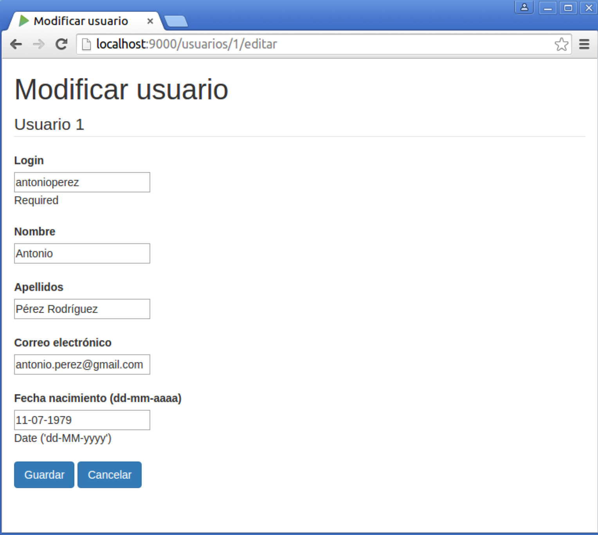
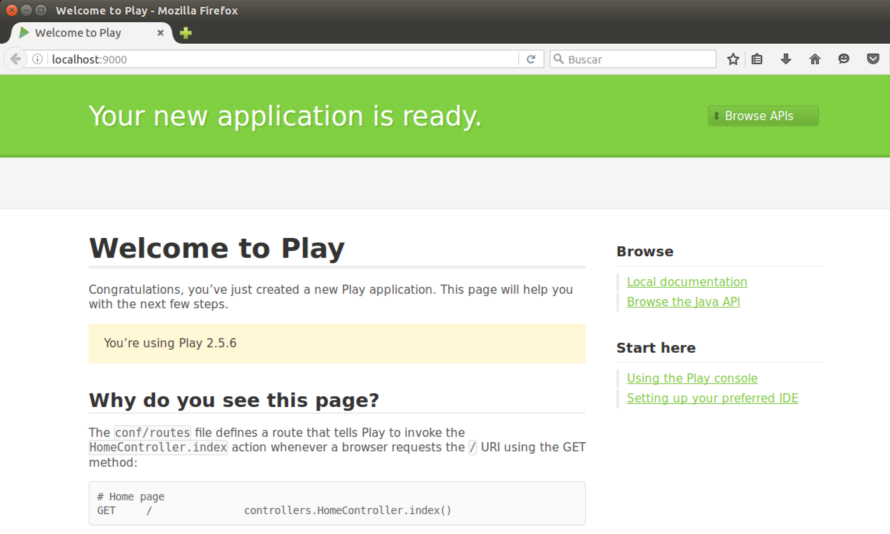
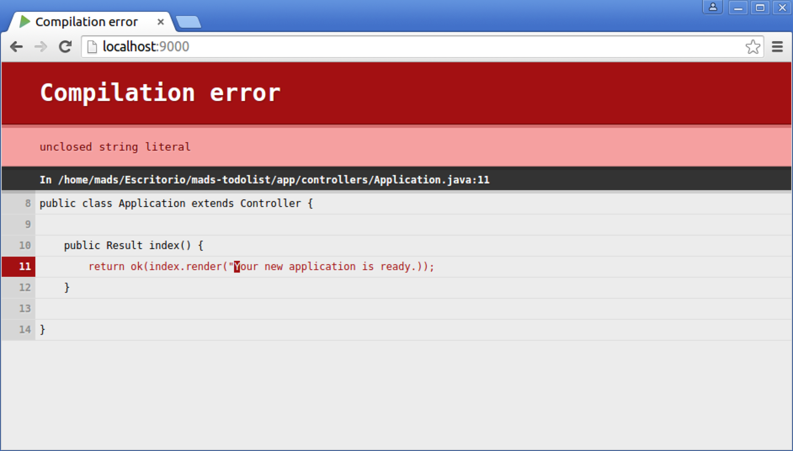
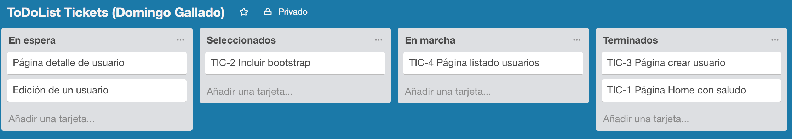

# Práctica 1: Primera aplicación Play Framework (Java)

[1. Objetivos](#1-objetivos)  
[2. Aplicación a desarrollar: ToDo List para equipos](#2-aplicación-a-desarrollar-todo-list-para-equipos)  
[3. Lenguajes, APIs y frameworks de programación](#3-lenguajes-apis-y-frameworks-de-programación)  
[4. Metodología de desarrollo](#4-metodología-de-desarrollo)  
[5. Realización de la práctica](#5-realización-de-la-práctica)  

## 1. Objetivos

El objetivo principal de esta primera práctica es implementar una aplicación web inicial con [_Play Framework_](https://playframework.com) en Java. Servirá para tomar un primer contacto con esta tecnología, para que podamos centrarnos en las próximas prácticas en aspectos más relacionados con las metodologías de desarrollo.

Comenzaremos también a trabajar con repositorios de código, usuando [Git](https://git-scm.com) como sistema de control de versiones y [GitHub](https://github.com) como repositorio remoto. Desarrollaremos la aplicación de forma iterativa, utilizando un flujo de trabajo Git denominado [_feature branch_](https://www.atlassian.com/git/tutorials/comparing-workflows/feature-branch-workflow) en el que cada característica nueva se implementa en una rama separada que después se mezcla con la rama principal de desarrollo.

## 2. Aplicación a desarrollar: ToDo List para equipos

Durante la asignatura desarrollaremos de forma iterativa una aplicación común. Las dos primeras prácticas servirán de base común para aprender a utilizar los lenguajes, _frameworks_, metodologías y herramientas. La tercera práctica será más abierta y cada equipo hará evolucionar la aplicación añadiendo nuevas funcionalidades originales ideadas por el propio equipo.

### Problema a resolver

Veamos una descripción de muy alto nivel de la aplicación a desarrollar, describiendo un supuesto práctico que plantea el problema que queremos resolver. 

**Gestión de tareas en una _startup_**

>Una _startup_ recién creada ha crecido rápidamente y quiere organizar mejor el trabajo de sus empleados. La empresa tiene un sistema de organización ágil, con equipos multifuncionales constituidos alrededor de proyectos en desarrollo, en los que participan desarrolladores de software, diseñadores, _product managers_, responsables de marketing, etc.

>La empresa quiere ofrecer a sus trabajadores una aplicación web con la que puedan gestionar las tareas pendientes del trabajo, que permita realizar acciones como:

>- añadir tareas a realizar
>- marcar tareas como terminadas
>- ...

>La empresa pretende que con el uso de la aplicación se mejore la organización y la comunicación entre todos los miembros de los equipos.

Deberemos diseñar y desarrollar una aplicación web que mejore el problema anterior. Iremos desarrollando las características concretas de la aplicación a lo largo de las prácticas. La aplicación tiene como nombre clave **ToDoList**.

### Características a implementar en la práctica 1

En esta primera práctica debemos implementar un [CRUD](https://en.wikipedia.org/wiki/Create,_read,_update_and_delete) de usuarios, que nos permita listar, añadir, modificar y eliminar usuarios del sistema.

- La página central de esta funcionalidad será un listado de todos los usuarios existentes.
- En alguna zona de la práctica habrá un enlace a una página para añadir un usuario.
- En la lista de usuarios, cada usuario tendrá un enlace a las posibles acciones a realizar sobre él: obtener detalles, editar y borrar

Se debe utilizar Bootstrap o algún otro framework CSS para que las páginas tengan un aspecto atractivo.

### Pantallas de la aplicación

Tienes libertad en el diseño de las pantallas de la aplicación. Las pantallas que mostramos a continuación son sólo un ejemplo.





## 3. Lenguajes, APIs y frameworks de programación

Para desarrollar la aplicación utilizaremos _Play Framework_ y un conjunto de tecnologías adicionales. Repasamos aquí las características principales e incluimos algunos enlaces para su estudio.

### Aplicación web basada en HTTP

Vamos a utilizar un enfoque basado en servicios REST para definir las rutas de las peticiones. Por ejemplo, para obtener los detalles del usuario con identificador `12` utilizaremos la petición:

```
GET /usuarios/12
```

Pero no implementaremos un servicio REST propiamente dicho, porque queremos desarrollar una aplicación que podamos demostrar y enseñar a los usuarios finales. Por ejemplo, las peticiones no van a devolver objetos JSON, sino páginas HTML que constituyen la interfaz de usuario. Tampoco vamos a ser estrictos en las peticiones. Por ejemplo, en lugar de hacer una petición PUT para modificar un recurso vamos a reutilizar la misma petición POST también van a utilizarse para modificar recursos (no sólo para añadir recursos nuevos).

Eso sí, el desarrollo se va a basar totalmente en las tecnologías HTTP y HTML. Es conveniente repasarlas para tener claros los conceptos más importantes, tanto de HTTP (tipo de petición, códigos de respuesta, elementos de una petición, etc.) como de HTML (formularios, CSS, algo de JavaScript, etc.).

Un libro imprescindible sobre HTTP que debe estar en la biblioteca de cualquier informático es el de O'Reilly: [HTTP - The Definitive Guide](http://shop.oreilly.com/product/9781565925090.do).

### Play Framework

[Play Framework](https://playframework.com) es un framework de desarrollo rápido de aplicaciones web disponible en los lenguajes Java y Scala. Vamos a utilizar la versión Java. El framework proporciona un soporte de ejecución que tiene como base el servidor [Netty](http://netty.io). Con este soporte es posible diseñar y poner en marcha distintos tipos de aplicaciones: servicios HTTP, servicios HTTP asíncronos basados en websockets, aplicaciones asíncronas basadas en eventos, etc. El modelo de ejecución es similar al modelo de programación reactiva asíncrona que ha popularizado JavaScript y el servidor **Node.js**. Nosotros vamos a implementar una aplicación tradicional que implementa un servicio HTTP.

Todas las prácticas de la asignatura las vamos a implementar en la última versión (2.5) [Play Framework en Java](https://www.playframework.com/documentation/2.5.x/JavaHome). Para entender el funcionamiento de esta primera práctica es necesario consultar la siguiente documentación del framework:

Sobre la instalación y el funcionamiento de Play:

- [Installing Play](https://playframework.com/documentation/2.5.x/Installing)
- [Creating a new application](https://playframework.com/documentation/2.5.x/NewApplication)
- [Using the Play console](https://playframework.com/documentation/2.5.x/PlayConsole)
- [Anatomy of a Play application](https://playframework.com/documentation/2.5.x/Anatomy)

Sobre peticiones y respuestas HTTP:

- [Actions, Controllers and Results](https://www.playframework.com/documentation/2.5.x/JavaActions)
- [HTTP routing](https://www.playframework.com/documentation/2.5.x/JavaRouting)
- [Flash scope](https://www.playframework.com/documentation/2.5.x/JavaSessionFlash#Flash-scope)

Sobre plantillas:

- [The template engine](https://www.playframework.com/documentation/2.5.x/JavaTemplates)
- [Common template use cases](https://www.playframework.com/documentation/2.5.x/JavaTemplateUseCases)

Sobre envío de datos de formularios:

- [Handling form submission](https://www.playframework.com/documentation/2.5.x/JavaForms)
- [Rendering an <input> element](https://www.playframework.com/documentation/2.5.x/JavaFormHelpers#Rendering-an-%3Cinput%3E-element)

Sobre el acceso a datos mediante JPA

- [Integrating with JPA](https://www.playframework.com/documentation/2.5.x/JavaJPA)

### Java Persistence API (JPA)

JPA es el API que utilizaremos para acceder a bases de datos y gestionar entidades persistentes usando un modelo ORM (_Object Relational Mapping_). Está integrado en Play, no es necesario instalar ninguna librería adicional.

JPA también es conocido por el nombre de una de sus implementaciones más populares, Hibernate. Es una tecnología muy usada y madura en el mundo Java. Permite gestionar la persistencia directamente con el modelo de objetos de la aplicación (se denominan _entidades_), independizándola del modelo relacional basado en tablas y registros.

La implementación de JPA ObjectDB tiene unos tutoriales muy completos y accesibles:

- [JPA Quick tour](http://www.objectdb.com/java/jpa/getting/started)
- [Entity classes](http://www.objectdb.com/java/jpa/entity)
- [Using JPA](http://www.objectdb.com/java/jpa/persistence)
- [JPA Queries](http://www.objectdb.com/java/jpa/query)

No es necesario estudiar todos los tutoriales. El objetivo de las prácticas no es aprender JPA, sino desarrollar de forma ágil una aplicación. Vamos a utilizar lo más básico de JPA y en la mayoría de las ocasiones se va a proporcionar el código necesario. Además, en caso de duda, siempre podrás realizar preguntas sobre cómo implementar una determinada funcionalidad en el foro de Moodle.

### Bootstrap

Para hacer más atractivo el diseño de las páginas HTML vamos a usuar el framework CSS [Bootstrap](http://getbootstrap.com/getting-started/). Es conveniente tener a mano su documentación, en concreto la lista de componentes:

- [Bootstrap components](http://getbootstrap.com/components/)

## 4. Metodología de desarrollo

Es importante realizar la aplicación siguiendo las indicaciones de este apartado. Se deberá utilizar git como sistema de control de versiones, dejando en la rama principal (_master_) la última versión funcional de la aplicación y creando una rama para implementar cada nueva característica.

### Git

Git es el sistema de control de versiones más utilizado en la actualidad. Es muy flexible, distribuido, adaptable a múltiples flujos de trabajo e ideal para una metodología de desarrollo en equipo. Suponemos que ya tienes cierta experiencia con su uso. Puedes usar los siguientes enlaces para repasar su funcionamiento.

- [Resumen de comandos de Git](comandos-git.md): Resumen de comandos principales para empezar a trabajar con Git.
- [Atlassian Git Tutorials](https://www.atlassian.com/git/tutorials/): Tutoriales muy orientados al uso de Git con gran cantidad de ejemplos. Es recomendable repasar los tutoriales básicos (_Getting Started_) y los tutoriales _Syncing_ y _Using Branches_ en el apartado _Collaborating_.
- [Libro de Scott Chacon](https://git-scm.com/book/en/v2): Completo manual con todos los detalles de todos los comandos de Git.

Cuando utilicemos git es muy importante realizar unos mensajes de commit claros. Un mensaje de commit es la forma de comunicar a los compañeros del equipo (en este caso con _el profesor_) qué cambios se han introducido en la aplicación y ponerlos en contexto (explicar por qué se han hecho, dar algún detalle de implementación, etc.). El post [How to Write a Git Commit Message](http://chris.beams.io/posts/git-commit/) explica muy bien esto.

Los commits deben definir cambios coherentes de la aplicación que se desarrolla. No deben tener errores de compilación. El mensaje del commit deberá tener el siguiente formato:

- Código del ticket que estamos implementando (ver más adelante)
- Descripción de menos de 50 caracteres de los cambios
- Línea en blanco
- Cuerpo del commit con una descripción más detallada del mismo. Las líneas deben tener como máximo 72 caracteres.


Un ejemplo:

```
$ git commit -m "TIC-3 Bootstrap incluido en plantilla principal

Se ha añadido bootstrap en el directorio de assets públicos
y se ha incluido en la plantilla principal de la aplicación"
```

En esta primera práctica el flujo de trabajo de Git se basará en abrir una rama desde `master` por cada _ticket_ y mezclarla en la rama principal con `git merge --no-ff`:

```
$ git merge --no-ff tic-4-pagina-creacion-usuario
```

De esta forma quedará claro en la historia de commits del proyecto los cambios introducidos por cada rama.


### Desarrollo incremental

Para realizar un desarrollo incremental de la aplicación, iremos definiendo claramente las características que debe cumplir y las desarrollaremos una a una de forma secuencial. No pasaremos a desarrollar la siguiente característica hasta haber comprobado que funciona la anterior. En el siguiente apartado se presenta una lista con las características que debe tener la práctica. El orden final que utilices en tu desarrollo puede ser distinto al planteado, pero la aplicación final debe contener todas las funcionalidades. 

Utilizaremos [Trello](https://trello.com) para registrar los _tickets_ a realizar en la aplicación. Utilizaremos Trello como herramienta de gestión y seguimiento de _issues_ (características, bugs, etc.) a implementar en el proyecto. Podríamos haber usado otra herramienta más profesional, como Jira o Bugzilla, pero las funcionalidades que proporcionan sobrepasan nuestras necesidades.

Utilizaremos git para remarcar el caráter incremental. Cuando empecemos a desarrollar un _ticket_ crearemos una rama con su identificador y su nombre y desarrollaremos su implementación en los commits de esa rama. Cuando hayamos terminado el desarrollo mezclaremos esa rama en la rama master. De esta forma, en cualquier momento del desarrollo tendremos en la rama _master_ una versión operativa de la aplicación que podríamos enseñar en una demostración. Esta rama principal incluirá todas las características terminadas hasta el momento.

### GitHub

[GitHub](https://github.com) y [Bitbucket](https://bitbucket.org) son servicios que permiten almacenar y gestionar repositorios Git. GitHub es el más conocido, pero tiene la limitación de no permitir repositorios privados. Bitbucket es muy práctico porque permite que  permite crear un número ilimitado de repositorios privados que se pueden compartir con un máximo de 5 personas. 

GitHub ha introducido una oferta para estudiantes llamada [Student Developer Pack](https://education.github.com/pack) en la que se incluye la posibilidad de un numero ilimitado de repositorios privados que se pueden compartir también por otras personas. Vamos a usar esta opción en las prácticas. La primera práctica será individual, y tendrás que compartir los repositorios con el profesor (`domingogallardo`). Más adelante crearemos equipos y se compartirán los repositorios con todos sus miembros.

## 5. Realización de la práctica

Para realizar esta práctica necesitas lo siguiente:

- [Java SE 8](http://www.oracle.com/technetwork/java/javase/downloads/jdk8-downloads-2133151.html)
- [Play Framework 2.4.2](https://playframework.com/download)
- Editor o entorno de desarrollo. Recomendamos [Atom](https://atom.io) o [IntelliJ Community Edition](https://www.jetbrains.com/idea/download/).
- Cuenta de estudiante en GitHub

### Pasos previos

#### 1. Máquina virtual

Hemos preparado una máquina virtual Virtual Box con Ubuntu 14.04 64 bits y el software necesario ya instado. El usuario de la MV es `mads` y su login también es `mads`.

Puedes descargar la imagen del disco duro de la MV (el fichero .vdi) de las siguientes URLs. 

En un único archivo ZIP:

- [MADS-2016-17.vdi.zip](http://www.dccia.ua.es/dccia/inf/asignaturas/MADS/software/MADS-2016-17.vdi.zip) (3,3 GB)

En varios archivos, comprimido en formato ZIP multi-part:

- [MADS-2016-17.vdi.multipart.z01](http://www.dccia.ua.es/dccia/inf/asignaturas/MADS/software/MADS-2016-17.vdi.multipart.z01) (1,1 GB)
- [MADS-2016-17.vdi.multipart.z02](http://www.dccia.ua.es/dccia/inf/asignaturas/MADS/software/MADS-2016-17.vdi.multipart.z02) (1,1 GB)
- [MADS-2016-17.vdi.multipart.zip](http://www.dccia.ua.es/dccia/inf/asignaturas/MADS/software/MADS-2016-17.vdi.multipart.zip) (1,1 GB)

Para descomprimir en **Mac OS X** o en **Linux** un fichero multi-part desde línea de comando

```
$ cat MADS-2016-17.vdi.multipart.* > combinado.zip
$ unzip combinado.zip
```

También es posible utilizar alguna aplicación:

- [The Unarchiver](https://itunes.apple.com/us/app/the-unarchiver/id425424353?mt=12) en **Mac OS X**.
- [7-zip](http://www.7-zip.org/download.html) en **Microsoft Windows**.

**Trabajo en el laboratorio con la máquina virtual**

Para trabajar en los ordenadores del laboratorio debes usar VirtualBox (está instalado tanto en Linux como en Windows) y llevar el fichero .vdi en un disco o lápiz USB externo. 

Cada vez que empieces a trabajar deberás crear una máquina linux de 64 bits que use como disco duro el fichero .vdi. Asegúrate de crear la máquina con la memoria suficiente (2 GB mínimo) y con un mínimo de 2 procesadores.Cuando termines la sesión deberás **apagar la MV** (¡¡no la dejes en suspensión!!) y desmontar el disco duro externo. Podrás utilizar el disco externo y la imagen para continuar trabajando en casa.

Debes **subir a GitHub todos los cambios conforme los vayas programando**. De esta forma evitas perder el código y quedará grabado tu trabajo continuo para poder hacer un seguimiento de la práctica.

#### 2. Cuenta de estudiante GitHub

Crea una [cuenta de estudiante](https://education.github.com/pack) en GitHub en la que puedas crear repositorios privados

#### 3. Repositorio de prueba

Debes crear un repositorio llamado `mads-prueba-git` en el que pruebes los [comandos básicos de Git](comandos-git.md). Ve añadiendo ficheros de texto sobre un tema que elijas (por ejemplo películas, series de televisión, libros, etc.) y prueba todos los comandos:

- git add
- git commit
- git status
- git diff
- git log --oneline
- creación ramas
- merge de ramas
- rebase de ramas (avanzamos el master y la rama, y después hacemos un rebase y un merge de la rama en el master)
- git log --oneline --graph (para comprobar el grafo de commits)
- comandos para modificar la historia: cambiar el último mensaje de commit, deshacer el último commit y crear una rama en un punto pasado de la historia

Sube el repositorio a GitHub y compártelo con el profesor.

### Desarrollo de la aplicación `play-todolist`

Detallamos a continuación los primeros pasos de la práctica. Si los sigues con atención comprobarás cómo construir una primera aplicación web con Play Framework. Después deberás continuar realizando la práctica tu solo/a.

Cualquier duda que te surja sobre cualquiera de las tecnologías intenta resolverla primero de la forma habitual (consultando _google_ y _stack overflow_). Si la pregunta es sobre Play, comprueba bien que las respuestas se refieren a la versión que estamos utilizando (la 2.4), porque el framework ha cambiado con mucha frecuencia.

En el caso en que no encuentres la solución, no dudes en consultar en el foro de la asignatura en Moodle. Te podrá contestar cualquier compañero o el profesor de la asignatura, así podemos aprender estas tecnologías entre todos.

Veamos los pasos a seguir:

#### 4. Creación de la aplicación inicial `play-todolist`

- En la máquina virtual ya está instalado Play Framework y el comando `activator` está en el PATH. Para comprobar dónde se encuentra ubicado, puedes lanzar la siguiente instrucción:

    ```
    $ which activator
    /home/mads/PlayFramework/activator-dist-1.3.5/activator
    ```

- Creamos la aplicación base en algún directorio, por ejemplo el escritorio:

    ```
    $ cd Escritorio
    $ activator new
    ```

    Nos mostrará una lista de plantillas, escribimos `play-java` y le damos al nuevo proyecto el nombre `mads-todolist`.

- Se habrá creado el directorio con ese nombre. Nos movemos a él y lanzamos play:

    ```
    $ cd mads-todolist
    $ activator run
    ```

    La primera vez que lanzamos el comando, tardará bastante en arrancar la aplicación porque play comprueba todas las dependencias y se descarga las librerías que no están disponibles en local. Después pondrá el servidor de play a escuchar en el puerto 9000

- Abre el navegador e abre la URL [http:localhost:9000](http:localhost:9000). Verás que play compila los programas fuentes y que responde con una página de saludo:

    

- Estudia cómo funciona la aplicación. Lanza `Atom` y carga el directorio `mads-todolist`. Estudia qué función cumple cada directorio y cada fichero. Comprueba cómo se muestra la frase `"Your new application is ready"` en la acción `index()` en el fichero `app/controllers/Application.java`. Prueba a introducir un error (por ejemplo, quitar las dobles comillas de alguna cadena) y vuelve a recargar la página. Verás que automáticamente Play recompila la aplicación y muestra el error en el propio navegador:


    

- Arregla el error y cambia el mensaje para comprobar que esta función es la define el mensaje que aparece en la plantilla.

Una vez que tenemos una primera versión en funcionamiento es un buen momento de crear el repositorio local con git:

- Cerramos la aplicación (`ctrl-d`)
- Estando dentro del directorio recién creado `Escritorio/mads-todolist/` ejecutamos el comando para inicializar git y llenar el repositorio local con la primera version:

    ```
    $ git init
    Initialized empty Git repository in /home/mads/Escritorio/mads-todolist/.git/
    $ git add .
    $ git commit -m "Versión inicial"

    *** Please tell me who you are.

    Run

    git config --global user.email "you@example.com"
    git config --global user.name "Your Name"

    to set your account's default identity.
    Omit --global to set the identity only in this repository.

    fatal: unable to auto-detect email address (got 'mads@mads.(none)')
    ```

    Introducimos nuestro correo electrónico (el que usaremos para autentificarnos en Bitbucket) y nuestro nombre verdadero:


    ```
    $ git config --global user.email "domingo.gallardo@ua.es"
    $ git config --global user.name "Domingo Gallardo"
    $ git commit -m "Versión inicial"
    ```

#### 5. GitHub

- Crea el repositorio `mads-todolist`
- Añade a `domingogallardo` como usuario con permiso de lectura (con la opción Settings del menú de la izquierda y Access Management)
- Conecta la rama principal del repositorio local con bibucket:

    ```
    $ git remote add origin https://<usuario>@bitbucket.org/<usuario>/mads-todolist.git  
    $ git push -u origin --all
    $ git push -u origin --tags
    ```

#### 6. Trello

Debes crear una cuenta en Trello y crear un tablero llamado "ToDoList Tickets (Nombre y primer apellido)". Ahí pondremos la información de los _tickets_ que hay que desarrollar en el proyecto. Cada ticket será una tarjeta de Trello que se irá moviendo de una columna (lista) a otra conforme se vaya desarrollando. 

El tablero deberá tener 4 listas:

- **En espera**: tickets disponibles para ser seleccionados y empezar a trabajar en ellos. Tendrán un título y una descripción de un conjunto de cambios a implementar en el proyecto, que se realizarán un una única rama de Git que terminará integrándose en la rama `master`.
- **Seleccionados**: tickets listos para empezar a desarrollarlos. Deben tener un número de identificación (**TIC-1**, **TIC-2**, **TIC-3**, ...) y una descripción corta, que después irá en el comentario del commit del _merge_ de la rama. 
- **En marcha**: tickets que están en desarrollo. Deben tener una rama abierta en el repositorio (por ahora en local, porque sólo habrá una persona trabajando en cada ticket).
- **Terminados**: tickets que ya se han incorporado a la rama `master` y se han subido la repositorio remoto. En la descripción de cada tarjeta se debe incluir un enlace al commit con el _merge_ de la rama (el commit resultante de hacer un `merge --no-ff`) en el repositorio remoto en GitHub.

Un ejemplo de cómo debe estar el tablero a mitad del desarrollo:




#### 7. Primera funcionalidad

Vamos a crear una primera funcionalidad muy sencilla. Nos va a servir para comprobar el flujo de trabajo con Trello y git. 

Empezamos con **Trello**:

- Creamos una tarjeta llamada **Página Home con saludo** en la columna **En espera**. Añadimos una descripción en la tarjeta:

    > Para comprobar que Play está funcionando correctamente crearemos una ruta, un controller y una vista que responda a las peticiones
    > ```http://localhost:9000/saludo``` y ```http://localhost:9000/saludo?nombre=Pepe```. Se debe devolver a la petición un HTML con un saludo.

- Movemos la tarjeta a la columna **Seleccionados** y añadimos al título de la tarjeta el número de _ticket_: **TIC-1**.
- Movemos la tarjeta a la columna **En marcha** para indicar que se empieza a implementar la característica.
- Crearemos entonces una rama en la que desarrollaremos la característica y después, cuando hayamos comprobado que funciona correctamente, mezclaremos esa rama con la rama principal, subiremos los cambios a GitHub y pasaremos la etiqueta a **Terminados**.

Y seguimos desarrollando la característica y usando **Git**:

##### Página de saludo

- Creamos una rama con el nombre `tic-1-pagina-home-saludo`:

    ```
    $ git checkout -b tic-1-pagina-home-saludo
    Switched to a new branch 'tic-1-pagina-home-saludo'
    mads@mads:~/Escritorio/mads-todolist$ git branch
    * feature1
    master
    ```

- Añadimos una nueva ruta en el fichero `conf/routes`:

    **conf/routes**

    ```
    ...
    GET     /saludo                     controllers.Application.saludo()
    ...
    ```

- Añadimos la acción `controllers.Application.saludo`:

    **app/controllers/Application.java**

    ```
    ...
    public class Application extends Controller {
        public Result saludo() {
        return ok(saludo.render());
    }
    ...
    ```

- Añadimos la vista `saludo.scala.html`:

    **app/views/saludo.scala.html**

    ```
    @main("Hola") {
        <h1>Hola mundo!</h1>
    }
    ```

- Comprobamos que se devuelve el saludo al acceder a la página [http://localhost/saludo](http://localhost/saludo)

- Hacemos un commit con los cambios:


    ```
    $ git status
    $ git add app/views/saludo.scala.html
    $ git commit -m "TIC-1 Añadida página de saludo"
    ```

##### Página de saludo con nombre

Vamos ahora a añadir el parámetro `nombre` a la página de saludo.

- Modificamos la ruta:

    ```
    ...
    GET     /saludo                     controllers.Application.saludo(nombre: String)
    ...
    ```

- Modificamos la acción:

    ```
    public Result saludo(String nombre) {
        return ok(saludo.render(nombre));
    }
    ```

- Modificamos la plantilla:

    ```
    @(nombre: String)

    @main("Hola") {
        <h1>Hola <em>@nombre</em>!</h1>
    }
    ```

- Comprobamos que funciona correctamente realizando la petición [http://localhost:9000/saludo?nombre=Pepe](http://localhost:9000/saludo?nombre=Pepe)

- Por último, realizamos el commit y, como hemos terminado la característica, mezclamos la rama con la principal y borramos la rama

    ```
    $ git commit -a -m "TIC-1 Añadido parametro nombre a la pagia de saludo"
    $ git checkout master
    $ git merge --no-ff tic-1-pagina-home-saludo -m "TIC-1 Merge Página home de saludo"
    $ git branch -d tic-1-pagina-home-saludo
    ```

- Subimos los cambios a Bitbucket:

    ```
    $ git push 
    ```

- Si tuviéramos que subir los cambios sin haber mezclado la rama, deberíamos subir la rama al repositorio remoto:

    ```
    $ git push -u origin <rama>
    ```

    Y después, cuando borremos la rama en local después de hacer un merge, también hay que borrarla en el repositorio remoto:

    ```
    $ git push origin --delete <rama>
    ```

**En Trello**:

Una vez integrada la rama y subidos los cambios a GitHub, moveremos la tarjeta correspondiente a la columna de **Terminados** y **añadiremos en la descripción un enlace al commit con el merge en GitHub.

De esta forma podremos revisar los cambios introducidos en cada uno de los _tickets_ terminados.

#### 8. Siguientes funcionalidades: _Backlog_ guiado de la práctica

A continuación listamos el _backlog_ de características a implementar en esta práctica. Se tratan de características de muy bajo nivel, que pueden implementarse con pocos commits cada una. Deberás crear un ticket (y una rama) para cada una. Al igual que las pantallas, considera que es un ejemplo. Puedes modificarlo si lo consideras conveniente. El formato del _backlog_ está tomado del libro de Henrik Kniberg [Scrum and XP from the Trenches - 2nd Edition](http://www.infoq.com/minibooks/scrum-xp-from-the-trenches-2).


| Nombre | Demostración | Notas |
| ------ | ------------ | ----- |
| Página home con saludo | Abrir el navegador en la página raíz del servidor, realizar la petición [http://localhost:9000/saludo?nombre=Pepe](http://localhost:9000/saludo?nombre=Pepe) y comprobar que se devuelve un HTML con un saludo. | Sirve para comprobar que Play está funcionando. |
| Crear usuario | Abrir la URL de creación de un usuario, introducir sus datos y comprobar que se han añadido a la base de datos. | En esta primera práctica vamos a trabajar con una base de datos en memoria. En lugar de comprobar que el usuario se ha añadido en la BD, sacaremos un mensaje de log si todo ha funcionado bien. |
| Incluir Bootstrap | Abrir una página cualquiera de la aplicación y comprobar que el CSS incluye ese framework. | |
| Listar usuarios | Abrir la URL de listado de usuarios y comprobar que aparecen todos los usuarios creados. | La página de listado de usuarios va a ser la página principal de la aplicación, desde la que se van a lanzar el resto de acciones. Incluir un enlace a la acción de crear usuario. |
| Detalle de un usuario | Abrir la URL del usuario (o pinchar en la acción de _detalle_ asociada al usuario) y comprobar que aparecen correctamente todos sus datos. | El formato de la fecha de nacimiento debe ser mm-yy-aaa. |
| Editar usuario | Pinchar en la acción de _editar_ asociada al usuario, realizar alguna modificación de alguno de sus datos y comprobar en el listado y en los detalles que la modificación se ha grabado. | El campo _login_ es obligatorio. Si no se introduce se debe volver al formulario y mostrar un error. |
| Borrar usuario | Pinchar en la acción de borrado asociada al usuario y comprobar que el usuario desparece del listado. | Se debe enviar una petición DELETE a la URL del usuario. Utilizar un script JavaScript. |

Puedes utilizar como guía para el desarrollo el código que puedes encontrar en el siguiente [enlace](aplicacion-inicial-play.md). 

**No copies y pegues todo el código de un fichero de golpe, sino sólo lo necesario para completar la característica que estés desarrollando.**

#### 8. Característica adicional: registro y logeo de nuevos usuarios

Las características anteriores son características "de juguete" con las que probamos el funcionamiento de Play. En el caso de que la aplicación estuviera en producción estas características de gestión de usuarios deberían estar protegidas y sólo podría utilizarlas el usuario administrador.

Debes implementar ahora  una característica "real": **registro y logeo de nuevos usuarios**. Debes ampliar la aplicación para permitir que nuevos usuarios de la aplicación puedan crear cuentas y logearse. Debes definir los _tickets_ que consideres necesarios. Puedes añadir los cambios que necesites en todos los componentes de la aplicación. 

Piensa cómo deberían ser las pantallas y qué se debería implementar.

## Entrega y evaluación

- La práctica tiene una duración de 3 semanas y debe estar terminada el martes 6 de octubre.
- Durante el desarrollo se debe compartir con el profesor (usuario: `domingogallardo`)
    - Repositorios GitHub: `mads-prueba-git` y `mads-todolist`
    - Tablero trello con los tickets
- Documentación en Markdown en el directorio `/docs` del repositorio con una descripción del trabajo realizado en la práctica:
    - Documentación técnica del desarrollo realizado
    - Funcionalidades adicionales implementadas
- En la fecha de la entrega de debe subir a Moodle un ZIP que contenga todo el proyecto y dejar la URL al repositorio en GitHub

Para la evaluación se tendrá en cuenta:

- Desarrollo contínuo (commits realizados a lo largo de las 3 semanas)
- Buen desarrollo y descripción de los cambios (commits bien documentados, ordenados, ramas de características visibles en la historia de commits)
- Tablero Trello bien ordenado
- Uso correcto de la nomeclatura (cada rama debe corresponder a un ticket, cada ticket debe tener un número de identificación que debe aparecer en todos los commits y en el merge)
- Correcto desarrollo de las funcionalidades de la práctica
- Cuidado en el aspecto de la aplicación, la terminación, control de errores
- Características adicionales desarrolladas

