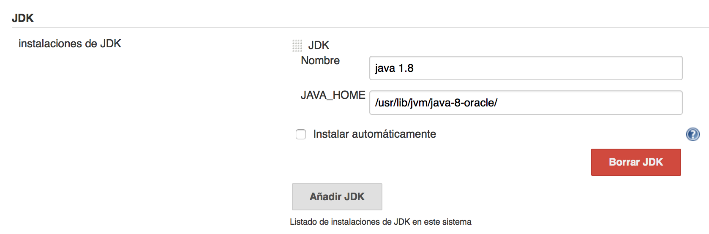
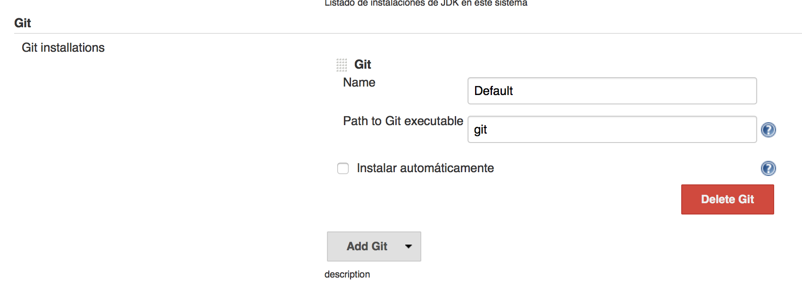
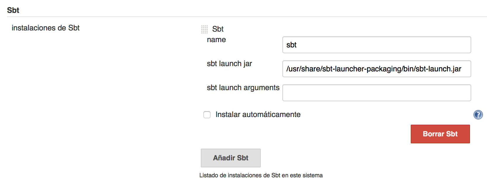
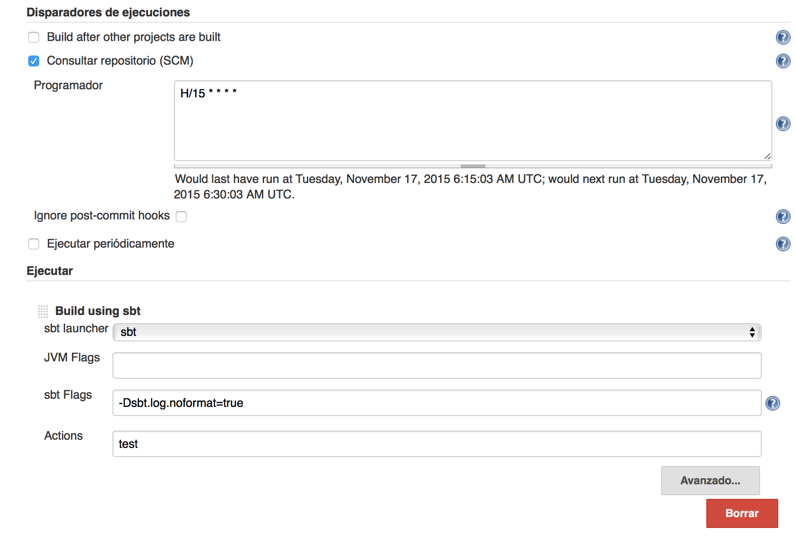
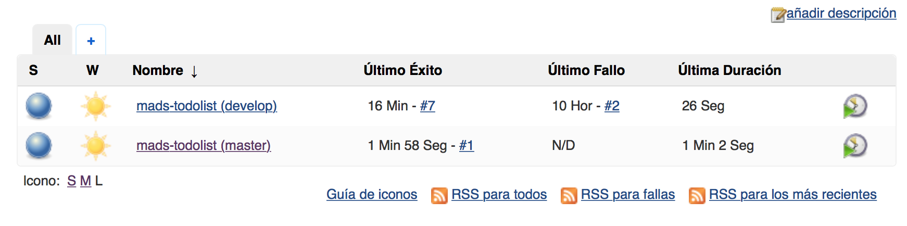
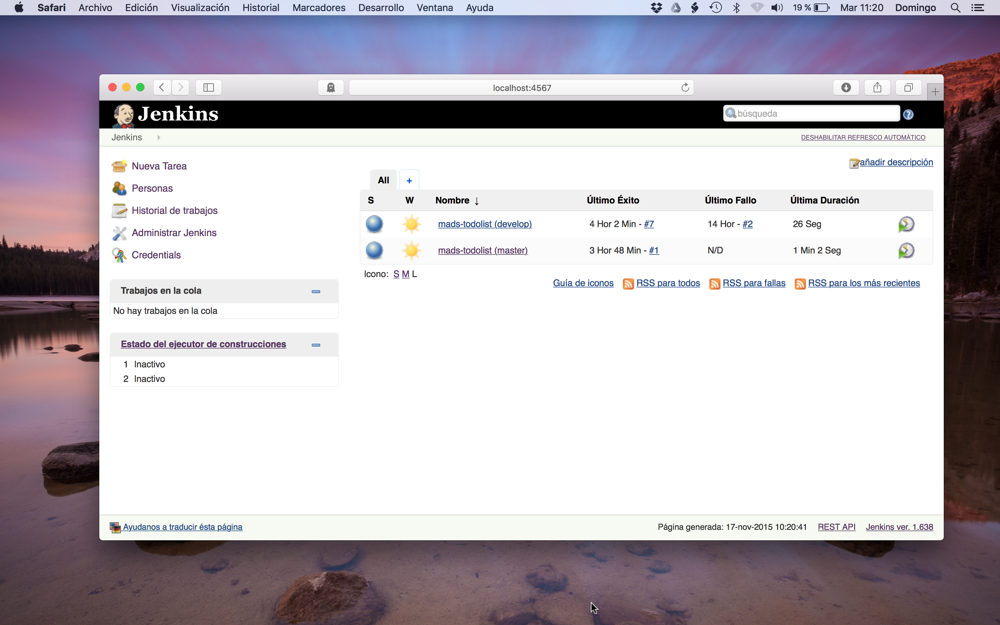

= Práctica 3 - Integración continua
Domingo Gallardo <domingo.gallardo@ua.es>
:Date:      :docdate:
:Revision:  0.4
:lang: es
:toc:
:toc-title: Índice
:toclevels: 3
:numbered:
:source-highlighter: pygments
:icons: font
:last-update-label!:

ifdef::pdf[]
:huge-size: scaledwidth="100%"
:large-size: scaledwidth="66%"
:normal-size: scaledwidth="50%"
:small-size: scaledwidth="33%"
:tiny-size: scaledwidth="25%"
endif::[]

ifndef::pdf[]
:huge-size: width="100%"
:large-size: width="66%"
:normal-size: width="50%"
:small-size: width="33%"
:tiny-size: width="25%"
endif::[]

Versión:  {revision} ({docdate})

== Objetivos

Esta práctica tiene dos objetivos principales:

- Trabajar con el sistema de control de versiones Git en equipo, utilizando el flujo de trabajo GitFlow sobre un repositorio remoto compartido
- Construir un sistema de integración continua basado en Vagrant y Jenkins conectado al repositorio remoto

La práctica tiene una duración de 3 semanas y la fecha límite de entrega es el martes 24 de noviembre.

Seguiremos trabajando en la aplicación `mads-todolist` que hemos estado desarrollando en las dos primeras prácticas.

== GitFlow sobre un repositorio remoto compartido

=== Configuración de los equipos

Los equipos de trabajo deben estar formados por 3 o 4 personas, una de las cuales realizará el papel de administrador del repositorio Git. Lo llamaremos coloquialmente _git master_. Todos los desarrolladores (incluido el _git master_) deberán tener acceso de escritura al repositorio remoto en Bitbucket en el que se va a realizar el desarrollo.

El _git master_ se encargará de:

- Configurar el repositorio de trabajo en Bitbucket
- Aprobar los _pull request_ en la interfaz web de Bitbucket
- Realizar una release con todos los cambios introducidos en las distintas ramas

Los miembros del equipo, incluido el _git master_ deberán abrir cada uno una rama de característica en la rama `develop`, realizar commits sobre esa rama y pedir un _pull request_ cuando la rama esté terminada. Además de en su propia rama, cada desarrollador deberá contribuir también en otras ramas, de forma que todas las ramas deberán tener commits de **al menos dos desarrolladores**.

Recomiendo que utilicéis https://slack.com[slack] como herramienta de comunicación entre todos los miembros del equipo. Es una herramienta que está muy extendida entre empresas y equipos de desarrollo de software y cuenta con un gran número de integraciones con otras herramientas que podéis usar, como https://trello.com[Trello] o el mismo Jenkins que usaréis en esta práctica.

=== Configuración del repositorio remoto

En primer lugar hay que configurar el repositorio remoto compartido en Bitbucket. El repositorio debe tener la estructura definida por GitFlow, con dos ramas permanentes: la rama `develop` y la rama `master`. Todos los miembros del equipo deben tener permiso de escritura en el repositorio. Dar también permiso de lectura a `domingogallardo`.

El _git master_ deberá crear un repositorio en Bitbucket con el nombre `mads-todolist-gXX` (siendo `gXX` el identificador del equipo de trabajo) y subir ahí el proyecto con el que se va a trabajar. El equipo deberá elegir qué proyecto de los miembros es el que escoge para realizar el desarrollo. Ese proyecto es el que habrá que subir al repositorio, después de haber limpiado todos los commits y añadido la rama `develop`:

[source]
----
$ git clone https://<usuario-repo>@bitbucket.org/<usuario-repo>/mads-todolist.git
$ cd mads-todolist/
$ rm -rf .git
$ git init
$ git add .
$ git commit -m "Primer commit"
$ git remote add origin https://<usuario-git-master>@bitbucket.org/<usuario-git-master>/mads-todolist-g00.git
$ git checkout -b develop
$ git push -u origin --all
----

=== Realización de GitFlow

- Para trabajar sin miedo de romper el proyecto, vamos a realizar GitFlow trabajando sobre un directorio `doc` en el se crearán ficheros de texto con documentación del proyecto.
- Se debe realizar un _release_ que integre al menos tantas _features_ como miembros del equipo. Cada _feature_ se habrá realizado en una rama independiente que habrá sido abierta por un miembro distinto y deberá contener commits de más de un miembro. Cuando se termine una _feature_, el responsable de la rama deberá realizar un _pull request_ en la interfaz de Bitbucket. Todos los miembros del equipo deben dar el visto bueno al _pull request_ en la interfaz web y deberá ser probada por el _git master_ en su repositorio local, antes de realizar el merge final en Bitbucket.
- Al menos un _pull request_ debe rechazarse y debe ser "arreglado" por el equipo e integrado en un _pull request_ siguiente.
- Cuando se hayan integrado todas las _features_, se realizará un _release_ de una nueva versión.
- Para nombrar las ramas, utilizar las nombres propuestos por GitFlow

==== Comandos git

Algunos comandos git no vistos anteriormente, relacionados con la gestión de ramas y repositorios remotos:

- Crear una rama local y subirla al repositorio remoto:
+
[source]
----
$ git checkout -b nueva-rama
$ git add <ficheros>
$ git commit 
$ git push -u origin nueva-rama
----

- Bajar todos los cambios en el repositorio remoto (incluyendo nuevas ramas)
+
[source]
----
$ git pull
$ git checkout nueva-rama
----
+
El comando `git pull` actualiza en local los cambios de las ramas del repositorio remoto y hace un merge con las ramas locales.

A continuación otros comandos importantes que vas a necesitar. En todos ellos se utiliza como repositorio remoto el repositorio `origin` (nombre que por defecto se da al repositorio remoto principal), aunque se podría trabajar con otros repositorios remotos.

*Actualización y consulta de repositorios remotos*

- `git fetch`: actualiza en local los cambios del repositorio remoto. Crea ramas locales correspondientes a las ramas remotas, que después hay que mezclar con merge. Un `git pull` consiste en un `git fetch` seguido de un `git merge`.
- `git pull --rebase origin <rama>`: actualiza en local los cambios de la rama remota haciendo un rebase (moviendo los commits actuales hacia adelante).
- `git push origin <rama>`: sube los cambios en la rama al repositorio remoto.

*Información remotos y ramas*

- `git brach -avv`: muestra el último commit de cada rama.
- `git remote show origin`: proporciona información del repositorio remoto, todas sus ramas, del local y de la conexión entre ambos.
- `git remote -v update`: información del estado de las ramas remotas y locales (si están actualizadas o hay cambios en algunas no bajadas o subidas).

*Borrado de ramas*

- `git push origin :<rama>: borra la rama en el repositorio remoto.
- `git branch -d <rama>`: borra la rama en local.
- `git remote prune origin`: elimina una referencia local a una rama remota borrada.

*Etiquetas*

- `git tag -a v0.0 -m "Versión inicial"`: etiqueta el último commit.
- `git push origin --tags`: sube las etiquetas al repositorio remoto.

*Log de commits*

- `git log --oneline --graph`: muestra todos los commits de la rama actual en forma de grafo.

[source]
----
$ git push <remoto> :<rama>: borra la rama en el repositorio remoto
$ git branch -d <rama>: borra la rama en local
$ git remote prune <remoto>: elimina una referencia local a una rama remota borrada
----

=== Cómo hacer un pull request

Veamos un flujo de trabajo con Git para gestionar y aprobar un Pull Request (PR) en el repositorio remoto en Bitbucket.

Suponemos un equipo formado por 3 desarrolladores (Ana, Lucía y Carlos). Se ha definido la política de que antes de integrar una rama de característica se debe realizar un Pull Request en Bitbucket y algún otro miembro del equipo debe comprobar su funcionamiento y dar el visto bueno. La integración la realizará el mismo desarrollador que ha creado el Pull Request. Aunque Bitbucket proporciona la opción de cerrar el PR desde la interfaz web, utilizaremos comandos Git en el repositorio local para hacerlo.

Un ejemplo del flujo de trabajo:

1. Ana abre una _feature_ creando la rama `feature10`, la sube a Bitbucket, realiza commits y cuando termina la característica comprueba que la rama se mezcla bien en `develop` y crea un PR en Bitbucket.
2. Lucía revisa el PR, se da cuenta de que faltan un par de cambios y pide a Ana que los termine.
3. Ana realiza los cambios en la rama, realiza la integración en `develop` y cierra el PR.
4. Lucía y Carlos actualizan sus repositorios locales.

Comandos Git para implementar este flujo de trabajo:

*1. Ana abre la feature y crea el PR en Bitbucket*

[source,shell]
----
$ git checkout -b feature10
$ git push -u origin feature10
# Hace cambios y commits y los sube al repositorio
$ git add .
$ git commit -m "Cambio"
$ git push
# Comprueba que el merge con develop funciona bien
$ git checkout develop
$ git pull
$ git merge feature10
# Si el merge es OK, se crea el PR en Bitbucket
<Se crea el PR en Bitbucket>
# Se deshace el merge
$ git reset --merge ORIG_HEAD
# Y se cambia a la rama a la espera de que un compañero apruebe el PR
$ git checkout feature10
----

Si el merge en `develop` genera un conflicto (o bien ficheros en conflicto, o tests que no pasan), se deshace el merge, se añaden cambios en la rama `feature10` para evitar los conflictos y se vuelve a probar el merge con develop. La idea es asegurarse de que en el momento de hacer el PR no existe ningún conflicto entre la rama y `develop`.

[source,shell]
----
# Si el merge en develop no es OK
# Se deshace el merge
$ git reset --merge ORIG_HEAD
$ git checkout feature10
# Se hacen los cambios para arreglar los conflictos
$ git add .
$ git commit -m "Arreglados conflictos con develop"
# Se suben los cambios
$ git push
# Y se crea el PR después de comprobar que la integración con develop será OK
$ git checkout develop
$ git merge feature10
# Si el merge es OK, se crea el PR en Bitbucket
<Se crea el PR en Bitbucket>
# Se deshace el merge
$ git reset --merge ORIG_HEAD
# Y se cambia a la rama a la espera de que un compañero apruebe el PR
$ git checkout feature10
----

*2. Lucía revisa el PR y pide cambios*

[source,shell]
----
$ git pull
$ git checkout feature10
$ git checkout develop
$ git merge feature10
# Comprueba el merge y se da cuenta de que faltan
# un par de cambios, que pide en la interfaz de Bitbucket.
# Deshace el merge para volver develop al commit anterior
$ git reset --merge ORIG_HEAD
----

*3. Ana añade los cambios en la rama y cierra el PR*

[source,shell]
----
$ git checkout feature10
# Añade los cambios
$ git add .
$ git commit -m "Cambios añadidos"
$ git push
# El push actualiza el PR en Bitbucket, y los compañeros pueden ver los nuevos cambios
# Cuando todo está OK, se cierra el PR (supongamos que es el número 21)
$ git checkout develop
$ git merge --no-ff -m "Integrado PR (pull request #21)" feature11
# La cadena `pull request #21` aparecerá en lal web de Bitbucket como un enlace a la página del PR
# Sube el merge a Bitbucket y esto cierra el PR
$ git push
# Se borra la rama en remoto y en local
$ git push --delete origin feature11
$ git branch -d feature11
----

*4. Lucía y Carlos actualizan sus repositorios*

[source,shell]
----
$ git checkout develop
$ git pull
# Si se han bajado la rama feature11 tienen que borrarla en local y borrar la referencia remota
$ git branch -d feature11
$ git remote prune origin
----

== Sistema de integración continua

El equipo debe configurar una  máquina Vagrant con Jenkins para que haga de servidor de integración contínua. Se debe crear dos tareas de Jenkins llamads `mads-todolist (develop)` y `mads-todolist (master)` en las que se haga _polling_ al repositorio Bitbucket cada 15 minutos para detectar cambios en la rama `develop` y en la rama `master` y se lancen los tests en el caso en que haya una nueva versión.

A continuación se muestran algunos detalles de la configuración del servidor de integración contínua.

=== Configuración de la máquina Vagrant

Fichero `Vagrantfile`:

[source]
----
# -*- mode: ruby -*-

Vagrant.configure(2) do |config|
  config.vm.box = "ubuntu/trusty64"
  config.vm.network :forwarded_port, host: 4567, guest: 8080
  config.vm.network :forwarded_port, host: 9000, guest: 9000 
  config.vm.provider "virtualbox" do |vb|
     vb.memory = "1500"
     vb.cpus = 2
  end
  config.vm.provision "shell", :path => "bootstrap.sh"
end
----

Fichero `bootstrap.sh`:

[source]
----
#!/usr/bin/env bash
activatorVersion="1.3.5"

###############################################
# Install Java 8
###############################################
sudo apt-get update
sudo apt-get install -y python-software-properties
sudo add-apt-repository -y ppa:webupd8team/java
sudo apt-get update 
echo debconf shared/accepted-oracle-license-v1-1 select true | \
  sudo debconf-set-selections
echo debconf shared/accepted-oracle-license-v1-1 seen true | \
  sudo debconf-set-selections
sudo apt-get install -y oracle-java8-installer

###############################################
# Install Scala
###############################################
sudo apt-get -y install scala

###############################################
# Install Unzip
###############################################
sudo apt-get -y install unzip

###############################################
# Install activator
###############################################
curl -L -O https://downloads.typesafe.com/typesafe-activator/$activatorVersion/typesafe-activator-$activatorVersion-minimal.zip
unzip -d /home/vagrant typesafe-activator-$activatorVersion-minimal.zip
rm typesafe-activator-$activatorVersion-minimal.zip
chmod +x /home/vagrant/activator-$activatorVersion-minimal/activator
echo "export PATH=/home/vagrant/activator-$activatorVersion-minimal:\$PATH" >> /home/vagrant/.bashrc

###############################################
# Install sbt
###############################################
echo "deb https://dl.bintray.com/sbt/debian /" | sudo tee -a /etc/apt/sources.list.d/sbt.list
sudo apt-key adv --keyserver hkp://keyserver.ubuntu.com:80 --recv 642AC823
sudo apt-get update
sudo apt-get install sbt

###############################################
# Reset bash
###############################################
source ~/.bashrc

###############################################
# Install jenkins
###############################################
wget -q -O - https://jenkins-ci.org/debian/jenkins-ci.org.key | sudo apt-key add -
sudo sh -c 'echo deb http://pkg.jenkins-ci.org/debian binary/ > /etc/apt/sources.list.d/jenkins.list'
sudo apt-get update
sudo apt-get install -y jenkins

###############################################
# Install Mysql, root password=‘mads’
###############################################
sudo debconf-set-selections <<< 'mysql-server mysql-server/root_password password mads'
sudo debconf-set-selections <<< 'mysql-server mysql-server/root_password_again password mads'
sudo apt-get -y install mysql-server

###############################################
# Install Git
###############################################
sudo apt-get -y install git
----

=== Configuración de Jenkins

Una vez aprovisionada la máquina Vagrant, tendrás un servidor Jenkins al que podrás conectarte desde el ordenador host, en el puerto 4567. Utiliza esa conexión para configurar las dos tareas de integración continua.

Primero debes configurar Jenkins:

. Instala los plugins:
+
- sbt plugin
- git plugin

. Pulsa en _Instalar sin reiniciar_ y después marcar la opción _Reiniciar Jenkins cuando termine la instalación y no queden trabajos en ejecución_

. Configura JDK, Git y Sbt: 
+

+

+

Una vez configurado Jenkins ya puedes crear las tareas `mads-todolist (develop)` y `mads-todolist (master)`.

. Crea las tareas usando la opción _proyecto de estilo libre_ y configura:
+
- Repositorio Git del que se debe descargar el proyecto
- Disparador de ejecución
- Comando a ejecutar
+
A continuación puedes encontrar una imagen de los dos últimos elementos, que muestra cómo configurar un _polling_ cada 15 minutos al repositorio git y realizar una ejecución de los tests si hay una nueva versión:
+

. El objetivo final es conseguir un servidor de integración continua que muestre el estado de la rama `develop` y de la rama `master`:
+

== Entrega y evaluación

* Fecha de entrega: 24 de noviembre.
* Durante el desarrollo debes compartir conmigo el repositorio Bitbucket del grupo (mi usuario de Bitbucket: `domingogallardo`)
* En la fecha de la entrega de debe **incluir en el repositorio** y **entregar en Moodle** un documento PDF con un informe sobre el desarrollo de la práctica, que debe incluir:
** Explicación detallada del flujo de trabajo Git realizado usando GitFlow.
** Instalación y funcionamiento de Jenkins (incluyendo capturas de pantalla completas del ordenador _host_, en las que aparezcan, en una ventana, el navegador mostrando la pantalla principal de Jenkins con builds correctos y con las salida de consola de cada uno de los dos trabajos). La siguiente figura es un ejemplo:

