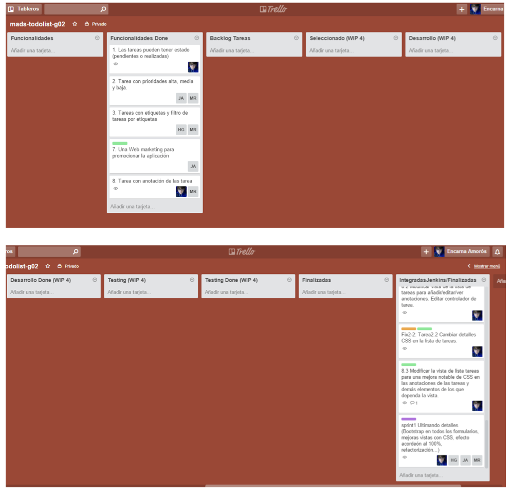

= Práctica 4 - Iteración con Scrum, Kanban e integración continua
Domingo Gallardo <domingo.gallardo@ua.es>
:Date:      :docdate:
:Revision:  0.3
:lang: es
:toc:
:toc-title: Índice
:toclevels: 3
:numbered:
:source-highlighter: pygments
:icons: font
:last-update-label!:

ifdef::pdf[]
:huge-size: scaledwidth="100%"
:large-size: scaledwidth="66%"
:normal-size: scaledwidth="50%"
:small-size: scaledwidth="33%"
:tiny-size: scaledwidth="25%"
endif::[]

ifndef::pdf[]
:huge-size: width="100%"
:large-size: width="66%"
:normal-size: width="50%"
:small-size: width="33%"
:tiny-size: width="25%"
endif::[]

Versión:  {revision} ({docdate})

Durante las 4 semanas de la práctica el equipo realizará una iteración para desarrollar un incremento de la aplicación `play-todolist` usando Scrum, Kanban e integración continua con GitFlow y Jenkins.

* Práctica en grupo, continuando con el mismo equipo y proyecto que la práctica 3 (12 grupos).
* 4 semanas: entrega el 22 de diciembre y presentación en la clase de teoría del 23 de diciembre.

== Scrum

* Se deberán realizar los eventos definidos por Scrum, tomando nota y redactando un informe con la fecha de la reunión, su duración y su desarrollo. Se deberán realizar las siguientes reuniones:
1. planificación del sprint
2. scrum diario (3 reuniones)
3. revisión del sprint
4. retrospectiva del sprint
* Se deben elaborar los siguientes artefactos y dejarlos compartidos como documentos Google Docs / Spreadsheet:
** *_Backlog_ del proyecto*. Se elaborará la primera semana. Contendrá todas las funcionalidades que se incluirían en todo el desarrollo del proyecto, junto con su valoración en puntos en escala Fibonacci (1, 2, 3, 5, 8, 13, 20, 40). Suponemos que el proyecto total tendrá una duración de 12 sprints. No hace falta definir con detalle todas las funcionalidades, ni tampoco es obligatorio usar el formato de historia de usuario. Pero las funcionalidades deben estar expresadas en un lenguaje que entienda el cliente final de la aplicación, no ser funcionalidades técnicas (esas hay que incluirlas en el tablero Kanban). Sirve para definir una visión que permita ver la dirección del desarrollo. Se pueden expresar en forma de lista de guiones. Si la lista es muy larga es conveniente estructurarla, dividiéndola en distintos apartados. Ordenar la lista (o listas) por orden de prioridad.
** *_Backlog_ del sprint*. Tomando como base este el _backlog_ del proyecto se definirá el _backlog_ del sprint. La puntuación de las funcionalidades del proyecto final debe ser 12 veces las del sprint.
* Todos los miembros deberán tomar el papel _product owner_ y aportar ideas y sugerencias para el _backlog_ del producto.
* Compartir el _backlog_ del proyecto y del sprint con todos los miembros del equipo (y con el profesor: `domingo.gallardo@gcloud.ua.es`) y dejar los enlaces en la página principal de Bitbucket (el documento `README.md`). 

==  Kanban y Trello

* Usaremos Trello como tablero Kanban de las *tareas* a realizar en el Sprint. Compartir el tablero con todos los miemobros del equipo y con el profesor (usuario `domingogallardo`). Poner también el enlace al tablero en el `README.md` del proyecto Bitbucket.
* En la primera semana se definirán las columnas del tablero Kanban. Se colocarán las funcionalidades del _backlog_ del sprint en la primera columna. Posteriormente se irán dividiendo en tareas y moviendo las tareas por el tablero. Cada tarea representa una _feature_ que habrá que desarrollar, probar e integrar en el proyecto (una _feature_ de GitFlow). Cuando todas las tareas de una funcionalidad estén terminadas, la funcionalidad se pasará a la columna de _Hecho_.
* Definiremos las siguientes listas en Trello:
** *Funcionalidades* - Lista completa de funcionalidades del _backlog_ del sprint. Las funcionalidades irán numeradas: 1, 2, 3, ...
** *Funcionalidades terminadas* - Lista a la que moveremos la tarjeta de funcionalidad una vez que se han terminado todas las tareas (_features_) que la componen y se han pasado todos los tests funcionales de aceptacion asociados a la funcionalidad.
** *Features* o tareas - Lista completa de tareas en las que se descomponen las funcionalidades. Numeración: 1.1, 1.2, 1.3, ...
** *Seleccionadas* (con WIP) - Características listas para el desarrollo
** *En desarrollo* (con WIP) - Características en desarrollo. Cada característica debe corresponderse con una rama de Git.
** *En desarrollo - Done* - Se ha terminado el desarrollo y los tests unitarios.
** *Integración* (con WIP) - Se ha lanzado el _pull request_ pidiendo la integración de la característica en la rama `develop`.
** *Integración - Done* - Se ha aprobado el _pull request_, se ha realizado la integración en la rama y Jenkins dice OK.
** *Pruebas funcionales* - Se realizan las pruebas funcionales de la característica.
** *Terminada* - La característica ha pasado las pruebas funcionales.
* Definir los bugs como tareas especiales (usar las etiquetas de Trello).
* Documentar la evolución del tablero Kanban.

Un ejemplo del tablero de un equipo del curso pasado:

== Integración continua con GitFlow

* Usaremos GitFlow para desarrollar e integrar las _features_. Cada _feature_ de GitFlow se debe corresponder con una tarjeta de Trello. La tarjeta se irá moviendo por los tableros hasta que esté terminada (el _pull request_ se haya aceptado y se integre en la rama de develop sin errores).
* A diferencia de la práctica anterior, donde había un _git master_, en esta práctica todos los miembros del equipo van a tener también ese papel. Así, el responsable de la _feature_ creará la rama, realizará los commits sobre ella (puede recibir ayuda de algún compañero, pero no es obligatorio), creará el _pull request_, probará la integración con `develop` en su repositirio local y, si todo va bien, aceptará él mismo el _pull request_ para hacer el merge con `develop` en Bitbucket. En el apartado 2.4 del enunciado de la práctica 3 está la información de cómo aceptar el _pull request_.
* El equipo podría definir la política de que al menos otro miembro del equipo apruebe también el _pull request_ de una _feature_ (¡cuatro ojos ven más que dos!).
* Al final del sprint se hará un release de la nueva versión.

== Presentación e informe

* En la presentación del 23 de diciembre se hará una demo de la nueva versión y una presentación (10 minutos) de todo lo realizado: metodología, artefactos, retrospectiva.
* El informe de la práctica deberá contener al menos:
** Informes sobre las reuniones de Scrum (planificación del sprint, 3 scrum diario, revisión y retrospectiva).
** _Backlog_ del producto y _backlog_ del sprint (junto con enlaces a los documentos Google Docs).
** Informe sobre el uso de Kanban y Trello.
