## Metodologías ágiles de desarrollo de software

<kbd></kbd>

<kbd></kbd>

- En esta sesión vamos a realizar **una introducción** a los temas y
  conceptos que vamos a estudiar en la asignatura.
- Repasaremos algunos conceptos que todos conocemos, pero dándoles la
  **orientación específica** que vamos a utilizar en la asignatura.

<kbd></kbd>

- Es importante comprobar qué entendemos por desarrollo de software
  **antes** de empezar la asignatura.
- Hay tantas formas de hacer un desarrollo como
  empresas/desarrolladores.
- **No hay que ser dogmático**: en la asignatura vamos a estudiar una
  idea general de cómo se debe hacer un buen desarrollo de un proyecto
  usando las denominadas _metodologías ágiles_. Cada
  empresa/desarrollador **adapta** estas ideas a sus propios
  procesos. Y cada metodología tiene sus condiciones de uso y
  situaciones en las encaja mejor.
- Haremos un **esquema** en la pizarra conforme se contestan las
  preguntas.

<kbd></kbd>

<kbd></kbd>

- Las metáforas ayudan a establecer una **cultura**, un estilo común
  de trabajo en el equipo o en la empresa. Una cultura proporciona un
  conjunto de **reglas invisibles** que todos cumplimos de forma casi
  automática. Estas reglas proporcionan un contexto común y favorecen
  que todos nos movamos en una dirección similar.
- Un excelente ejemplo de cultura ingenieril es la de Spotify,
  explicada en dos excelentes vídeos de Henrik Kniberg:
  [Spotify engineering culture (part 1)](https://labs.spotify.com/2014/03/27/spotify-engineering-culture-part-1/)
  y
  [Spotify engineering culture (part 2)](https://labs.spotify.com/2014/09/20/spotify-engineering-culture-part-2/).

<kbd>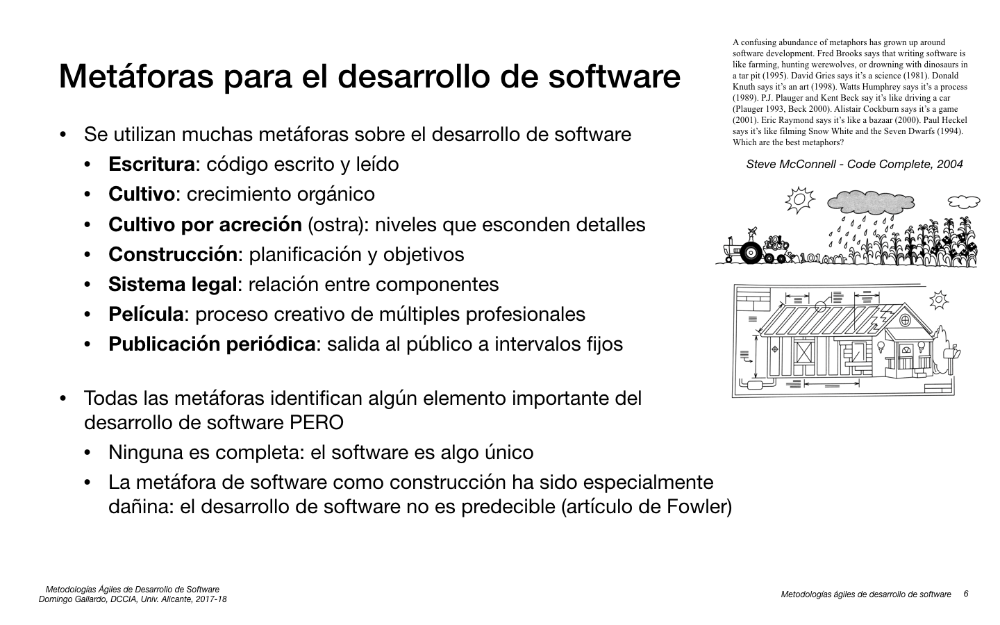</kbd>

- El software es **multidimiensional**, se puede considerar desde
  muchos puntos de vista. Por eso hay múltiples metáforas, todas ellas
  correctas porque resaltan uno de sus aspectos.
- El artículo de Martin Fowler
  [The new methodology](../../lecturas/martin-fowler_the-new-methodology.pdf)
  explica perfectamente por qué la metáfora de la construcción no es
  buena: el desarrollo de software no es una actividad predictiva,
  sino **adaptativa** (más sobre ello en otras diapositivas).

<kbd>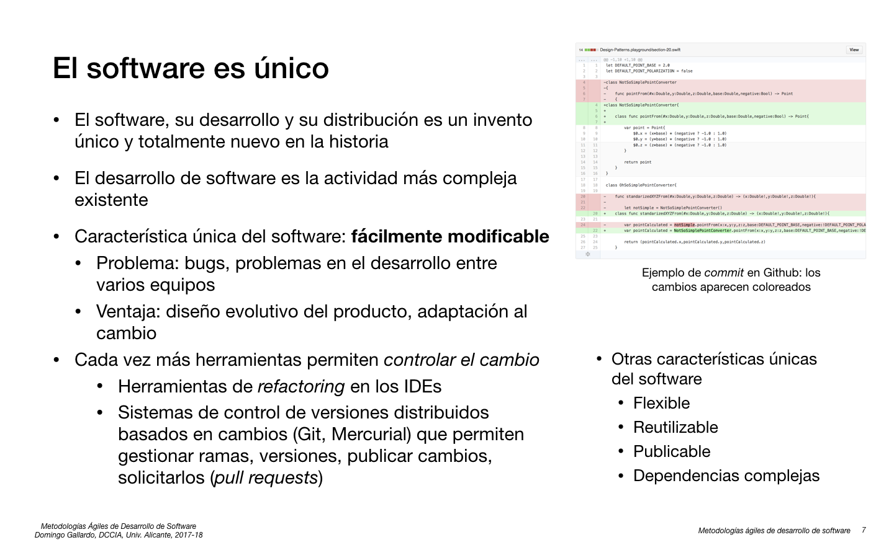</kbd>

- Una de las características distintivas más importantes del software,
  frente a otros productos desarrollados por otras ingenierías, es
  **la facilidad de su modificación**. Una casa, una vez construida,
  es muy difícil de modificar. Los ciclos de modificación de productos
  de consumo como teléfonos móviles, ordenadores, televisores,
  automóviles, etc. son de meses o años.
- El software es totalmente distinto en este aspecto: es posible
  escribir y publicar una actualización en **minutos o horas**.
- El software debe ser _soft_.

<kbd>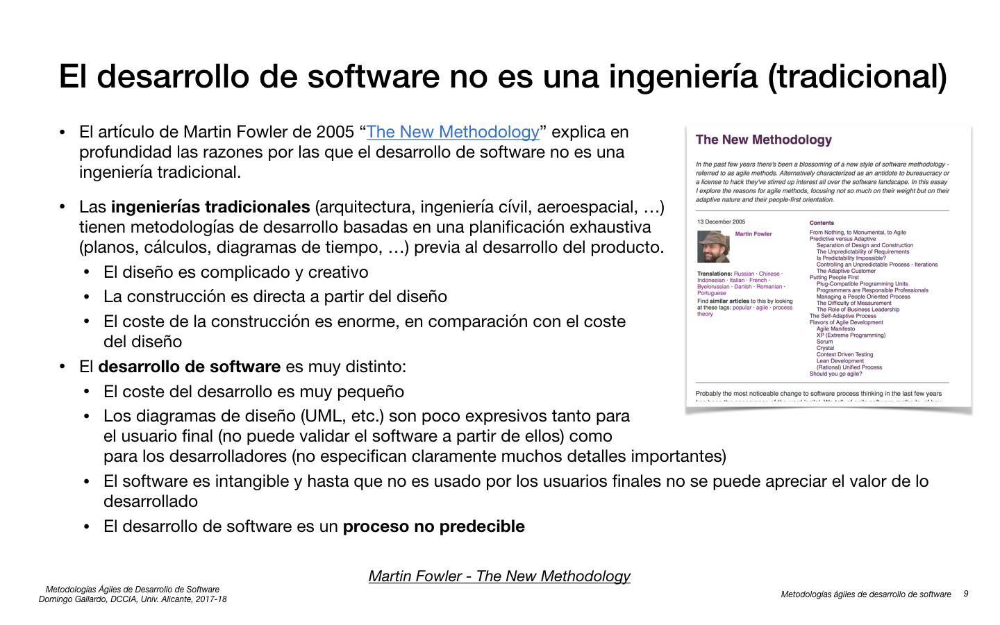</kbd>

- **Obligatorio leer y estudiar** el artículo de Martin Fowler
  [The new methodology](../../lecturas/martin-fowler_the-new-methodology.pdf)
  que explica la diferencia entre las ingenierías tradicionales y la
  ingeniería del software. El artículo también proporciona una buena
  introducción a las metodologías ágiles (la **nueva metodología**):
  - Uno de los puntos más importantes del artículo es el que argumenta
    que los requerimientos de un proyecto software **no son
    predecibles**.
  - La forma de controlar un proceso no predecible es mediante
    **iteraciones cortas**.
  - El enlace original al artículo de Martin Fowler
    [es este](http://www.martinfowler.com/articles/newMethodology.html).

<kbd></kbd>

- Juego de palabras en inglés: **_build the right thing_** y **_build
  the thing right_**.
- Una buena metodología sirve para construir un producto fiable,
  mantenible, en el tiempo correcto.
- Tan importante como eso es diseñar el conjunto de características
  (_features_) que satisfacen mejor los objetivos finales del
  proyecto: **software que funciona** (_working software_).

<kbd></kbd>

- Un proyecto con éxito es el resultado de una buena combinación de
  cuatro elementos: personas, proceso (metodología), producto (alcance
  y complejidad del software a desarrollar) y tecnología utilizada.
- Un cambio grande en alguna de estas dimensiones es una decisión de
  gran calado, que habría que realizar al comienzo de un nuevo
  proyecto. En los proyectos en marcha se pueden realizar ajustes y
  **pequeños experimentos** que permitan comprobar cómo mejorar.

<kbd>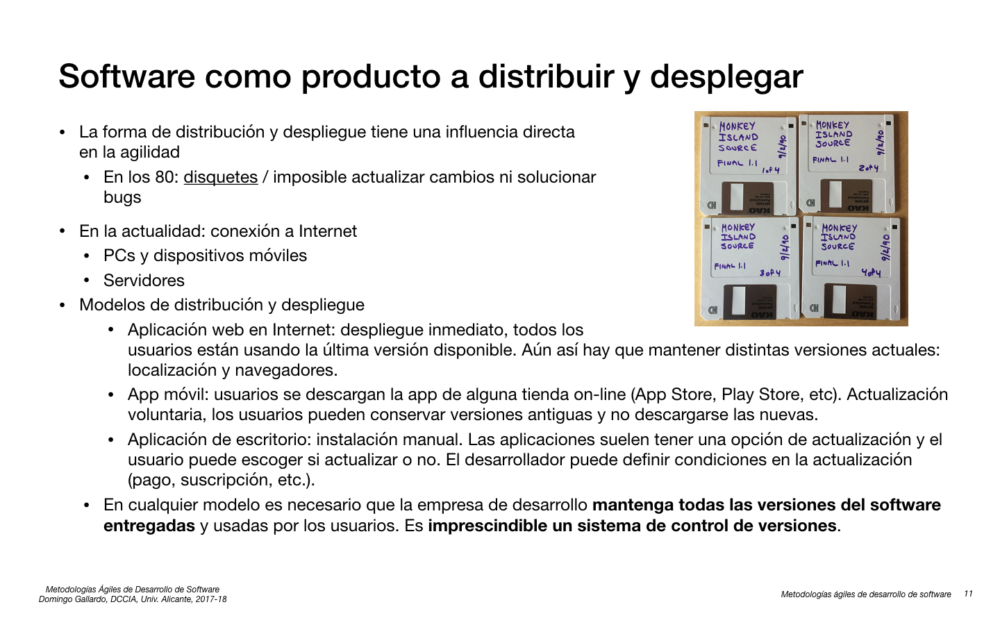</kbd>

- La forma de **desplegar** un producto software para que pueda ser
  usado por los clientes ha cambiado mucho en los últimos años.
- Las aplicaciones web hacen posible despliegues instantáneos de
  nuevas versiones.
- Un enlace a la [wikipedia](https://es.wikipedia.org/wiki/Disquete)
  con la explicación de qué es un disquete, para todos los que no los
  hayan conocido.

<kbd></kbd>

- El valor de un proyecto, o de una funcionalidad, es lo contento que
  se queda el cliente cuando lo usa.
- Es difícil comprobar el valor de una funcionalidad hasta que no se
  usa de verdad.
- El software en funcionamiento es un sistema complejo en el que
  participan usuarios, otro software, datos, etc.

<kbd></kbd>

- El concepto de **deuda técnica** aparecerá más de una vez en la
  asignatura: parches, o arreglos rápidos que hacemos en el software
  _para que funcione_, pero que son muy difíciles de mantener y
  adaptar.
- Es una metáfora. Como cualquier deuda, tarde o temprano tendremos
  que pagarla. Una buena explicación sobre el concepto, con bastante
  detalle, la puedes encontrar en este
  [post de Javier Garzás](http://www.javiergarzas.com/2012/11/deuda-tecnica-2.html).

<kbd></kbd>

<kbd>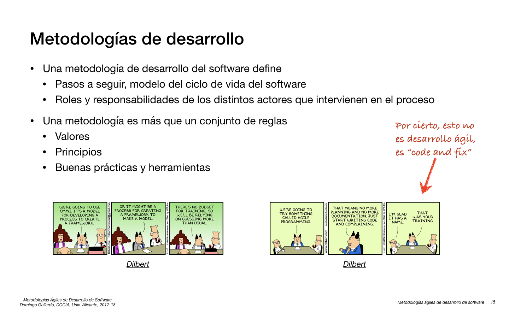</kbd>

<kbd>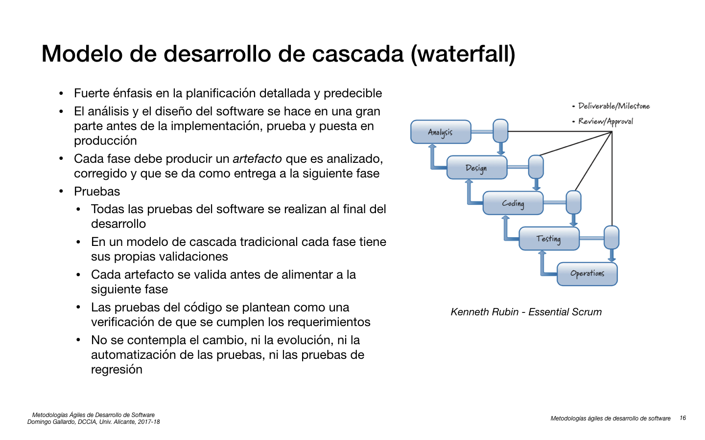</kbd>

- En el modelo de cascada el conjunto de requisitos está totalmente
  definido y cerrado.
- Se piensa que el trabajo creativo, de diseño, es sólo la fase de
  especificación de requisitos, y que el resto del proceso es "picar
  código".
- Problemas: demasiado tiempo para probar una versión en
  funcionamiento, el testing al final hace muy difícil la
  rectificación, la integración con otros desarrollos es es misión
  imposible.

<kbd>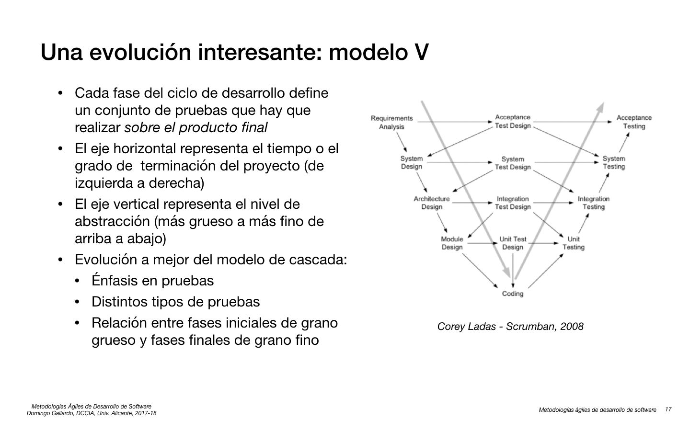</kbd>

- Una de las características más importantes del modelo en V es que se
  muestra gráficamente la relación los distintos **niveles de
  abstracción del desarrollo**. Además, **cada nivel de desarrollo
  tiene pruebas** específicas que lo validan. Existen pruebas de
  aceptación de los requisitos, pruebas de diseño del sistema, que
  validan la arquitectura, pruebas de integración y pruebas
  unitarias. Las pruebas se diseñan **al mismo tiempo** que el
  software en cada uno de los niveles.

<kbd>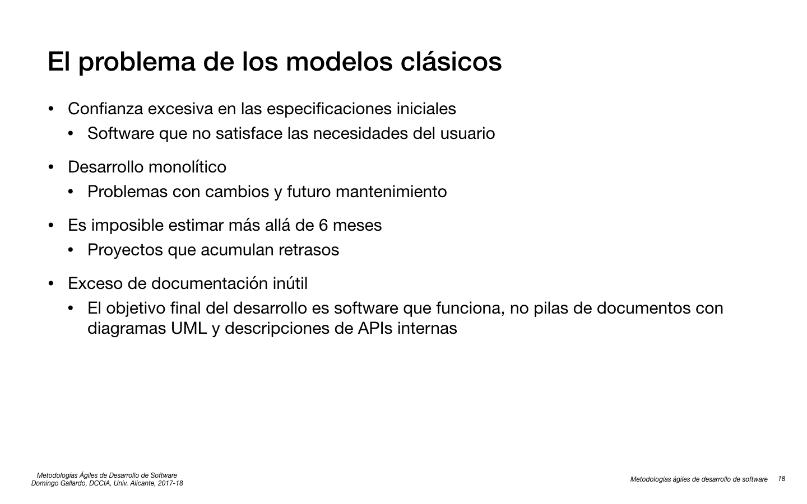</kbd>

<kbd>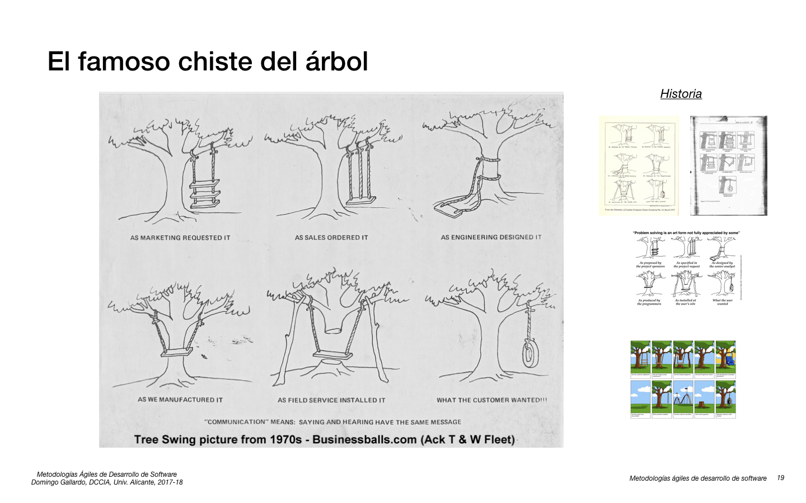</kbd>

- Ya os habrán contado el **_chiste del columpio en el árbol_** en
  alguna otra asignatura. La moraleja es muy visual: cada uno
  interpreta a su manera lo que el cliente necesita. Es un ejemplo muy
  visual de la importancia de escuchar bien al cliente y **saber
  interpretar y descubrir** sus necesidades.
- Las distintas imágenes están sacadas de un artículo en el que se
  explica
  [la historia del chiste](http://www.businessballs.com/treeswing.htm).

<kbd>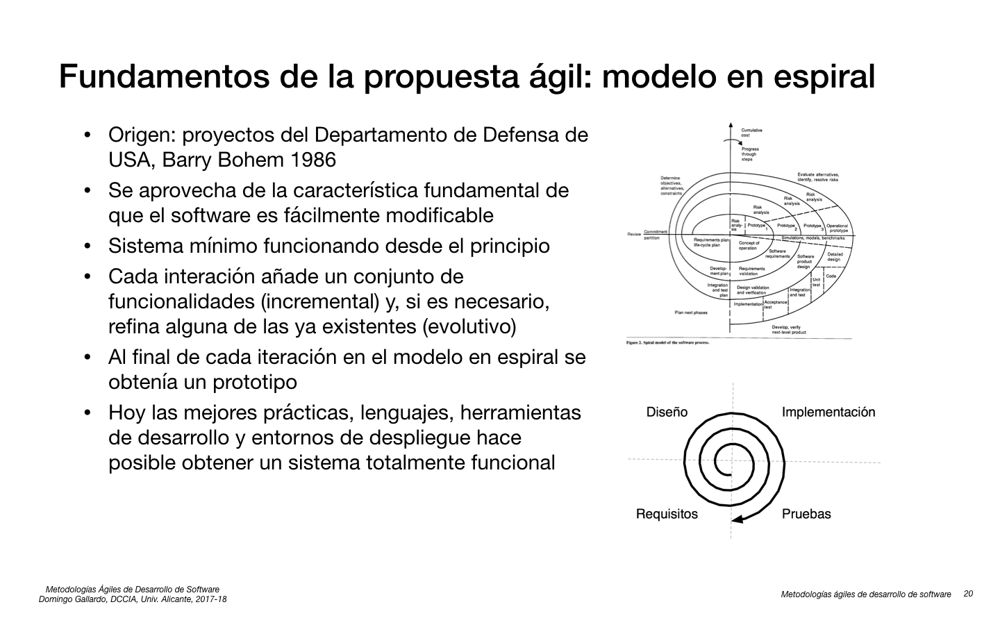</kbd>

- El modelo en espiral es un **antecesor** de los modelos de
  desarrollo ágil.
- Un desarrollo basado en prototipos permite tener una
  **retroalimentación rápida** y determinar pronto que funcionalidades
  son las que sirven y cuáles las que no. También permite **mejorar la
  estimación** del tiempo necesario para terminar el proyecto final.
- Un prototipo no tiene el 100% de la implementación de cada
  funcionalidad, pero permite **comprobar el funcionamiento** de
  distintos aspectos (usabilidad de las funcionalidades de cara al
  usuario, rendimiento, funcionamiento de la arquitectura, etc.).
- El cliente puede probar pronto el prototipo e **indicar posibles
  modificaciones**.
- El uso de prototipos es habitual en otros disciplinas, como el
  diseño de productos (con **impresoras 3D**) o el cine y los
  videojuegos (con modelos y escenas de baja fidelidad).

<kbd>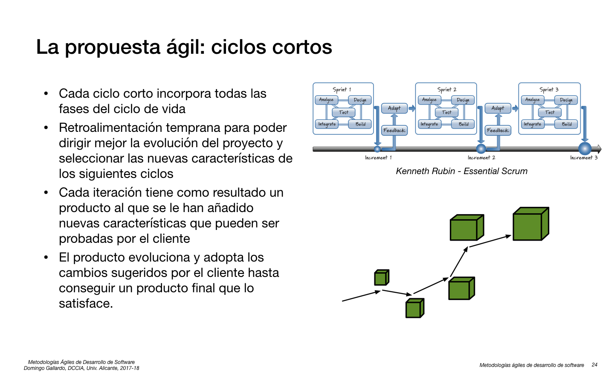</kbd>

<kbd></kbd>

<kbd>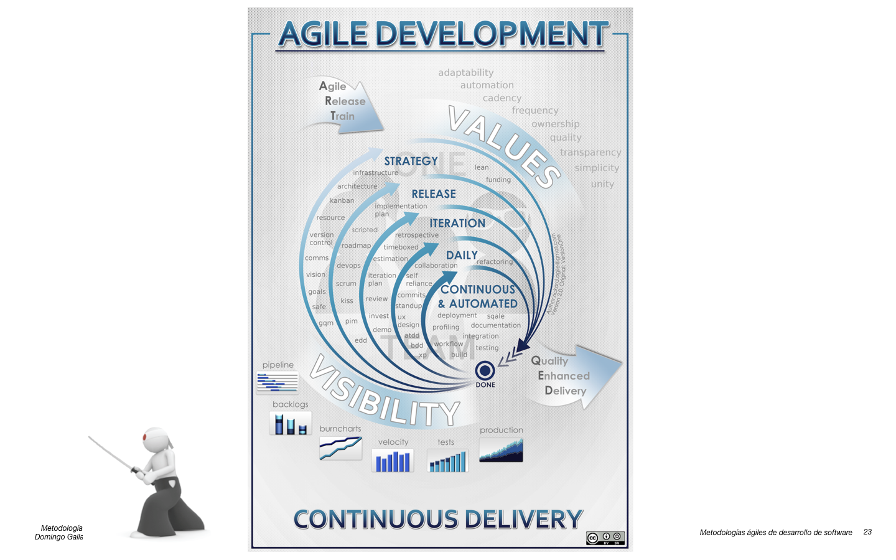</kbd>

- Muchas palabras en un único cartel: adaptabilidad, automatización,
  cadencia, frecuencia, propiedad, calidad, transparencia, unidad,
  tubería, backlogs, burnchats, velocidad, tests, producción,
  despliegue, flujo de trabajo, build, integración, testing, XP,
  colaboración, devops, ...
- Veremos muchas de ellas en la asignatura.
- La imagen del samurai la han tomado prestada de la portada de un
  interesante libro:
  [The Agile Samurai](https://pragprog.com/book/jtrap/the-agile-samurai).

<kbd>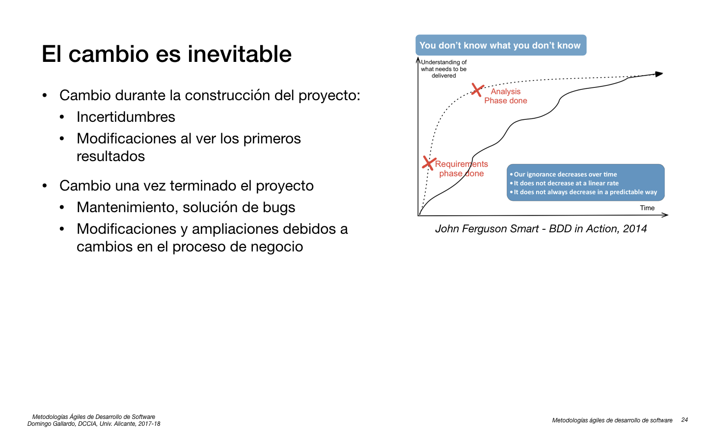</kbd>

- El objetivo del desarrollo es **resolver un problema** del
  cliente. Ya hemos comentado que esto implica un proceso iterativo de
  diseño en el va a ser obligado reajustes de dirección y cambios en
  el proyecto.
- "No sabemos lo que no sabemos": el proceso de desarrollo también es
  un **proceso de exploración en las necesidades** del cliente
  mediante la **comunicación continua**.
- Una vez terminado el proyecto siempre va a haber que
  **mantenerlo**. Se puede cobrar una licencia semestral o anual para
  mantenimiento básico: actualizaciones básicas, solución de bugs,
  adaptación a nuevas versiones de librerías y dependencias.
- Las necesidades de cambios en el negocio serán también
  **oportunidades** de nuevos contratos de desarrollo.

<kbd>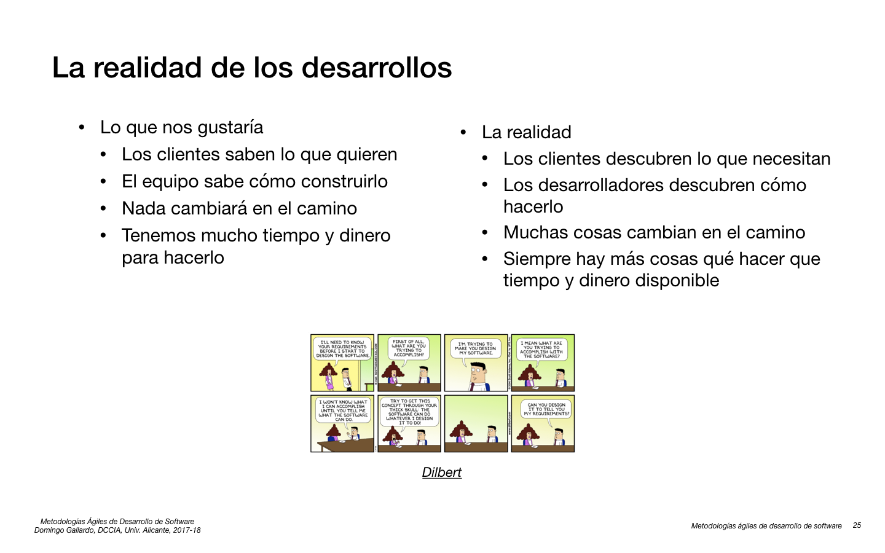</kbd>

<kbd>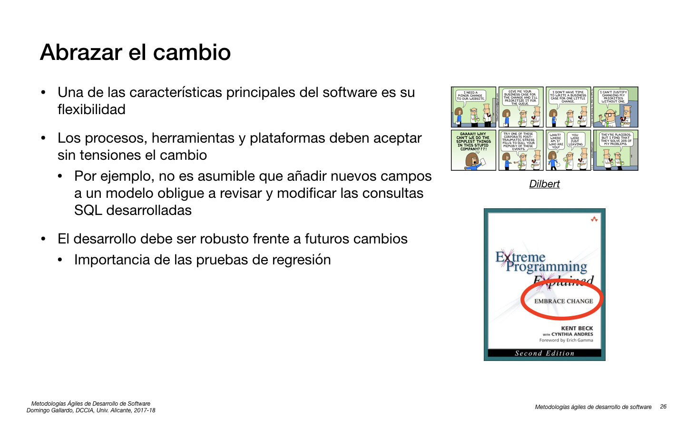</kbd>

- Es fundamental utilizar herramientas, frameworks, diseños de código,
  etc. que permitan **introducir cambios fácilmente** en la
  aplicación.
- También es básico diseñar y ejecutar tests de los distintos módulos
  y funcionalidades del producto conforme se va desarrollando. De esta
  forma tenemos una red de seguridad con la que asegurarnos de que los
  **nuevos cambios no rompan ninguna funcionalidad** ya
  introducida. Esto es lo que se denomina _regression testing_.

<kbd>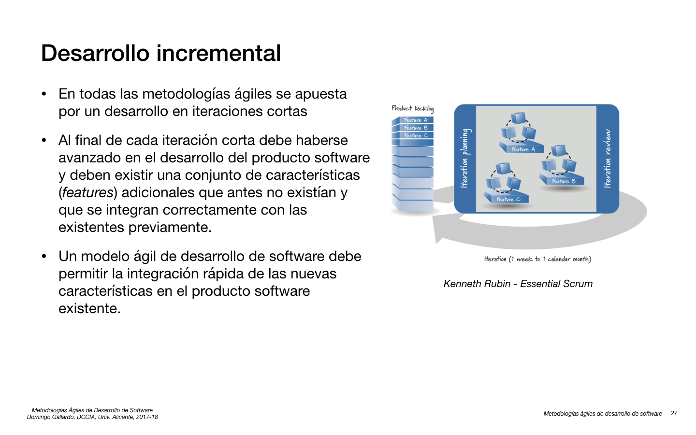</kbd>

- ¿Cuánto de corta debe ser una iteración? **2 o 3 semanas** es una
  cantidad de tiempo razonable.
- La iteración es importante para definir una **cadencia de hitos**
  (por ejemplo, reuniones con el cliente para hacer demostraciones),
  pero es tan importante o más que el flujo de trabajo permita
  introducir funcionales nuevas de forma continua. Veremos que Kanban
  refuerza más este concepto de **flujo continuo**.
- En inglés se habla siempre de **_features_** para referirse a
  elementos de la aplicación que el proporcionan valor al
  usuario. Nosotros traduciremos el término por **característica** o
  **funcionalidad**. Frente a estos términos, el término de
  **requisito** no es demasiado apropiado en un marco moderno de
  metodologías ágiles, es más propio de modelos antiguos de desarrollo
  en cascada.

<kbd>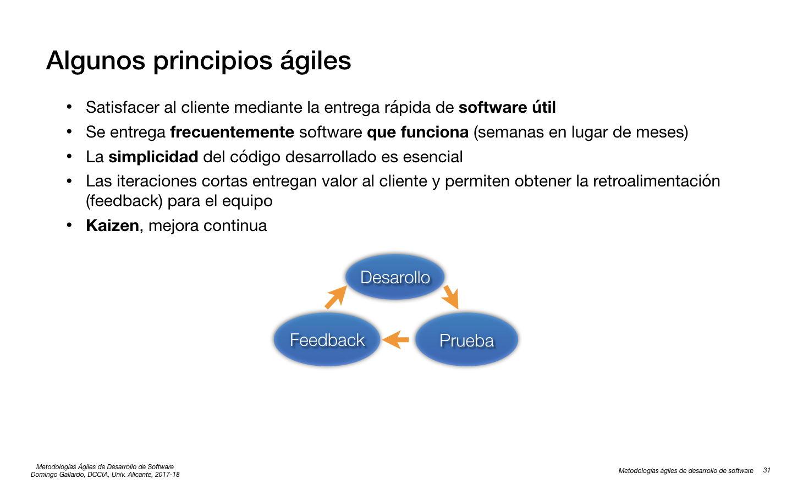</kbd>

- Los veremos con más detalle la semana que viene, cuando hablemos del
  **manifiesto ágil**.

<kbd>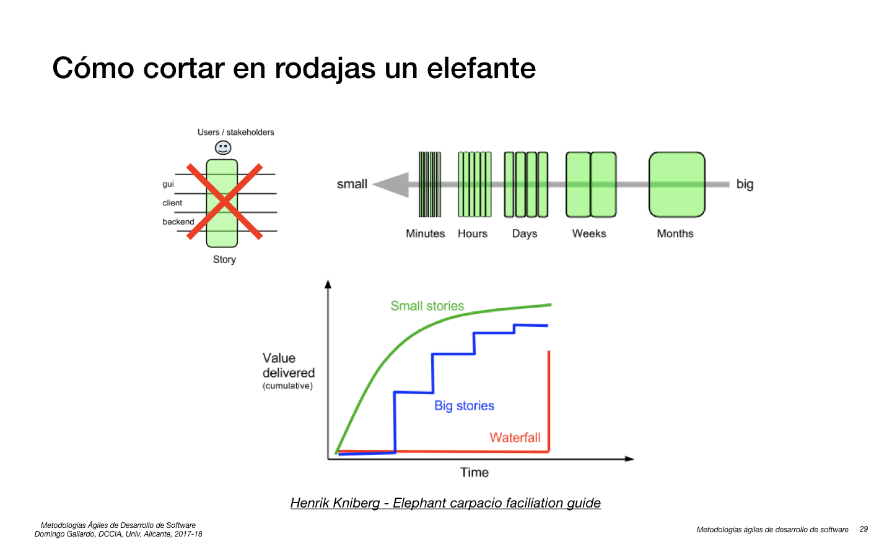</kbd>

- Cuando realizamos un desarrollo incremental hay que incluir en cada
  incremento **todas las capas** de la aplicación (acceso a datos,
  lógica de negocio, presentación) para que el cliente pueda comprobar
  la aplicación. La capa de presentación puede no estar terminada, o
  ser sólo un prototipo, pero debe funcionar correctamente, tal y como
  funcionará el producto final.
- Debemos intentar siempre **descomponer** una funcionalidad grande en
  varias _sub-funcionalidades_ más pequeñas. Pero todas ellas deben
  tener todas las capas de la aplicación.
- La gráfica es muy buena: indica cómo va creciendo el valor del
  producto dependiendo del tamaño de las funcionalidades. Además las
  funcionalidades que aportan mayor valor deberían introducirse **al
  principio** del desarrollo, dejando para el final las
  funcionalidades menos valiosas (ajustes de interfaces de usuario,
  características para usuarios avanzados, etc.)

<kbd></kbd>

- El concepto de Producto Mínimo Viable (MVP, _Minimum Viable
  Product_) tiene su origen en la necesidad de las _startups_ de
  lanzar **muy rápido** algo con lo que poder captar usuarios (e
  inversores).
- Es uno de los elementos de la propuesta de Eric Ries para aplicar la
  filosofía _lean_ a las _startups_ denominada
  [**_lean startup methodology_**](http://theleanstartup.com/pribnciples).

<kbd>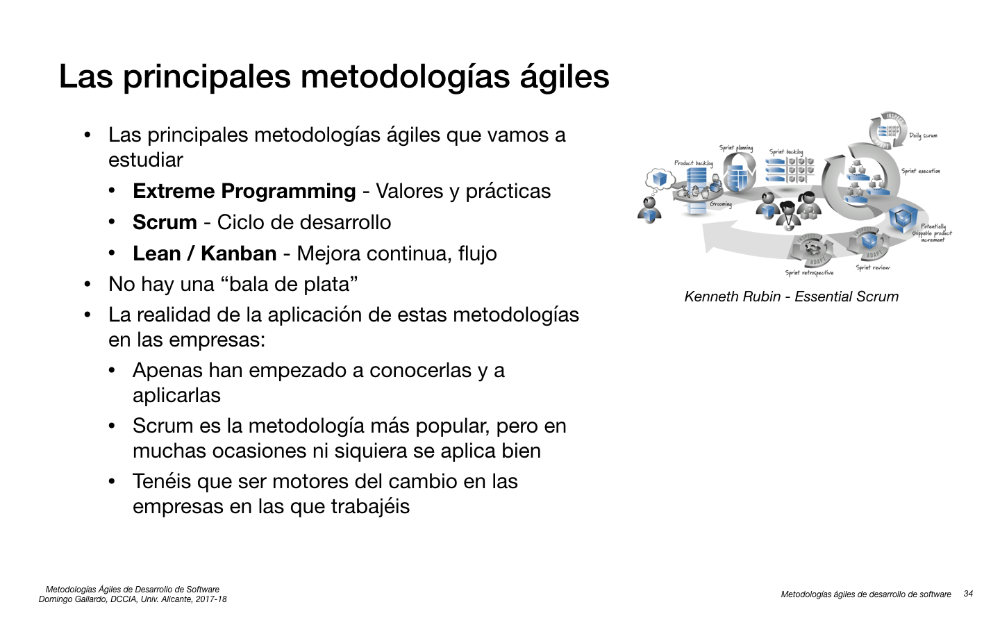</kbd>

- No existe ninguna _bala de plata_ (_silver bullet_) que de la
  respuesta mágica al desarrollo de software (artículo de Brooks:
  [No Silver Bullet](../../lecturas/Brooks-NoSilverBullet.pdf)).

<kbd>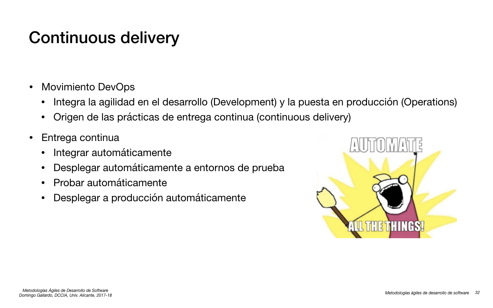</kbd>

- La entrega continua es la respuesta a las prácticas tradicionales en
  las que la integración y el despliegue se hace al final de todo el
  proceso de desarrollo, de forma manual y costosa.
- Muy importante las nuevas herramientas y tecnologías: Git, Docker,
  Cloud.
- Hablaremos de que el _continuous delivery_ es un paso más allá de la
  propuesta de **integración continua** en la que todas las noches un
  **servidor de integración continua** lanza automáticamente los tests
  sobre la rama de desarrollo y saltan las alarmas si no se pasan
  todos los tests.
- Muchas de estas ideas vienen del **desarrollo de software _open
  source_**, en el que múltiples desarrolladores colaboran de forma
  remota para lanzar _releases_ coherentes y sin fallos de productos
  de gran complejidad (el desarrollo de Linux es un de los ejemplos
  principales). Ver, por ejemplo, el documento
  [_Understanding the Open Source Development Model_](https://www.linux.com/publications/understanding-open-source-development-model)
  de Ibrahim Haddad en 2011.

<kbd>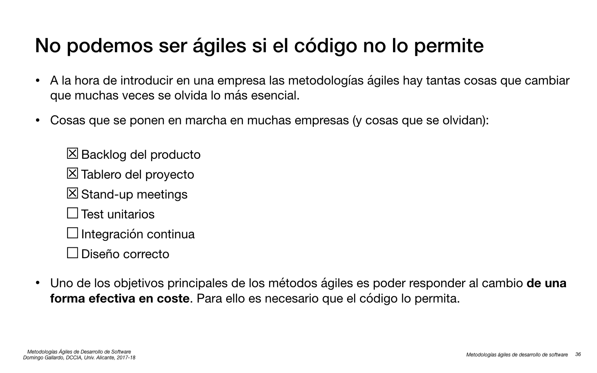</kbd>

- Veremos con más detalle estos principios en el tema correspondiente.

<kbd>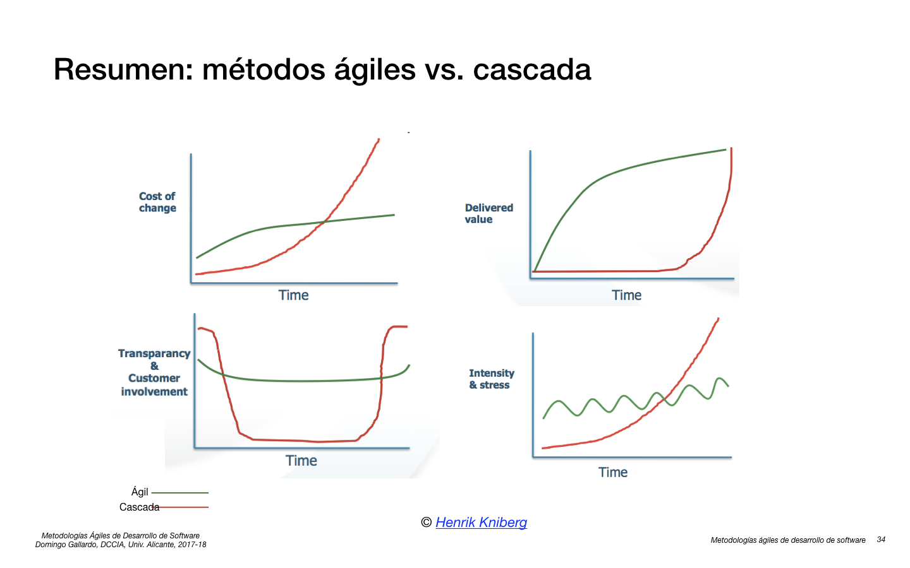</kbd>

- Cuatro gráficas muy relevantes sacadas de la
  [pila de diapositivas de Henrik Kniberg](https://dl.dropboxusercontent.com/u/1018963/Henrik%20Kniberg%20Agile%20Lean%20Slides.pdf)
  sobre Agile. Usaremos alguna de sus diapositivas más de una vez
  (¡pero siempre referenciándolas!).
- Las gráficas la evolución de cuatro métricas respecto al tiempo de
  desarrollo de un proyecto en metodologías tradicionales (cascada) y
  ágiles:
    - Coste de la introducción de cambios en el proyecto
    - Valor entregado
    - Transparencia y participación del cliente
    - Intensidad de trabajo y estrés

<kbd></kbd>

<kbd></kbd>

- En España cada vez más empresas están introduciendo estas
  metodologías. Sobre todo empresas nuevas y _startups_.
- Cada vez más asistencia a eventos como la
  [Conferencia Agile Spain](http://cas2016.agile-spain.org).

<kbd>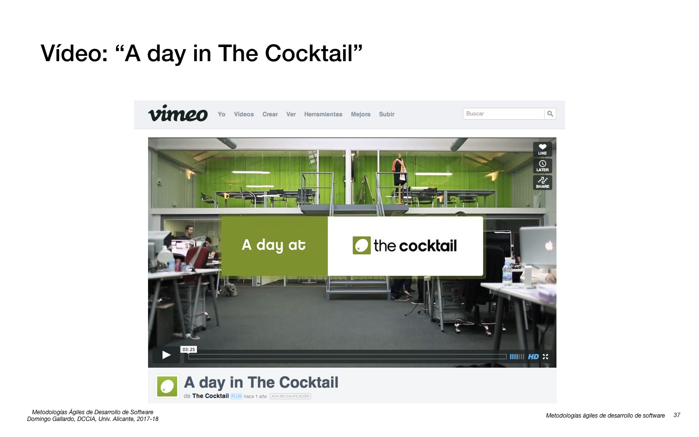</kbd>

- Vídeo: [A day in the Cocktail](https://vimeo.com/44320895)
- El vídeo es
  de 2012. [The Cocktail](https://www.linkedin.com/company/60972?trk=prof-exp-company-name)
  sigue desarrollando software dirigido por
  [Alberto Knapp](https://twitter.com/albertoknapp).

<kbd>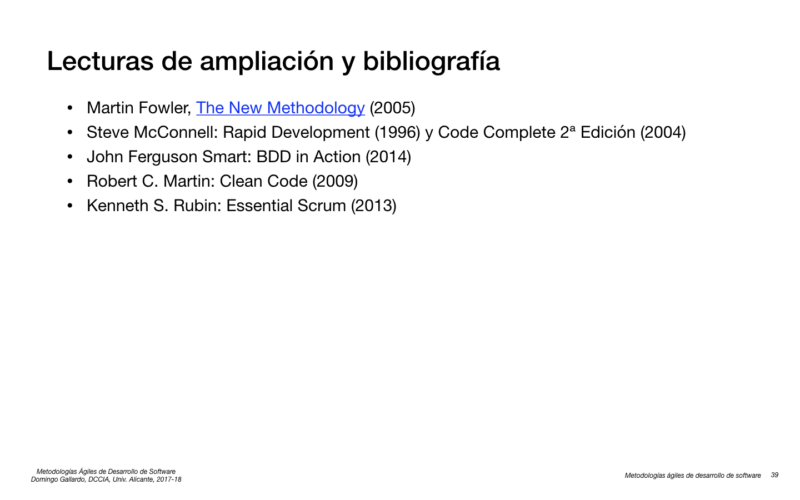</kbd>

Enlaces de la bibliografía:

- Martin Fowler, 2005 - The new methodolgy:
  [versión PDF]((../../lecturas/martin-fowler_the-new-methodology.pdf)),
  [artículo original](http://www.martinfowler.com/articles/newMethodology.html)
- Steve McConnell, 1996 -
  [Rapid Development: Taming Wild Software Schedules](http://www.stevemcconnell.com/rd.htm)
- Steve McConnell, 2004 -
  [Code Complete, 2nd Edition](http://www.stevemcconnell.com/cc.htm)
- [Robert C. Martin](https://sites.google.com/site/unclebobconsultingllc/),
  2009 -
  [Clean Code](https://www.pearsonhighered.com/program/Martin-Clean-Code-A-Handbook-of-Agile-Software-Craftsmanship/PGM63937.html)
- Kenneth S. Rubin, 2013 -
  [Essential Scrum](http://www.innolution.com/essential-scrum)
