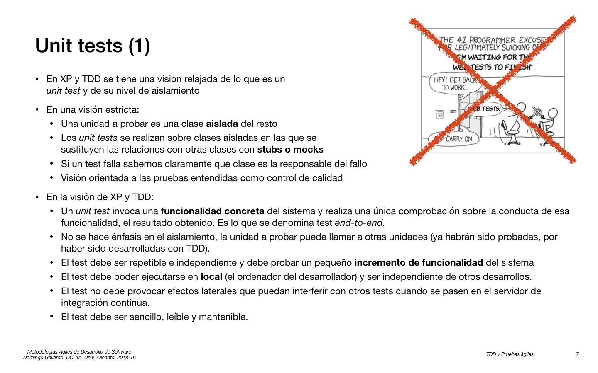
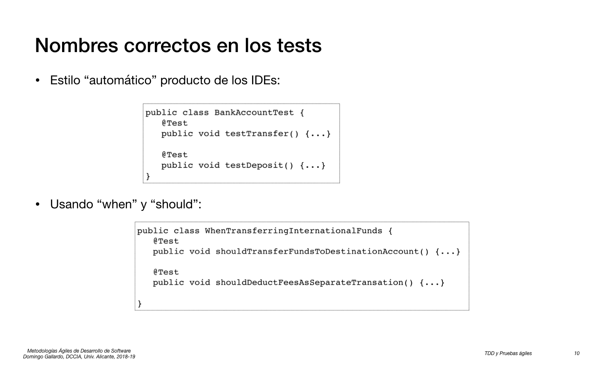
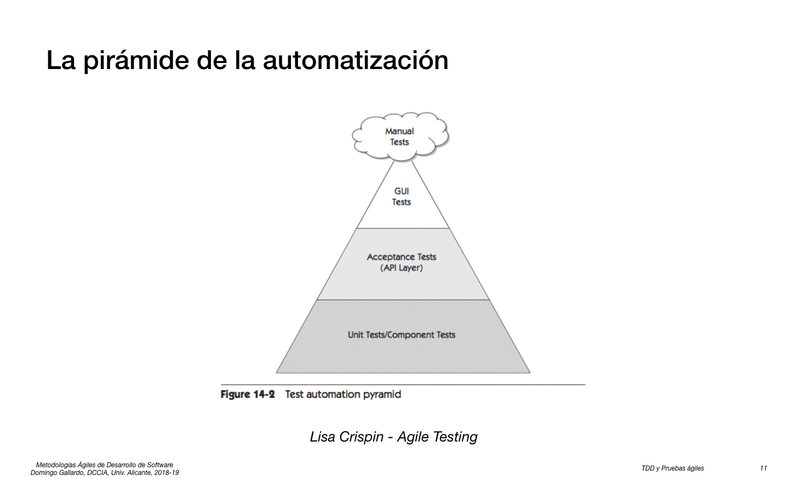
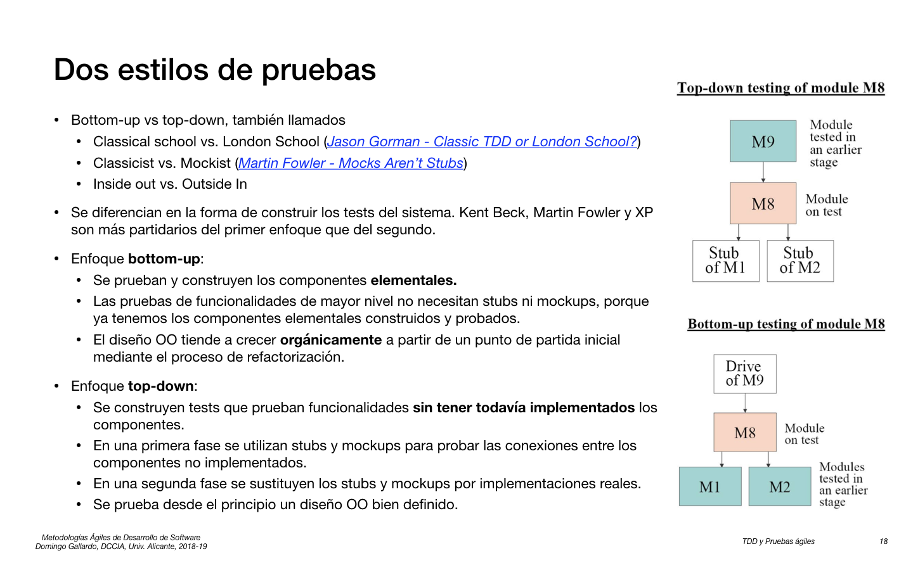
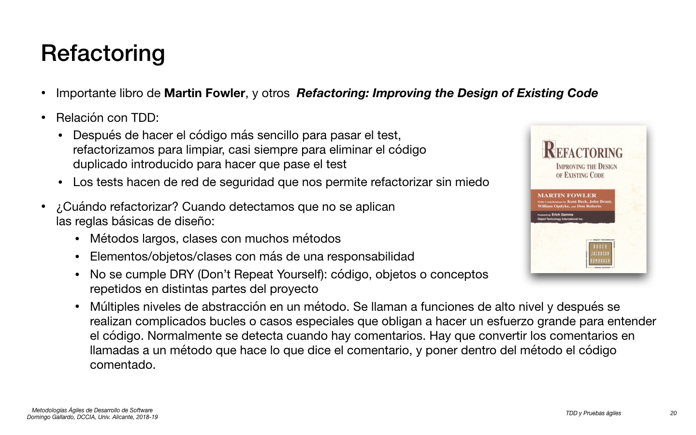

## TDD y pruebas ágiles

<kbd></kbd>

<kbd></kbd>

<kbd></kbd>

<kbd></kbd>

<kbd></kbd>

- [JUnit.org](http://junit.org/junit4/)

<kbd></kbd>

<kbd></kbd>

<kbd></kbd>

- [Twitter](https://twitter.com/mfeathers) de Michael Feathers
- [Working Effectively with Legacy Code](https://www.amazon.com/Working-Effectively-Legacy-Michael-Feathers/dp/0131177052)
- [Mockito](https://github.com/mockito/mockito)
- [unittest.mock](https://docs.python.org/3/library/unittest.mock.html#module-unittest.mock)
- [Sinon.JS](http://sinonjs.org)

<kbd></kbd>

<kbd></kbd>

<kbd></kbd>

<kbd></kbd>

<kbd></kbd>

- [Test-Driven Development by Example](https://www.amazon.com/Test-Driven-Development-Kent-Beck/dp/0321146530)
- [Growing Object-Oriented Software, Guided by Tests](http://www.growing-object-oriented-software.com)

<kbd></kbd>

<kbd></kbd>

<kbd></kbd>

<kbd></kbd>

- [The Three Rules of TDD](http://butunclebob.com/ArticleS.UncleBob.TheThreeRulesOfTdd)

<kbd></kbd>

- [Classic TDD or "London School"?](http://codemanship.co.uk/parlezuml/blog/?postid=987)
- [Mocks Aren't Stubs](http://martinfowler.com/articles/mocksArentStubs.html)

<kbd></kbd>

<kbd></kbd>

- [Refactoring: Improving the Design of Existing Code](https://www.amazon.com/Refactoring-Improving-Design-Existing-Code/dp/0201485672)

<kbd></kbd>

<kbd></kbd>

<kbd></kbd>

<kbd></kbd>

