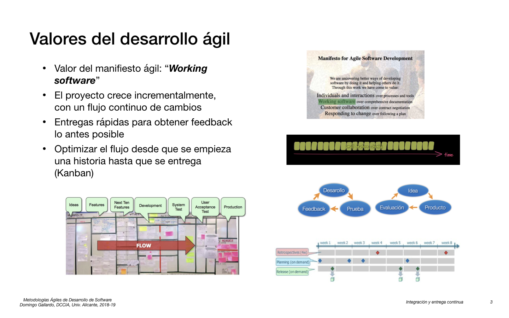
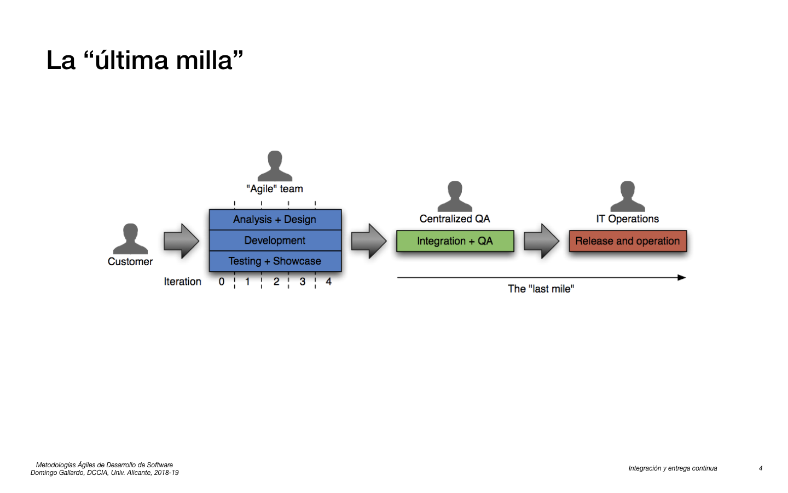
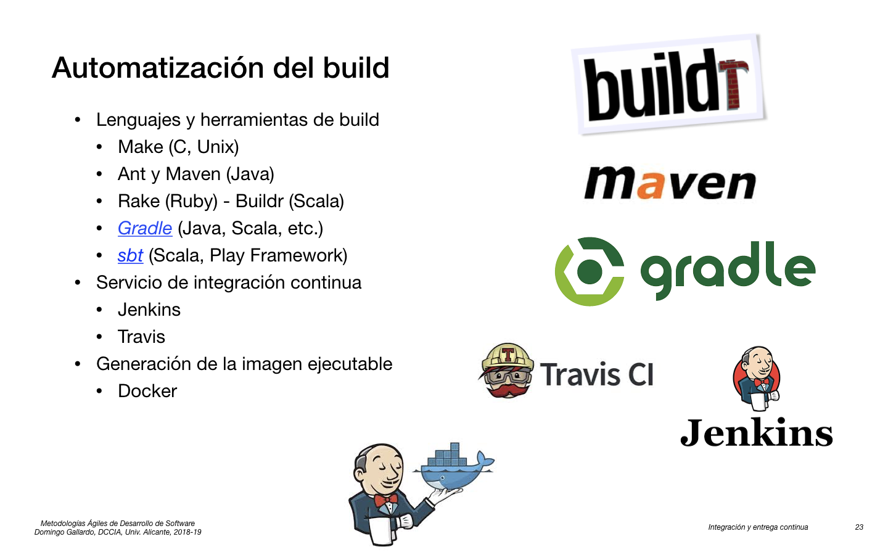
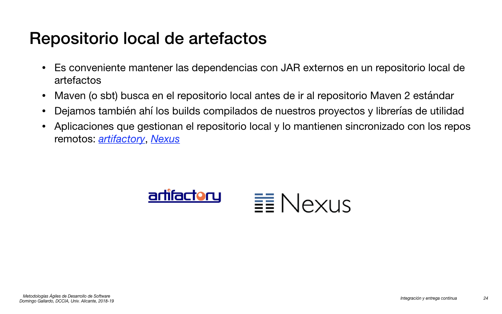
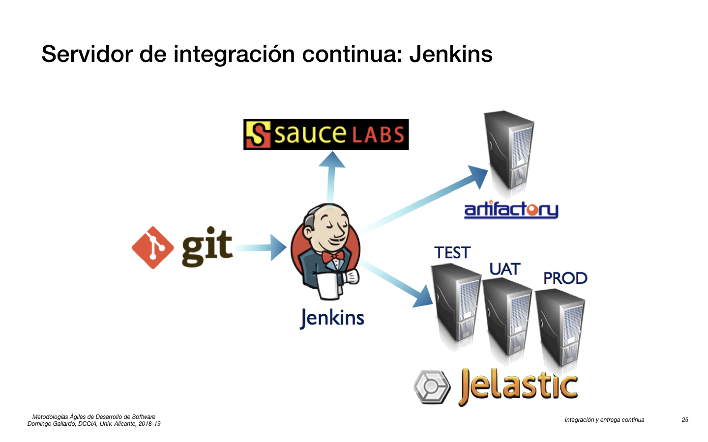
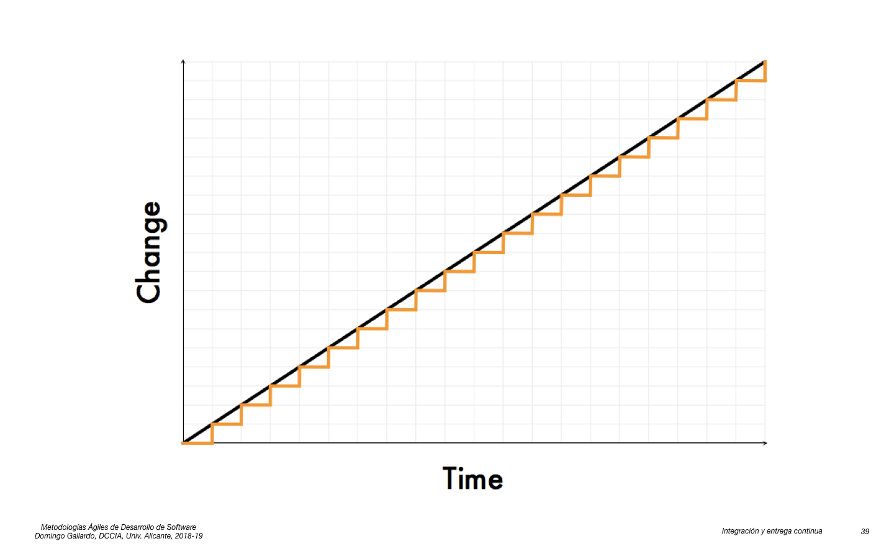
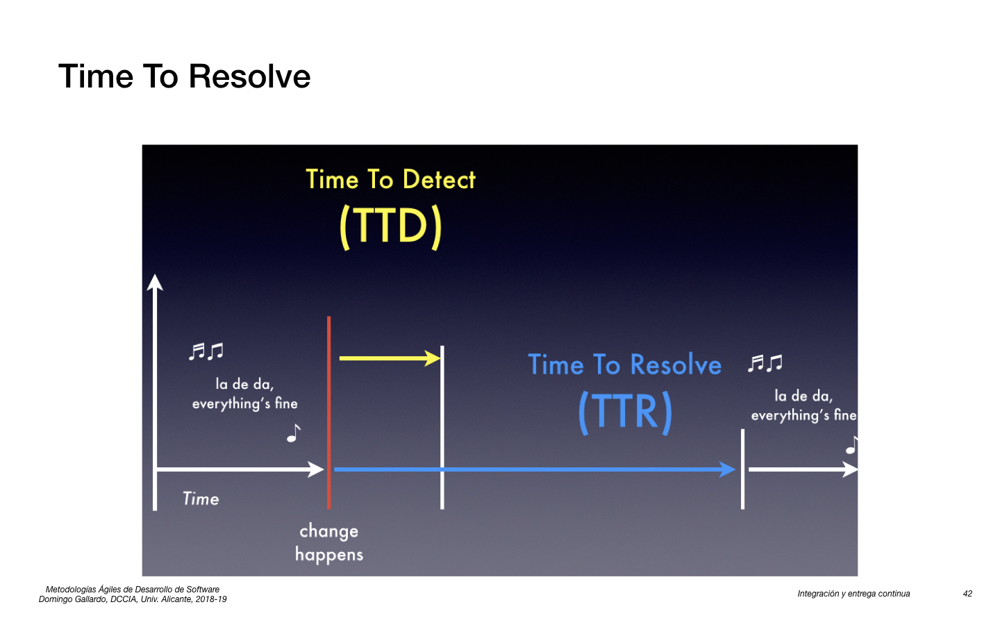
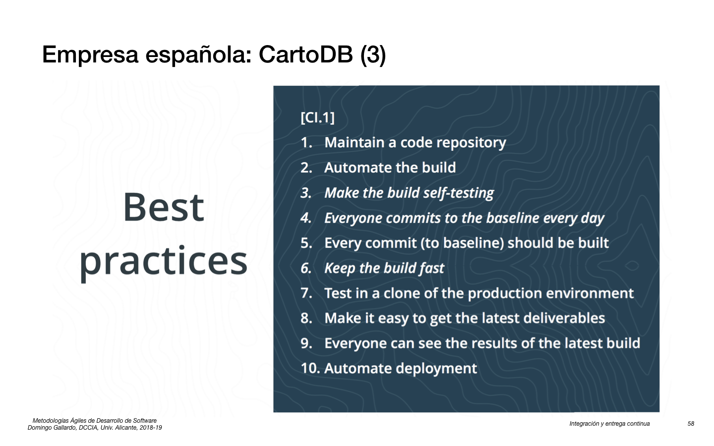

## Integración y entrega continua

<kbd></kbd>

<kbd></kbd>

<kbd></kbd>

<kbd></kbd>

<kbd></kbd>

<kbd></kbd>

<kbd></kbd>

<kbd></kbd>

<kbd></kbd>

<kbd></kbd>

<kbd></kbd>

<kbd></kbd>

<kbd></kbd>

<kbd></kbd>

<kbd></kbd>

<kbd></kbd>

<kbd></kbd>

- [Todd Papaioannou - Slideshare](https://www.slideshare.net/drluckyspin/continuous-integration)

<kbd></kbd>

- [Martin Fowler - Continuous Integration](http://www.martinfowler.com/articles/continuousIntegration.html)

<kbd></kbd>

<kbd></kbd>

- [Todd Papaioannou - Slideshare](https://www.slideshare.net/drluckyspin/continuous-integration)

<kbd></kbd>

<kbd></kbd>

- [Gradle](https://gradle.org)
- [Sbt](http://www.scala-sbt.org/release/docs/index.html)

<kbd></kbd>

- [Artifactory](https://www.jfrog.com/open-source/#os-arti)
- [Nexus](http://www.sonatype.org/nexus/)

<kbd></kbd>

<kbd></kbd>

<kbd></kbd>

<kbd></kbd>

<kbd></kbd>

<kbd></kbd>

En el repositorio de GitHub
[domingogallardo/mads-todolist-guia](https://github.com/domingogallardo/mads-todolist-guia)
se encuentra la aplicación web en Play Framework que hemos hecho en la
práctica 1. En la raíz del repositorio está el fichero `Dockerfile`
con el que podemos realizar la construcción (_build_) de la aplicación
y generar una imagen docker con la última versión.

**Fichero `Dockerfile`**:

```dockerfile
FROM domingogallardo/playframework
WORKDIR /app
ADD . /app
RUN sbt clean stage

EXPOSE 9000
ENV CONFIG_FILE=conf/application.conf
ENV SECRET=abcdefghijk

CMD target/universal/stage/bin/mads-todolist-2017 -Dplay.crypto.secret=$SECRET -Dconfig.file=$CONFIG_FILE
```

La línea `FROM` indica la imagen docker base sobre la que se construye
la aplicación.

La línea `WORKDIR` indica el directorio en el que se van a ejecutar
todos los comandos `ADD`, `RUN` o `CMD`. Si el directorio no existe en
la imagen, se crea. En este caso creamos el directorio `/app` en el
que se va a compilar la aplicación.

El comando `RUN` se ejecuta cuando la imagen se construye. En este
caso se lanza `sbt clean stage` para generar el ejecutable (que se
guardará en el directorio
`target/universal/stage/bin/NOMBRE_PROYECTO`).

Los siguientes comandos ya son para cuando se ejecuta el
contenedor. El comando `EXPOSE` define un puerto a mapear con la
máquina host. En este caso el puerto 9000, que es en el que se lanza
la aplicación. El comando `ENV` define valores por defecto de
variables de entorno. Estas variables pueden ser sobreescritas con el
parámetro `-e` en un `docker run`. En nuestro caso definimos el
fichero de configuración por defecto y la palabra `SECRET` por
defecto.

Por último, `CMD` define el comando que se ejecuta en el contenedor
cuando se realiza un `docker run`. En nuestro caso llamamos a la
aplicación pasando como parámetro el fichero de configuración y la
palabra `SECRET`.

**Construcción de la imagen docker**

Para construir la imagen podemos clonar el repositorio y hacer un
`docker build`. Como nombre de la imagen usaremos
`domingogallardo/mads-todolist:0.1`. Docker identifica el número que
hay después de los dos puntos como el número de versión.

```
$ git clone https://github.com/domingogallardo/mads-todolist-guia.git
$ cd mads-todolist-guia
$ docker build -t domingogallardo/mads-todolist:0.1 .
```

Se puede hacer también en un único comando, pasando a docker la URL
del repositorio:

```
$ docker build https://github.com/domingogallardo/mads-todolist-guia.git -t domingogallardo/mads-todolist:0.1
```

**Subida a docker hub**

Una vez construida la imagen se puede subir a Docker Hub haciendo
`docker push`:

```
$ docker push domingogallardo/mads-todolist:0.1
```

Allí estará disponible para descargarla y ejecutarla desde cualquier servidor.

**Ejecución de la aplicación**

Para ejecutar la aplicación debemos usar el comando `docker run`. 

Lo más sencillo es ejecutar la aplicación trabajando con la base de
datos en memoria:

```
$ docker run -d --rm -p 80:9000 domingogallardo/mads-todolist:0.1
```

También podemos lanzar una configuración específica, por ejemplo,
podemos lanzar la base de datos MySQL

```
$ docker run -d --rm -p 3306:3306 --name play-mysql -e MYSQL_ROOT_PASSWORD=mads -e MYSQL_DATABASE=mads mysql
```

y lanzar la ejecución de integración que trabaja con esa base de
datos, tal y como hacemos en la práctica 2:

```
$ docker run --link play-mysql:mysql --rm -d -p 80:9000 \
     -e DB_URL="jdbc:mysql://play-mysql:3306/mads" -e DB_USER_NAME="root" \
     -e DB_USER_PASSWD="mads" -e CONFIG_FILE="conf/integration.conf" domingogallardo/mads-todolist:0.1
```


**Lanzamiento de tests**

Podemos también ejecutar los tests haciendo que se ejecute el comando
`bash` con el comando que lanza los tests:

```
$ docker run --rm domingogallardo/mads-todolist:0.1 /bin/bash -c "sbt test"
```

Para los tests de integración:

```
$ docker run --link play-mysql:mysql --rm -e DB_URL="jdbc:mysql://play-mysql:3306/mads" \
     -e DB_USER_NAME="root" -e DB_USER_PASSWD="mads" domingogallardo/mads-todolist:0.1 \
     /bin/bash -c "sbt '; set javaOptions += \"-Dconfig.file=conf/integration.conf\"; test'"
```

<kbd></kbd>

- Travis: [Using Docker in builds](https://docs.travis-ci.com/user/docker/)


<kbd></kbd>

<kbd></kbd>


- [Charla Jezz Humble - Adopting Continuous Delivery](https://vimeo.com/68320415)

<kbd></kbd>

<kbd></kbd>

<kbd></kbd>

- [Charla John Allspaw](http://www.slideshare.net/jallspaw/ops-metametrics-the-currency-you-pay-for-change)

<kbd></kbd>

<kbd></kbd>

<kbd></kbd>

<kbd></kbd>

<kbd></kbd>

<kbd></kbd>

<kbd></kbd>

<kbd></kbd>

- [Oracle - Data Access Object](http://www.oracle.com/technetwork/java/dataaccessobject-138824.html)

<kbd></kbd>

<kbd></kbd>

<kbd></kbd>

- [Etsy’s Product Development with Continuous Experimentation](https://www.infoq.com/presentations/Etsy-Deployment)

<kbd></kbd>

<kbd></kbd>

<kbd></kbd>

- [Elastic Load Balancing](https://aws.amazon.com/elasticloadbalancing/)

<kbd></kbd>

<kbd></kbd>

<kbd></kbd>

<kbd></kbd>

<kbd></kbd>

<kbd></kbd>

<kbd></kbd>

<kbd></kbd>

<kbd></kbd>

- [Etsy’s Product Development with Continuous Experimentation](https://www.infoq.com/presentations/Etsy-Deployment)

<kbd></kbd>

- [Deploying the Netflix API](http://techblog.netflix.com/2013/08/deploying-netflix-api.html)

<kbd></kbd>

<kbd></kbd>

<kbd></kbd>

- Continuous Integration at CartoDB:
   - [Slideshare](https://www.slideshare.net/juanignaciosl/continuous-integration-at-cartodb-march-16)
   - [YouTube](https://www.youtube.com/watch?list=PLKxa4AIfm4pWYrMY88Obx2JNVIjfXEm4v&time_continue=13&v=fRB_rlUtxys)
   - [Repositorio CartDB en GitHub](https://github.com/CartoDB/cartodb)

<kbd></kbd>

<kbd></kbd>

- [ThoughtWorks - Continuous Delivery](https://www.thoughtworks.com/continuous-delivery)
