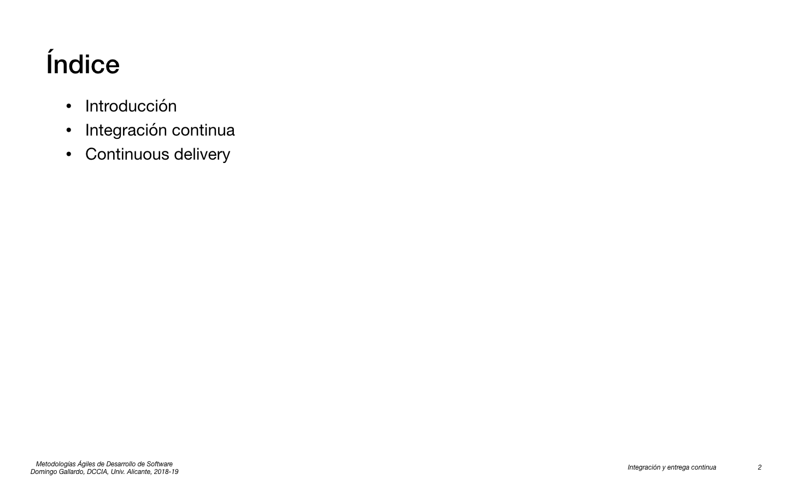
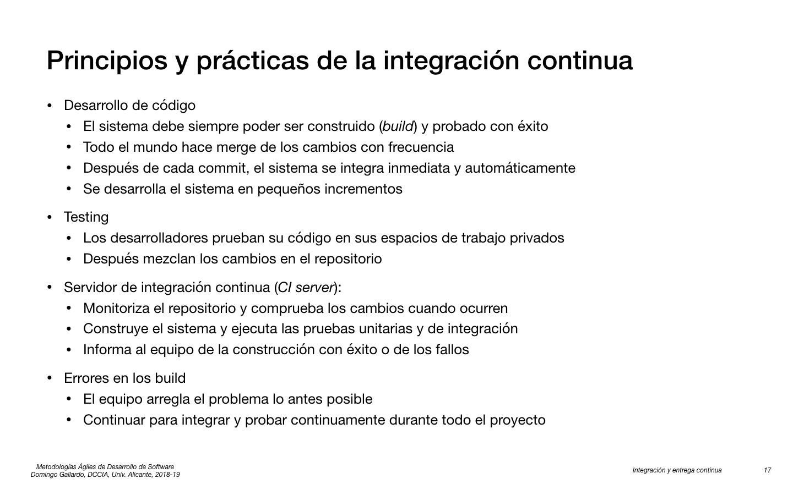
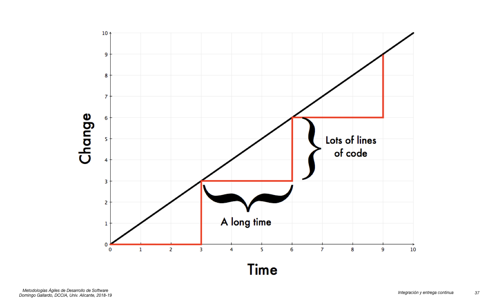
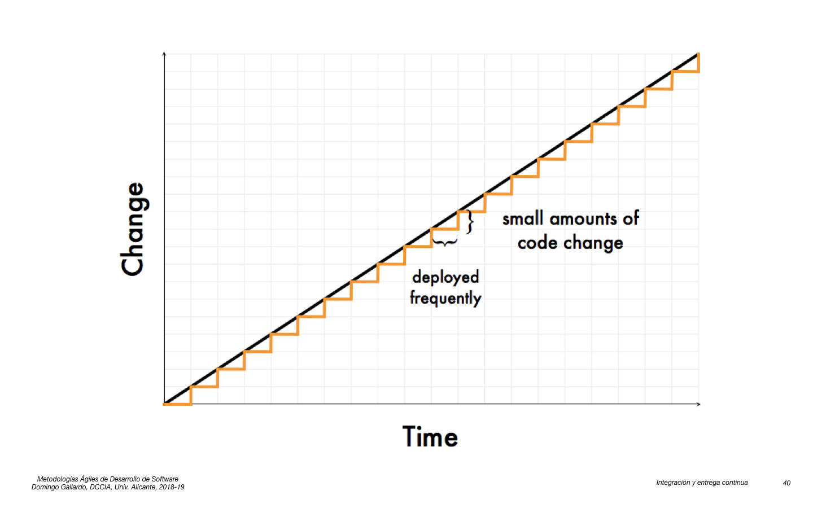
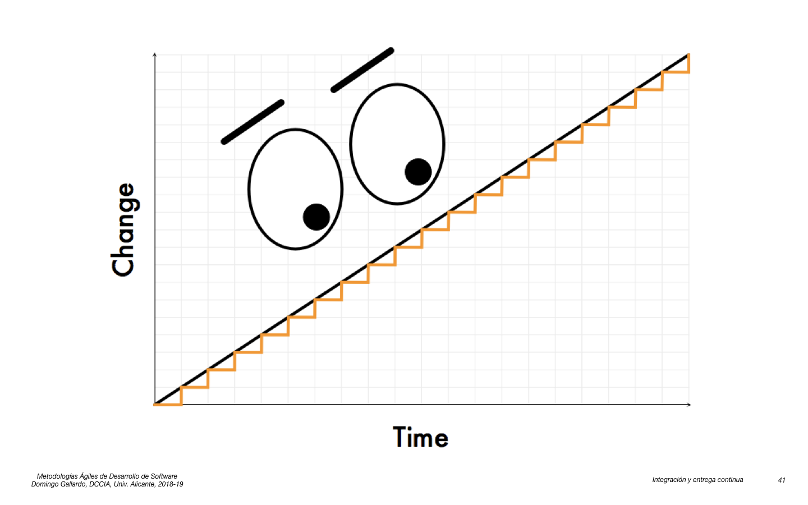
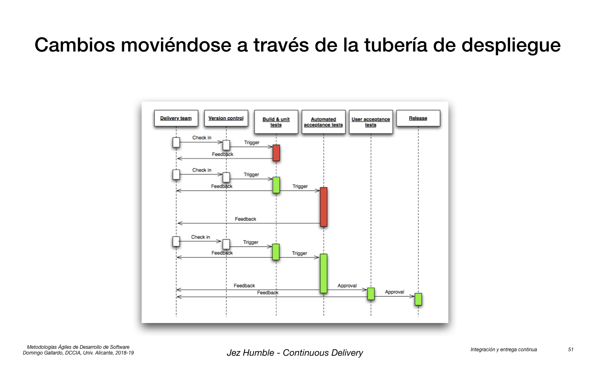

## Integración y entrega continua

<kbd></kbd>

<kbd></kbd>

<kbd></kbd>

<kbd></kbd>

<kbd></kbd>

<kbd></kbd>

<kbd></kbd>

<kbd></kbd>

<kbd></kbd>

<kbd></kbd>

<kbd></kbd>

<kbd></kbd>

<kbd></kbd>

<kbd></kbd>

<kbd></kbd>

<kbd></kbd>

<kbd></kbd>

- [Todd Papaioannou - Slideshare](https://www.slideshare.net/drluckyspin/continuous-integration)

<kbd></kbd>

- [Martin Fowler - Continuous Integration](http://www.martinfowler.com/articles/continuousIntegration.html)

<kbd></kbd>

<kbd></kbd>

- [Todd Papaioannou - Slideshare](https://www.slideshare.net/drluckyspin/continuous-integration)

<kbd></kbd>

<kbd></kbd>

- [Gradle](https://gradle.org)
- [Sbt](http://www.scala-sbt.org/release/docs/index.html)

<kbd></kbd>

- [Artifactory](https://www.jfrog.com/open-source/#os-arti)
- [Nexus](http://www.sonatype.org/nexus/)

<kbd></kbd>

<kbd></kbd>

### Demostración de Docker ###

Comprobamos la instalación de docker:


```
$ docker version
$ docker ps
```

Comprobamos las imágenes que hay descargadas en nuestra máquina:

```
$ docker images
```

Ejecutamos una imagen:

```
$ docker run docker/whalesay cowsay Hello world
```

Para generar el mensaje se producen los siguientes pasos:

1. El cliente Docker contacta el demonio Docker que se está ejecutando
   en la máquina host.
2. El demonio comprueba si tenemos la imagen `hello-world` y si no se
   la descarga del _Docker Hub_.
3. El demonio crea un nuevo contenedor a partir de la imagen que
   arranca el ejecutable que produce la salida de texto.
4. El demonio pasa las salida de texto al cliente Docker, el cual la
   envía a la terminal.

Para ver los contenedores en ejecución:

```
$ docker ps
```

Y todos los contenedores (incluyendo los parados):

```
$ docker ps -a
```

Podemos ejecutar un contenedor basado en una imagen Linux Alpine
(Alpine es una distribución Linux muy ligera):

```
$ docker run alpine /bin/echo 'Hello world'
```

O hacerlo de forma interactiva:

```
$ docker run -it alpine /bin/sh
```

También como un demonio, que está en ejecución hasta que lo paramos:

```
$ docker run -d ubuntu /bin/sh -c "while true; do echo hello world; sleep 1; done"

1e5535038e285177d5214659a068137486f96ee5c2e85a4ac52dc83f2ebe4147

$ docker ps
CONTAINER ID  IMAGE         COMMAND               CREATED        STATUS       PORTS    NAMES
1e5535038e28  alpine        /bin/sh -c 'while tr  2 minutes ago  Up 1 minute           insane_babbage

$ docker logs insane_babbage

hello world
hello world
hello world
...

$ docker stop insane_babbage
$ docker ps

CONTAINER ID  IMAGE         COMMAND               CREATED        STATUS       PORTS NAMES
```


<kbd></kbd>

<kbd></kbd>

<kbd></kbd>


### Construir una imagen propia ###

Creamos un directorio:

```
$ mkdir midocker
$ cd midocker
```

Editamos el fichero **Dockerfile**

```
FROM docker/whalesay:latest
RUN apt-get -y update && apt-get install -y fortunes
CMD /usr/games/fortune -a | cowsay
```

Llamamos a `docker build` para construir la nueva imagen y le damos el nombre `docker-whale`:

```
$ docker build -t docker-whale .
```

Comprobamos que se ha añadido al repositorio local de imágenes:

```
$ docker images
REPOSITORY          TAG                 IMAGE ID            CREATED             SIZE
docker-whale        latest              244786599109        13 seconds ago      275 MB
ubuntu              latest              42118e3df429        3 months ago        124.8 MB
python              2.7                 b5c7fb15c9cb        3 months ago        691.6 MB
hello-world         latest              c54a2cc56cbb        4 months ago        1.848 kB
docker/whalesay     latest              6b362a9f73eb        17 months ago       247 MB
```

Y ya podemos ejecutar el contenedor:

```
$ docker run docker-whale
 ________________________________________ 
/ The farther you go, the less you know. \
|                                        |
\ -- Lao Tsu, "Tao Te Ching"             /
 ---------------------------------------- 
    \
     \
      \     
                    ##        .            
              ## ## ##       ==            
           ## ## ## ##      ===            
       /""""""""""""""""___/ ===        
  ~~~ {~~ ~~~~ ~~~ ~~~~ ~~ ~ /  ===- ~~~   
       \______ o          __/            
        \    \        __/             
          \____\______/   
```


### Servidor web ###

Es posible también montar en el contenedor un directorio del host. 

Vamos, por ejemplo, a poner en marcha un servidor web y usar un
directorio del host como directorio del sitio web.


Creamos un directorio `webserver` y creamos dentro un fichero `default`:

```
server {
    root /var/www;
    index index.html index.htm;

    # Make site accessible from http://localhost/
    server_name localhost;

    location / {
        # First attempt to serve request as file, then
        # as directory, then fall back to index.html
        try_files $uri $uri/ /index.html;
    }
}
```

Creamos también el siguiente fichero `Dockerfile`:

```
FROM ubuntu:14.04

RUN echo "deb http://archive.ubuntu.com/ubuntu precise main universe" > /etc/apt/sources.list
RUN apt-get update
RUN apt-get -y install nginx

RUN echo "daemon off;" >> /etc/nginx/nginx.conf
RUN mkdir /etc/nginx/ssl
ADD default /etc/nginx/sites-available/default

EXPOSE 80

CMD ["nginx"]
```

El fichero anterior usa los siguientes comandos para construir la imagen:

- `FROM` le dice a Docker cuál es la imagen base
- `RUN` ejecutará el comando a continuación 
- `ADD` copiará un fichero de la máquina host en la imagen. Es muy útil para ficheros de configuración o scripts que queramos ejecutar.
- `EXPOSE` expondrá un port a la máquina host. Es posible exponer más de un puerto como: `EXPOSE 80 443 8888`
- `CMD` ejecutará un comando cuando se ponga en marcha el contenedor

Una vez definido el fichero `Dockerfile`, podemos construir la imagen:

```
$ docker build -t nginx-example .
```

Podemos comprobar que se ha construido listando las imágenes:

```
$ docker images
```

Por último, lanzamos el servidor web:

```
$ docker run -p 80:80 -d nginx-example
```

El parámetro `p 80:80` liga el puerto 80 del contenedor con el puerto 80 del host.

Hacemos `docker ps` para asegurarnos que el contenedor está
funcionando:

```
$ docker ps
CONTAINER ID        IMAGE               COMMAND             CREATED             STATUS              PORTS                NAMES
a377dd528a85        nginx-example       "nginx"             22 seconds ago      Up 21 seconds       0.0.0.0:80->80/tcp   reverent_franklin
```

Si abrimos el navegador en `localhost` veremos que
responde, pero obtenemos un error 500 porque falta el fichero
`index.html`.

Para arreglarlo, creamos el fichero `index.html` en el directorio actual:

**`index.html`**:

```
<h1>Hola desde el contenedor</h1>
```

Y lanzamos el contenedor montando el directorio actual en el
directorio `/var/www` del contenedor (el servidor Nginx usa el
directorio `/var/www` como sitio por defecto donde poner los ficheros
HTML):

```
$ docker stop reverent_franklin
$ docker run -v $(PWD):/var/www:rw -p 80:80 -d nginx-example
```

Si comprobamos ahora el navegador, veremos que muestra el HTML que
hemos guardado. Podemos probar a cambiar el HTML y veremos cómo se
actualiza también en el contenedor.

### Borrar contenedores e imágenes ###

- Para borrar un contenedor

    ```
    $ docker rm <ID o nombre contenedor>
    ```

- Para borrar todos los contenedores:

    ```
    $ docker rm $(docker ps -a -q)
    ```

- Para borrar una imagen:

    ```
    $ docker rmi <nombre imagen>
    ```

- Para borrar todas las imágenes:

    ```
    $ docker rmi $(docker images -q)
    ```

### Más información sobre Docker ###

- [Docker Overview](https://docs.docker.com/engine/understanding-docker/)
- [Get Started with Docker](https://docs.docker.com/engine/getstarted/)


<kbd></kbd>

Veamos un ejemplo concreto de fichero `Dockerfile`. Es un fichero que
vamos a usar en prácticas para _dockerizar_ nuestra aplicación Play y
generar una imagen que podremos usar para lanzar tests o para ejecutar
la aplicación.

Debemos colocar el fichero `Dockerfile` en la raíz del proyecto.

**Fichero `Dockerfile`**:

```dockerfile
FROM domingogallardo/playframework
WORKDIR /app
ADD . /app
RUN sbt clean stage

EXPOSE 9000
ENV CONFIG_FILE=conf/application.conf
ENV SECRET=abcdefghijk

CMD target/universal/stage/bin/mads-todolist-2017 -Dplay.crypto.secret=$SECRET -Dconfig.file=$CONFIG_FILE
```

La línea `FROM` indica la imagen docker base sobre la que se construye
la aplicación.

La línea `WORKDIR` indica el directorio en el que se van a ejecutar
todos los comandos `ADD`, `RUN` o `CMD`. Si el directorio no existe en
la imagen, se crea. En este caso creamos el directorio `/app` en el
que se va a compilar la aplicación.

El comando `ADD` copia el directorio actual (y sus subdirectorios) en
el directorio `/app` de la máquina Docker. De esta forma copiamos
la aplicación Play.

El comando `RUN` se ejecuta cuando la imagen se construye. En este
caso se lanza `sbt clean stage` para generar el ejecutable (que se
guardará en el directorio
`target/universal/stage/bin/NOMBRE_PROYECTO`).

Los siguientes comandos ya son para cuando se ejecuta el
contenedor. El comando `EXPOSE` define un puerto a mapear con la
máquina host. En este caso el puerto 9000, que es en el que se lanza
la aplicación. El comando `ENV` define valores por defecto de
variables de entorno. Estas variables pueden ser sobreescritas con el
parámetro `-e` en un `docker run`. En nuestro caso definimos el
fichero de configuración por defecto y la palabra `SECRET` por
defecto.

Por último, `CMD` define el comando que se ejecuta en el contenedor
cuando se realiza un `docker run`. En nuestro caso llamamos a la
aplicación pasando como parámetro el fichero de configuración y la
palabra `SECRET`.

**Construcción de la imagen docker**

Una vez creado el fichero `Dockerfile` ya podemos hacer un
`docker build` para construir la imagen con nuestra aplicación. Como nombre de la imagen usaremos
`domingogallardo/mads-todolist-2017:0.2`. Docker identifica el número que
hay después de los dos puntos como el número de versión.

```
$ cd mads-todolist-guia
$ docker build -t domingogallardo/mads-todolist-2017:0.2 .
```

Si el repositorio se ha subido a GitHub se puede también construir la
máquina en un único comando, pasando a docker la URL
del repositorio en GitHub

```
$ docker build https://github.com/domingogallardo/mads-todolist-guia.git -t domingogallardo/mads-todolist-2017:0.2
```

**Subida a docker hub**

Una vez construida la imagen se puede subir a Docker Hub haciendo
`docker push` (después de autenticarse con `docker login`). Tardará
bastante la primera vez. En las siguientes compilaciones ya no tardará
tanto, porque sólo se subirá la parte que cambia de la máquina.

```
$ docker login
Username: <docker-id>
Password: <contraseña>
$ docker push domingogallardo/mads-todolist-2017:0.2
```

Allí estará disponible para descargarla y ejecutarla desde cualquier servidor.

**Ejecución de la aplicación**

Para ejecutar la aplicación debemos usar el comando `docker run`. 

Lo más sencillo es ejecutar la aplicación trabajando con la base de
datos en memoria:

```
$ docker run -d --rm -p 80:9000 domingogallardo/mads-todolist-2017:0.2
```

También podemos lanzar la base de datos MySQL:

```
$ docker run -d --rm -p 3306:3306 --name play-mysql -e MYSQL_ROOT_PASSWORD=mads -e MYSQL_DATABASE=mads mysql
```

y lanzar la ejecución de integración que trabaja con esa base de
datos, tal y como hacemos en la práctica 2:

```
$ docker run --link play-mysql:mysql --rm -d -p 80:9000 \
     -e DB_URL="jdbc:mysql://play-mysql:3306/mads" -e DB_USER_NAME="root" \
     -e DB_USER_PASSWD="mads" -e CONFIG_FILE="conf/integration.conf" domingogallardo/mads-todolist-2017:0.2
```


**Lanzamiento de tests**

Podemos también ejecutar los tests haciendo que se ejecute el comando
`bash` con el comando que lanza los tests:

```
$ docker run --rm domingogallardo/mads-todolist-2017:0.2 /bin/bash -c "sbt test"
```

Para los tests de integración:

```
$ docker run --link play-mysql:mysql --rm -e DB_URL="jdbc:mysql://play-mysql:3306/mads" \
     -e DB_USER_NAME="root" -e DB_USER_PASSWD="mads" domingogallardo/mads-todolist-2017:0.2 \
     /bin/bash -c "sbt '; set javaOptions += \"-Dconfig.file=conf/integration.conf\"; test'"
```

<kbd></kbd>

- Travis: [Using Docker in builds](https://docs.travis-ci.com/user/docker/)


<kbd></kbd>

<kbd></kbd>


- [Charla Jezz Humble - Adopting Continuous Delivery](https://vimeo.com/68320415)

<kbd></kbd>

<kbd></kbd>

<kbd></kbd>

- [Charla John Allspaw](http://www.slideshare.net/jallspaw/ops-metametrics-the-currency-you-pay-for-change)

<kbd></kbd>

<kbd></kbd>

<kbd></kbd>

<kbd></kbd>

<kbd></kbd>

<kbd></kbd>

<kbd></kbd>

<kbd></kbd>

- [Oracle - Data Access Object](http://www.oracle.com/technetwork/java/dataaccessobject-138824.html)

<kbd></kbd>

<kbd></kbd>

<kbd></kbd>

- [Etsy’s Product Development with Continuous Experimentation](https://www.infoq.com/presentations/Etsy-Deployment)

<kbd></kbd>

<kbd></kbd>

<kbd></kbd>

- [Elastic Load Balancing](https://aws.amazon.com/elasticloadbalancing/)

<kbd></kbd>

<kbd></kbd>

<kbd></kbd>

<kbd></kbd>

<kbd></kbd>

<kbd></kbd>

<kbd></kbd>

<kbd></kbd>

<kbd></kbd>

- [Etsy’s Product Development with Continuous Experimentation](https://www.infoq.com/presentations/Etsy-Deployment)

<kbd></kbd>

- [Deploying the Netflix API](http://techblog.netflix.com/2013/08/deploying-netflix-api.html)

<kbd></kbd>

<kbd></kbd>

<kbd></kbd>

- Continuous Integration at CartoDB:
   - [Slideshare](https://www.slideshare.net/juanignaciosl/continuous-integration-at-cartodb-march-16)
   - [YouTube](https://www.youtube.com/watch?list=PLKxa4AIfm4pWYrMY88Obx2JNVIjfXEm4v&time_continue=13&v=fRB_rlUtxys)
   - [Repositorio CartDB en GitHub](https://github.com/CartoDB/cartodb)

<kbd></kbd>

<kbd></kbd>

- [ThoughtWorks - Continuous Delivery](https://www.thoughtworks.com/continuous-delivery)
