## Introducción a MADS

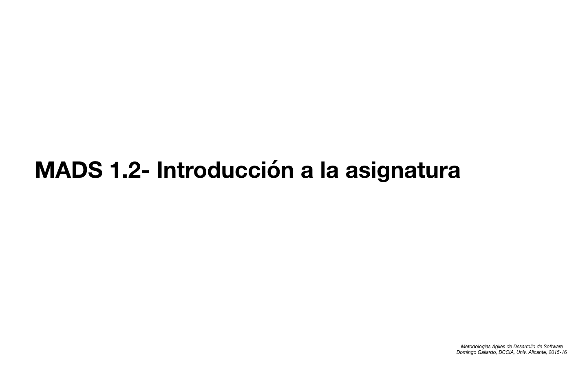

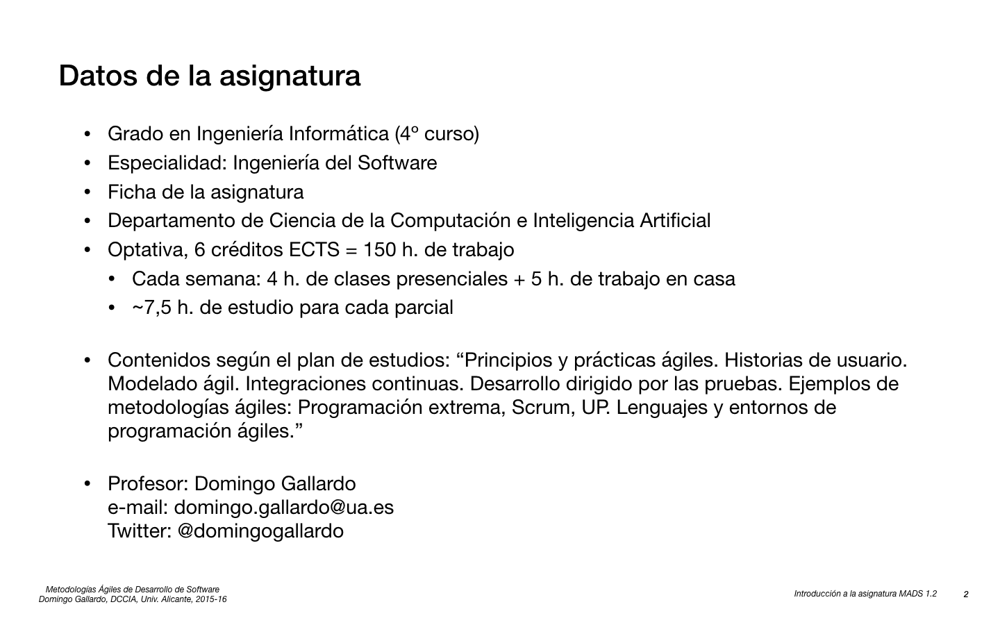

Puedes consultar la ficha UA de la asignatura en [este enlace](http://cv1.cpd.ua.es/ConsPlanesEstudio/cvFichaAsiEEES.asp?wcodasi=34037&wLengua=C&scaca=2016-17).

Herramientas docentes:

- [Moodle](https://moodle2016-17.ua.es/moodle/course/view.php?id=927): Utilizaremos Moodle para publicar semana a semana enlaces a los materiales en GitHub. También se realizarán las entregas finales de las prácticas (que se deberán ir subiendo también a GitHub). Y utilizaremos el foro de Moodle para poner en común dudas que os puedan surgir cuando estáis realizando los trabajos.
- [Apuntes y materiales en GitHub](https://github.com/domingogallardo/mads-ua): Los apuntes consisten en ficheros Markdown con algunas explicaciones sobre las diapositivas. Una ventaja de utilizar GitHub es que se podrá consultar los últimos cambios que se hayan introducido en los materiales.

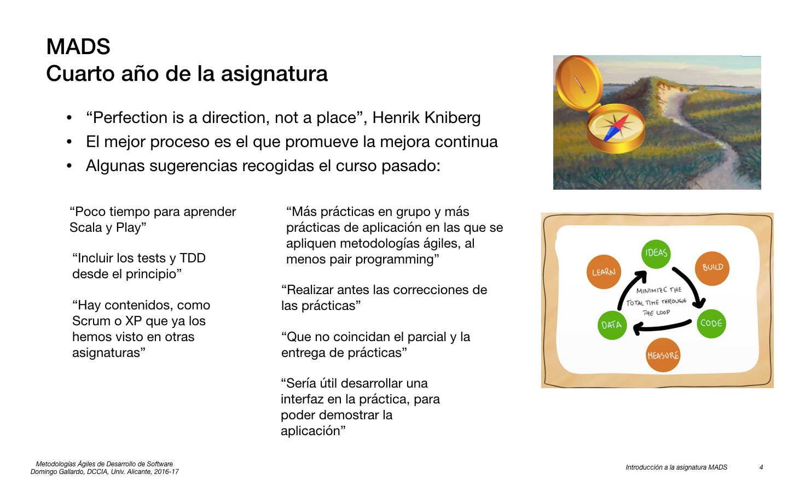

- [Henry Kniberg](https://www.crisp.se/konsulter/henrik-kniberg) es un gran divulgador de las metodologías ágiles. Trabaja en la actualidad como consultor en Spotify y Lego. Le gusta compartir todo lo que hace y muchos de los libros que ha escrito están en abierto. Vamos a utilizar muchos de sus materiales (diapositivas, vídeos, libros, artículos). Muy recomendable su [blog](http://blog.crisp.se/author/henrikkniberg).

- El ciclo "-> Ideas -> Code -> Data ->" es una versión del [ciclo de mejora continua](https://www.google.com/search?rls=en&biw=1363&bih=789&tbm=isch&q=continuous+improvement+cycle&sa=X&ved=0ahUKEwikmbO9m_vOAhWKbxQKHZ2zAwAQhyYIIw) de las metodologías _lean_.

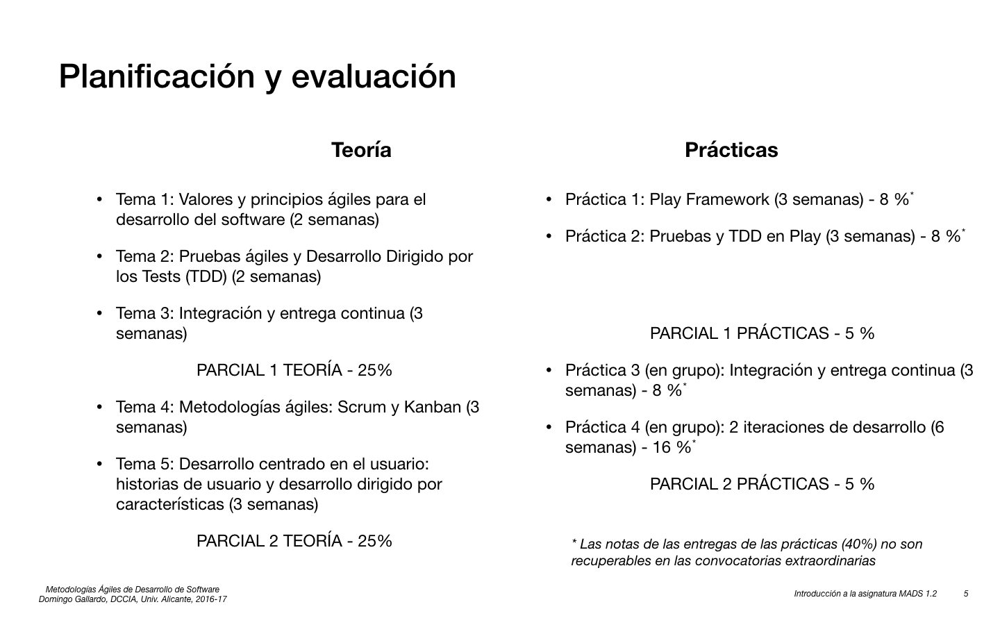

- Hay cambios importantes en el orden de los temas con respecto al curso anterior. Se deben en gran medida a una reestructuración de las prácticas. En la segunda práctica ya habrá que trabajar con flujos de trabajo con Git y construir un sistema de integración continua, por lo que es necesario adelantar el tema de **integración continua** a las semanas 3, 4, 5 y 6.

    Se ha eliminado una de las prácticas del curso pasado (la de desarrollo utilizando **Test Driven Development** TDD) para poder hacer una práctica 3 más larga. En esta práctica se deberá realizar una iteración completa de desarrollo de la aplicación. Se han adelantado los temas de **historias de usuario** y **Scrum y Kanban** para poder aplicarlos en esta práctica. Y el tema de **XP y TDD** se ha retrasado a las últimas semanas de curso. No porque sea menos importante, ni mucho menos, sino porque no vamos a tener tiempo para aplicarlo en prácticas (aunque intentaremos compensarlo haciendo alguna kata en vivo de TDD).

- Sólo la primera práctica es individual. Las prácticas 2 y 3 serán en grupo. Los grupos deberán tener entre 3 y 4 personas.

- El primer examen parcial será el 2 de noviembre y se realizará en horario de la clase de teoría. El segundo parcial coincidirá con la fecha oficial del examen de la asignatura. En esas fechas se realizarán los exámenes de teoría y práctica. 

- En cuanto a la evaluación, el **70% por ciento** de la calificación será por la nota en los exámenes parciales y el **30% por las prácticas**. No hay examen final. Las preguntas serán principalmente de tipo test. Los parciales de la parte de prácticas incluirán preguntas de las tecnologías que se han usado para realizar las prácticas.

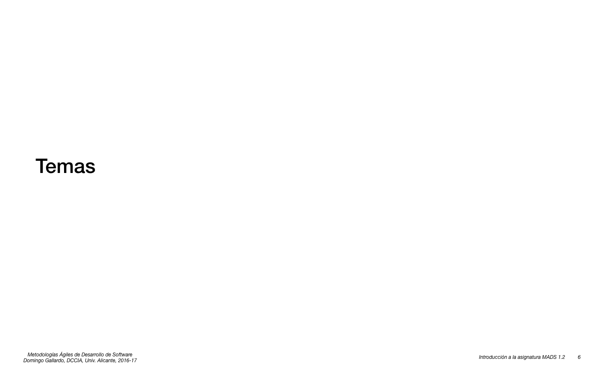

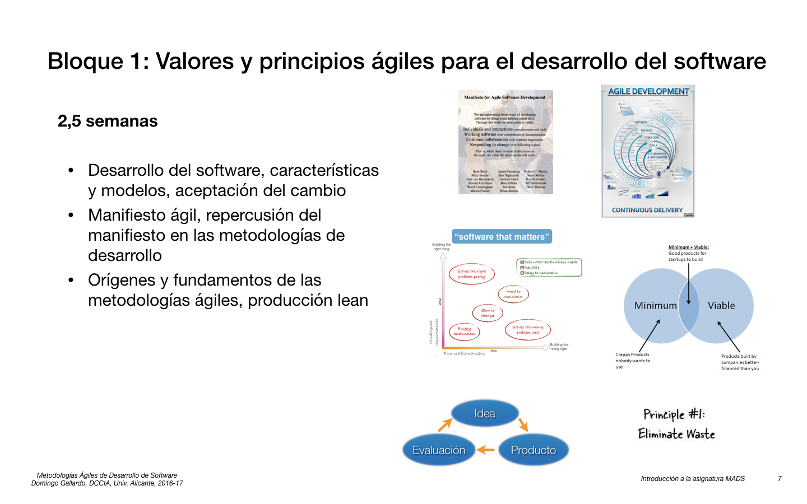

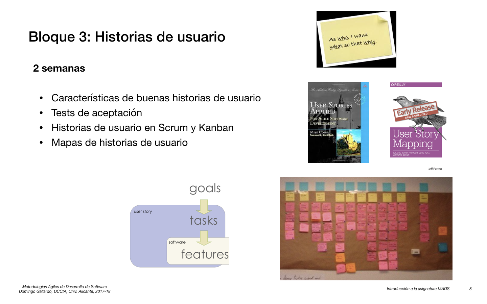

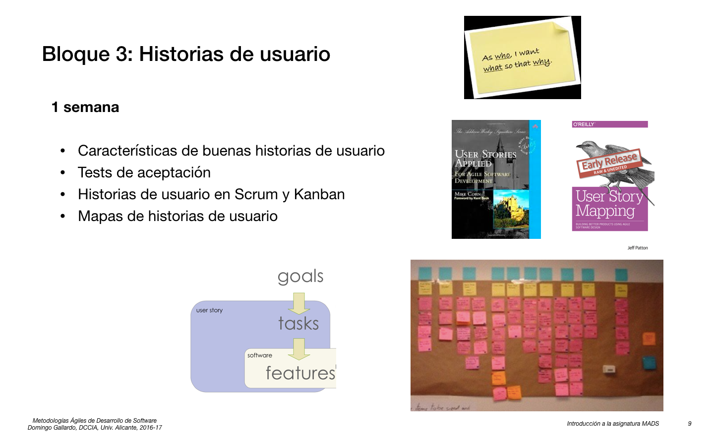

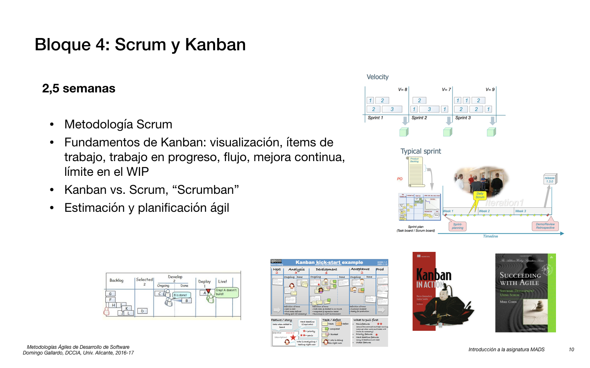

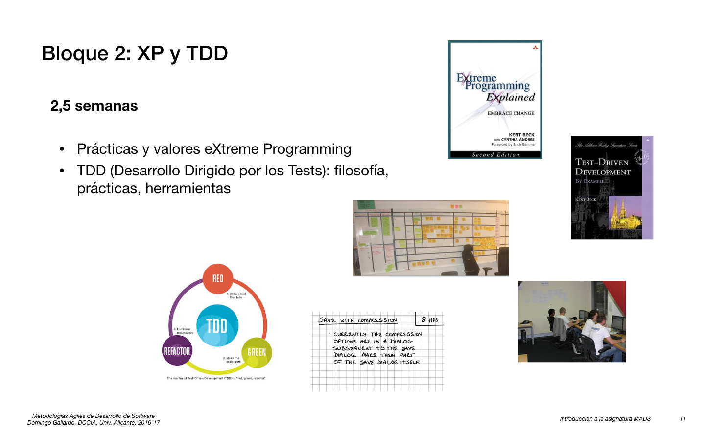

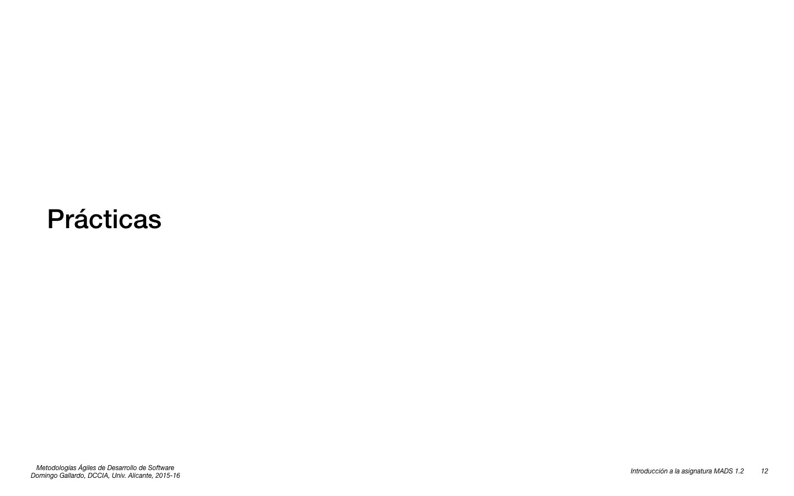

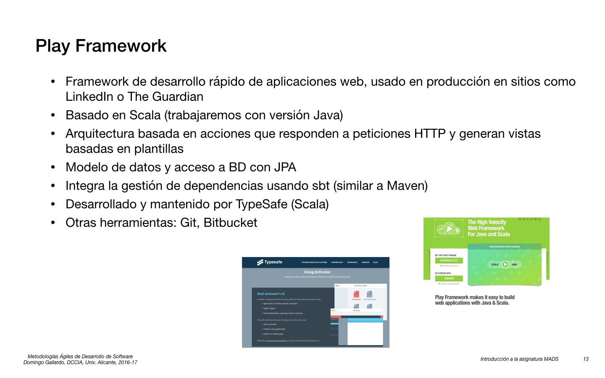

Enlaces:

- [Play Framework](https://www.playframework.com)
- [GitHub](http://github.com)
- [Git](https://git-scm.com/book/en/v2)
- [Docker](https://www.docker.com)

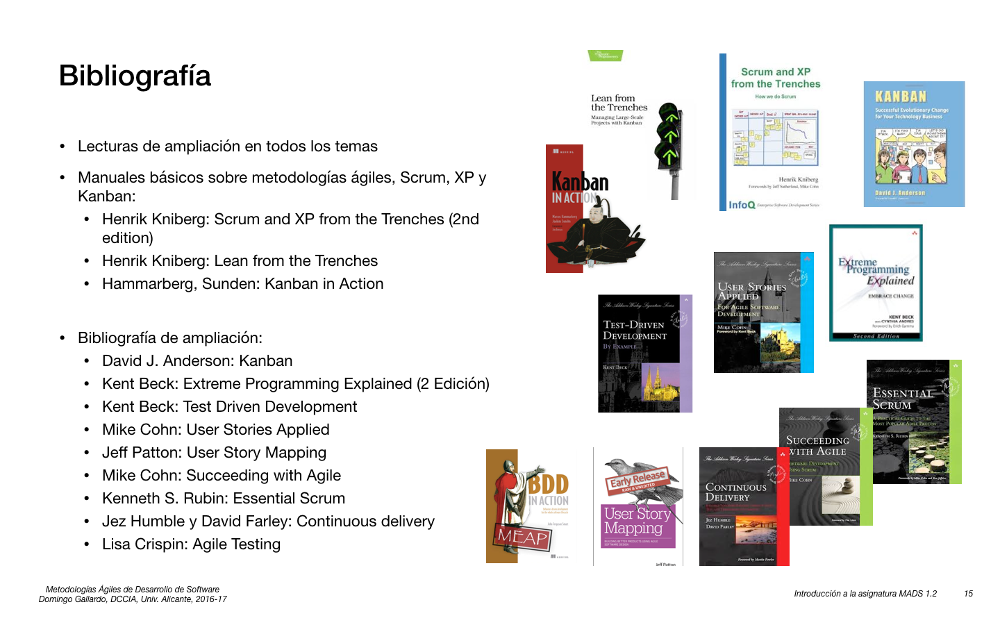

Todos los libros se encuentran en la biblioteca (en formato físico y/o digital), y alguno de ellos están disponibles on-line.

- Stellman, Green: Learning Agile - [Biblioteca UA](http://gaudi.ua.es/uhtbin/cgisirsi/0/x/0/05?searchdata1=9781449331924)
- Henrik Kniberg: Scrum and XP from the Trenches (2nd edition) - [On-line](https://www.infoq.com/minibooks/scrum-xp-from-the-trenches-2)
- Henrik Kniberg: Lean from the Trenches - [On-line](https://www.crisp.se/file-uploads/Lean-from-the-trenches.pdf)
- Hammarberg, Sunden: Kanban in Action - [Biblioteca UA](http://gaudi.ua.es/uhtbin/cgisirsi/0/x/0/05?searchdata1=9781617291050)
- David J. Anderson: Kanban - [Biblioteca UA](http://gaudi.ua.es/uhtbin/cgisirsi/0/x/0/05?searchdata1=9780984521401)
- Kent Beck: Extreme Programming Explained (2 Edición) - [Biblioteca UA](http://gaudi.ua.es/uhtbin/cgisirsi/0/x/0/05?searchdata1=0321278658)
- Koskela, Lasse: Practical TDD and Acceptance TDD for Java developers - [Biblioteca UA](http://gaudi.ua.es/uhtbin/cgisirsi/0/x/0/05?searchdata1=1932394850)
- Mike Cohn: User Stories Applied - [Biblioteca UA](http://gaudi.ua.es/uhtbin/cgisirsi/0/x/0/05?searchdata1=9780321205681)
- Jeff Patton: User Story Mapping - [Biblioteca UA](http://gaudi.ua.es/uhtbin/cgisirsi/0/x/0/05?searchdata1=9781491904909)
- Mike Cohn: Succeeding with Agile - [Biblioteca UA](http://gaudi.ua.es/uhtbin/cgisirsi/0/x/0/05?searchdata1=0321579364)
- Kenneth S. Rubin: Essential Scrum - [Biblioteca UA](http://gaudi.ua.es/uhtbin/cgisirsi/0/x/0/05?searchdata1=9780137043293)
- Jez Humble y David Farley: Continuous delivery - [Biblioteca UA](http://gaudi.ua.es/uhtbin/cgisirsi/0/x/0/05?searchdata1=9780321601919)
- Lisa Crispin: Agile Testing - [Biblioteca UA](http://gaudi.ua.es/uhtbin/cgisirsi/0/x/0/05?searchdata1=9780321534460)

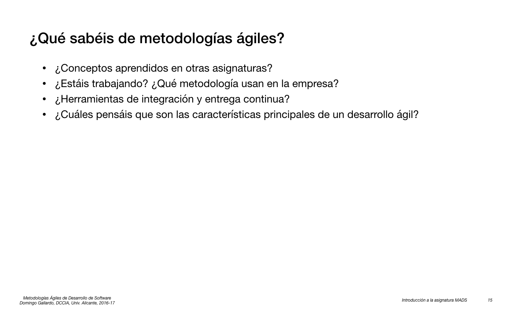

- Un pequeño debate sobre qué conocéis a priori de las metodologías ágiles. Haremos un resumen en la pizarra.

Terminamos la introducción a la asignatura viendo 15 minutos de un vídeo muy interesante, del _agilista_ español **Ángel Medinilla** ([@angel_m](https://twitter.com/angel_m)): [Introducción a Lean y Agile](https://www.youtube.com/watch?v=xUoZakVq6Dg). Iremos viendo fragmentos del vídeo durante varias semanas; se trata de una muy buena introducción a esta primera parte de la asignatura, que complementa muy bien lo que iremos estudiando en las clases de teoría.

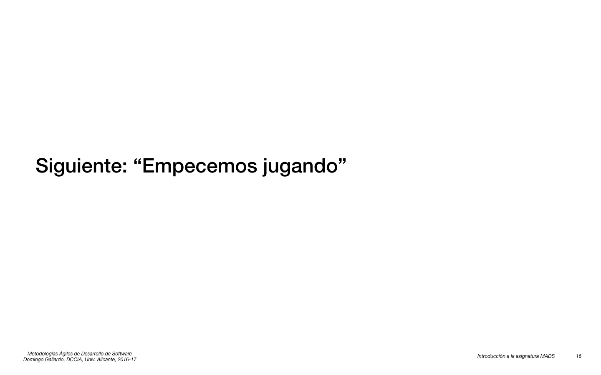

- **!No os vayáis todavía¡**. Falta hacer un juego: el **reto del malvavisco**. Si lo conocéis no digáis nada para no _spoilearlo_.
