## Manifiesto ágil

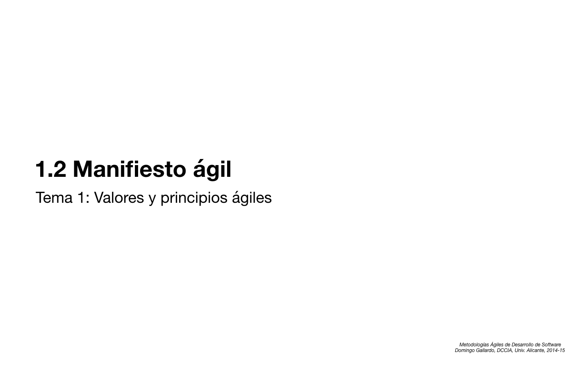

- Vamos a ver un ejemplo de la adopción de metodologías ágiles en un
  equipo. Está sacado del libro _Learning Agile_ de Stellman y
  Greene. Suponemos una empresa que desarrolla máquinas de monedas y
  quioscos digitales:
    - Desarrollador líder / arquitecto (_lead developer and architect_)
    - Líder de equipo (_team leader_) un miembro más del equipo, que
      se encarga además de conseguir que el equipo tenga un propósito,
      visión común motivador, espíritu de equipo, atención a los
      individuos y que progrese y obtenga resultados. Objetivo:
      mejorar sus habilidades y comunicaciones.
    - Gestor de proyecto (_project manager_) que hace un seguimiento
      del desarrollo del mismo.
    - Conocedor del negocio y responsable de clientes (_business
      analyst_, _account manager_)

- Recordemos que un buen proyecto software es aquel:
    - Que tiene las funcionalidades que necesita el cliente (_doing
      the right thing_)
    - Que tiene un código sin _bugs_, bien diseñado, mantenible, sin
      deuda técnica (_doing the thing right_)

- Hay equipos que si han tenido éxito desarrollando con waterfall
  (ejemplo: software para dispositivos médicos):
    - Los requerimientos están claros y se han completado carpetas
      llenas de documentación que apenas se consulta, porque todo el
      equipo la ha desarrollado y ha resuelto la mayoría de las dudas
      en el proceso de escribirla. La documentación refleja con
      detalle el producto que se tiene que desarrollar.
    - **Buena comunicación**, porque para desarrollar con éxito el
      proyecto el equipo debe hablar continuamente con usuarios,
      gerentes y ejecutivos.
    - **Buenas prácticas**, especialmente las de **revisión de
      código** y **pruebas automatizadas**, que se dirigen a detectar
      _bugs_ pronto en el desarrollo. El equipo reflexiona activamente
      sobre cómo se produjeron estos errores y cómo evitarlos en el
      futuro. En el desarrollo se usan entornos, lenguajes,
      herramientas y técnicas que facilitan la integración continua,
      minimizan los errores y automatizan las tareas repetitivas.

- Sin embargo el proceso de cascada no funciona bien la mayoría de las
  ocasiones:
    - En la mayoría de las ocasiones es muy difícil elaborar un
      documento de especificación (por ejemplo una documentación de un
      API REST) completo desde cero, sin que el cliente interactúe con
      algún tipo de prototipo o demostración.
    - No puede responder al cambio, porque se centra más en la
      documentación que en la colaboración.
    - Al estar los requerimientos y _deadlines_ del proyecto grabados
      en roca y ser inmutables, cualquier cambio de requisitos
      provocará un retraso que hará que el cliente quede descontento.

- Cambios al introducir metodologías ágiles:
    - Desarrollador leader: introduce **diseño dirigido por los
      tests** (TDD, _Test Driven Design_) en el equipo, define un
      **script automatizado para el build** (_automated build script_)
      y pone en marcha un **servidor de integración** (_build
      server_).
    - Gestor de proyecto: aprende Scrum. Divide el proyecto en
      **iteraciones**, realiza un seguimiento del proyecto en el
      tablero de tareas, usando la **velocidad** del proyecto y
      diagramas de _burndown_.
    - El responsable de clientes empieza a elaborar **historias de
      usuario** para el equipo y ayuda al equipo a definir **planes de
      release** del producto.
    - El lider del equipo empieza a dirigir **reuniones diarias** y de
      **retrospectivas** en las que analizan el desarrollo.

- Por ejemplo, el uso de **historias de usuario** ha mejorado el
  trabajo de todos ellos:
    - Joanna, la gestora de proyecto que se está convirtiendo en una
      Scrum Master, ve una historia de usuario como un **trabajo
      pendiente de hacer**, empaquetar y construir. Es una tarjeta en un
      tablero con una estimación de tiempo y unos responsables, que
      ayuda a mantener a todo el mundo en el camino.
    - Dan, el arquitecto y desarrollador líder, ve una historia de
      usuario como una **pieza pequeña de funcionalidad**, escrita de una
      forma sencilla y fácil de entender. Puede descomponerla en
      tareas, crear una tarjeta para cada una de ellas, y escribir su
      nombre en la tarjeta cuando empieza a trabajar en ella. Cuando
      termina una tarea, la mueve a una sección del tablero reservada
      para las tareas completadas.
    - Tom, el propietario del producto, ve una historia de usuario
      como **valor que retornará a la empresa**, porque le permite ver una
      conexión clara entre lo que el equipo está construyendo y lo que
      los usuarios harán con el software una vez que esté
      terminado. Las historias de usuario le ayudan a hablar con los
      clientes, de forma que puede descubrir lo que buscan en el
      software de la _jukebox_, y se asegura de que cada historio
      representa algo que un usuario realmente necesita.
    - Bruce, el líder del equipo, ve una historia de usuario como un
      objetivo específico alrededor del que **el equipo puede
      organizarse**. Les ayuda a descubrir qué historias deberían
      hacerse a continuación, y usa los avances para mantenerlos
      motivados.

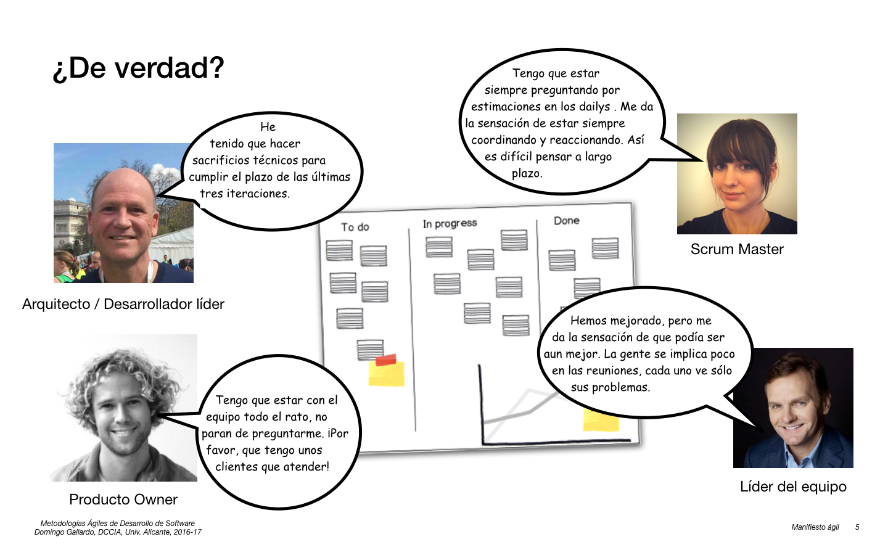

- Se produce alguna mejora, pero no es se nota un aumento espectacular
  en la productividad ni en la calidad. El equipo no se ha convertido
  en híper-productivo:
    - Cada persona introduce alguna mejora en su ámbito de actuación.
    - Todos tienen algunas reservas que no les hace sentirse cómodos
      en sus nuevos roles.

- Pero no todo son bondades. Veamos un ejemplo, en el que
  Tom escribe una historia de usuario en la que indica que la
  _jukebox_ debe dar preferencia a los éxitos del momento. 

    - Dan hecha de menos una especificación detallada. La flexibilidad
      puede ser buena, pero también puede conducir a algunos problemas
      en el proyecto. Cuando Dan escribió el código para la historio
      de usuario del "éxito del momento", pensó que se trabaja de
      construir una funcionalidad que permitiera a los dueños del bar
      promocionar el último éxito en la _jukebox_ tan pronto como éste
      estuviera disponible en el servidor, para que los clientes la
      seleccionaran una y otra vez. Pero cuando le hizo una
      demostración a Tom al final de la iteración apareció un gran
      problema. Tom tuvo que explicarle que las canciones de más
      éxito tocadas en la _jukebox_ obligan al dueño del bar a pagar
      más royalties.

    Dan tuvo que reescribir una gran parte del software para poner
    un límite en el número de veces que se promociona una canción,
    dependiendo de los royalties que tiene que pagar. No pudo
    entregarlo al final de iteración, y Tom tuvo que quedar mal con
    los clientes porque esa funcionalidad no estaba implementada.

    Si Dan hubiera entendido todas las implicaciones que tenía
    la historia, y las necesidades y problemas de los clientes, le
    hubiera preguntado más a Tom antes de empezar a codificar. Y al
    revés, si Tom hubiera tomado el tiempo necesario para asegurarse
    de que Dan entendía todos los detalles de la historia antes de que
    empezara a implementarla tampoco hubiera sucedido el problema.

    Pero no tuvieron esa conversación, y el proyecto cayó en el
    mismo tipo de problemas que cuando estaban haciendo _waterfall_:
    desarrolladores que hacen suposiciones incorrectas, que saltan a
    programar y que tienen que hacer cambios en el código que podrían
    haberse evitado y que lo hacen más frágil.

    - Cuando una persona piensa sólo en su trabajo y no se da cuenta
      de lo que representa para el equipo completo (_whole team_) una
      herramienta, técnica o práctica ágil, puede suceder exactamente
      el mismo problema que le ha pasado a Dan y Tom. Este problema se
      denomina **perspectiva fracturada**, porque cada uno tiene una
      visión diferente de la práctica ágil.

    - El problema se denomina también **_silo mentality_** (mentalidad
      de silo): la empresa (o el equipo) se divide en grupos aislados,
      que no se comunican entre si y cada uno intenta maximizar su
      propio interés (local) a pesar de que eso pueda penalizar
      objetivos más globales.

- Solución: entender que tras la práctica hay un conjunto de
  **valores** que le dan significado y que todos deben compartir.

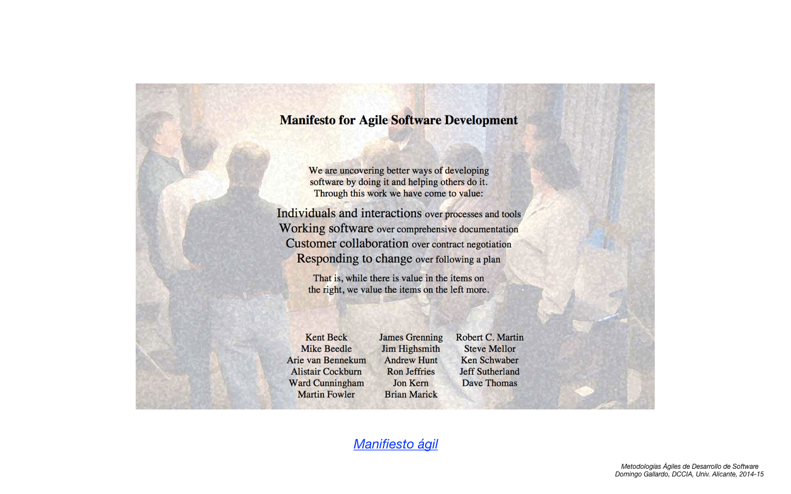

- [Sitio web](http://agilemanifesto.org) con el manifiesto ágil.

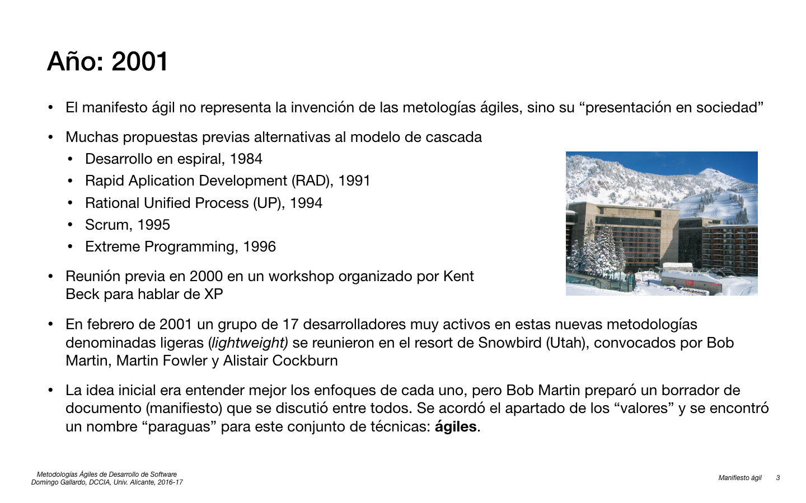

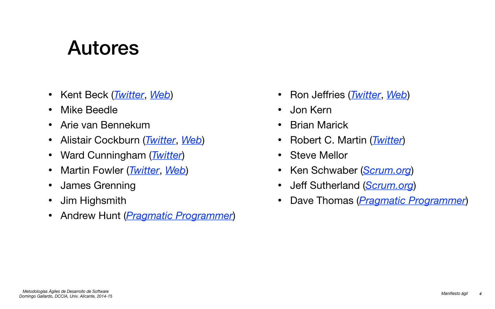

- Kent Beck ([Twitter](https://twitter.com/KentBeck))
- Alistair Cockburn ([Twitter](https://twitter.com/TotherAlistair), [Blog](http://alistair.cockburn.us))
- Ward Cunningham ([Twitter](https://twitter.com/WardCunningham))
- Martin Fowler ([Twitter](https://twitter.com/martinfowler), [Blog](http://martinfowler.com))
- Andrew Hunt ([Twitter](https://twitter.com/pragmaticandy), [Pragmatic Programmer](https://pragprog.com))
- Ron Jeffries ([Twitter](https://twitter.com/RonJeffries), [Blog](http://ronjeffries.com))
- Robert C. Martin ([Twitter](https://twitter.com/unclebobmartin), [Clean Code](https://sites.google.com/site/unclebobconsultingllc/))
- Ken Schwaber ([Twitter](https://twitter.com/kschwaber), [Scrum.org](https://www.scrum.org))
- Jeff Sutherland ([Twitter](https://twitter.com/jeffsutherland), [Scrum.org](https://www.scrum.org))
- Dave Thomas ([Twitter](https://twitter.com/pragdave), [Pragmatic Programmer](https://pragprog.com))

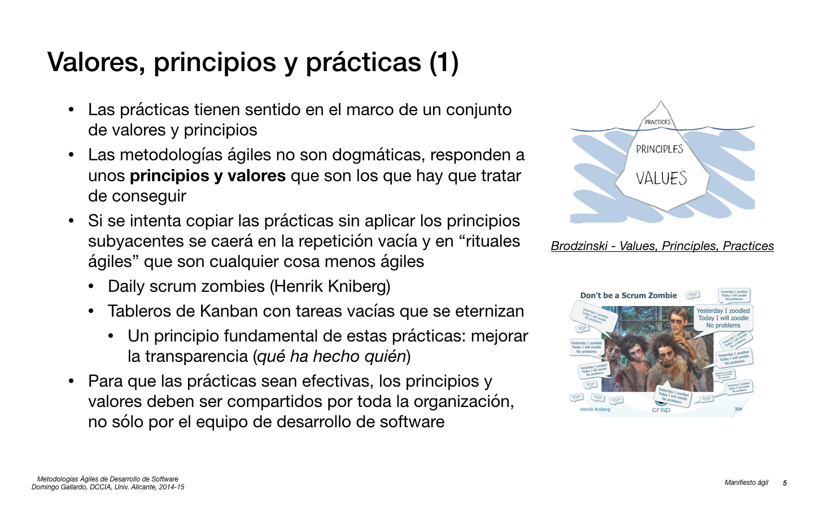

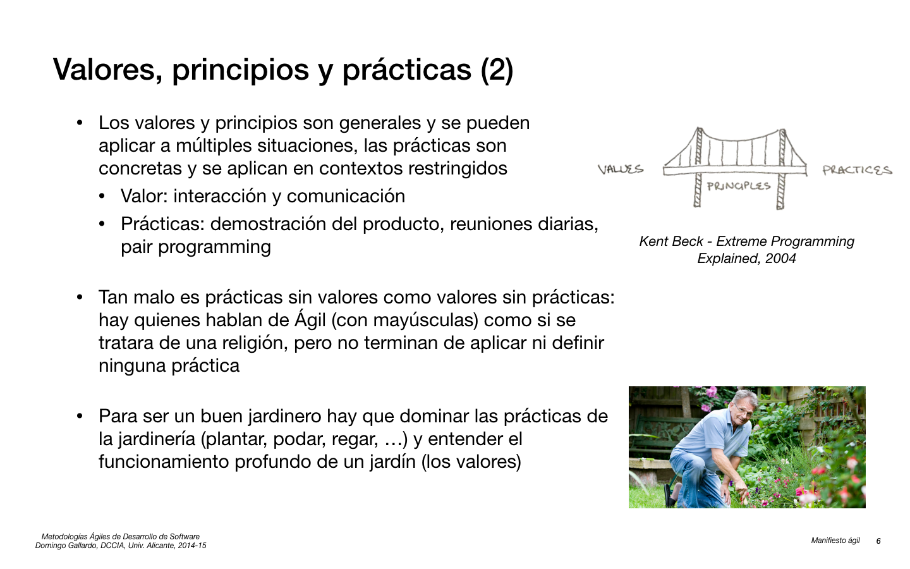

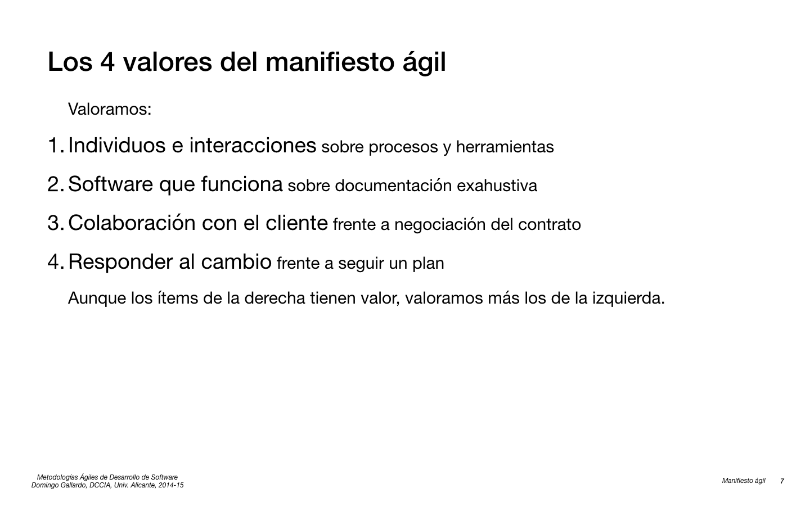

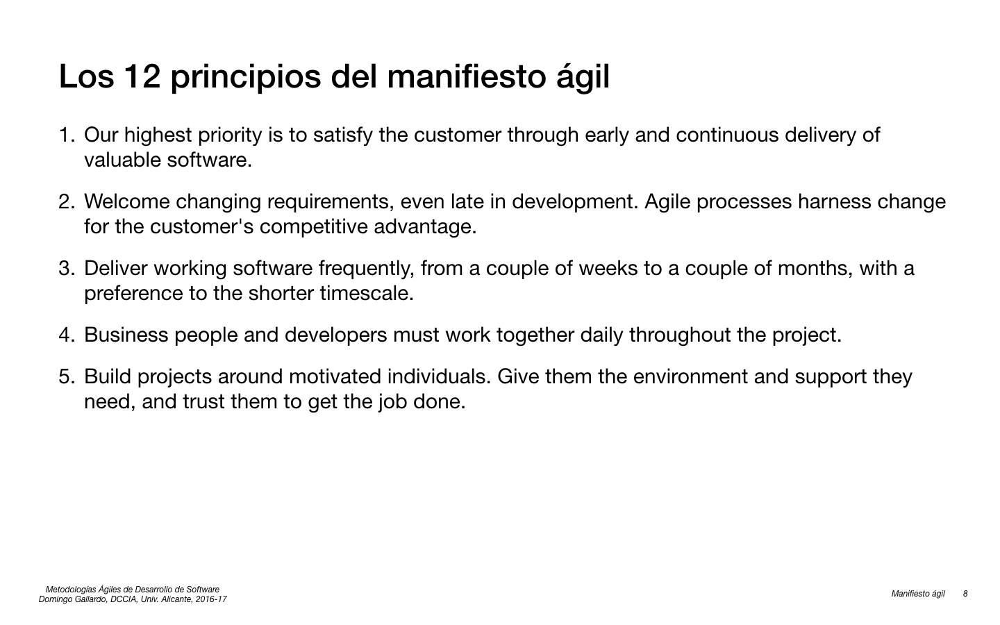

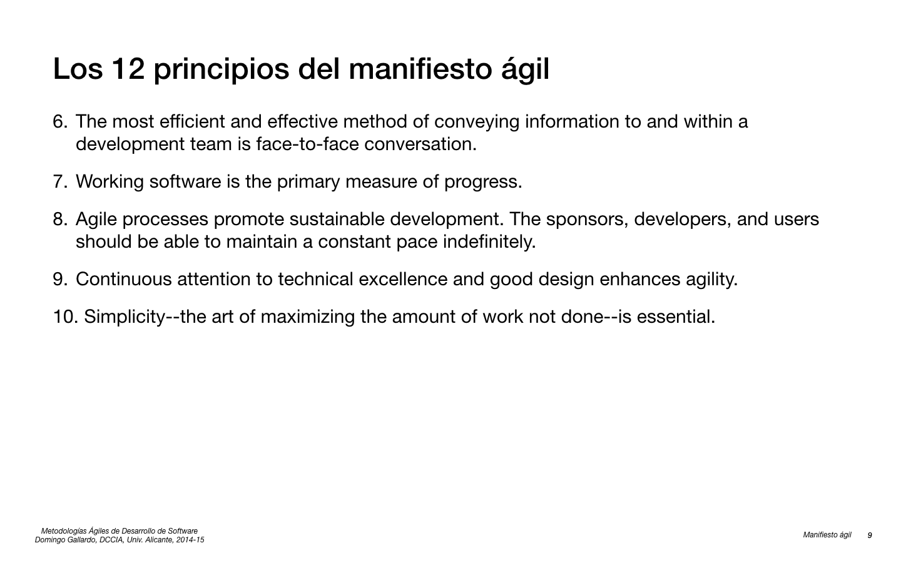

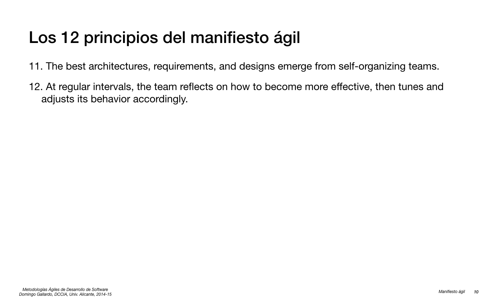

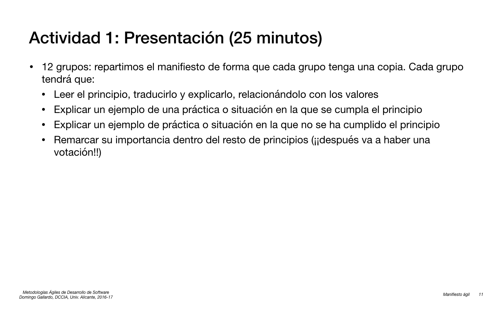

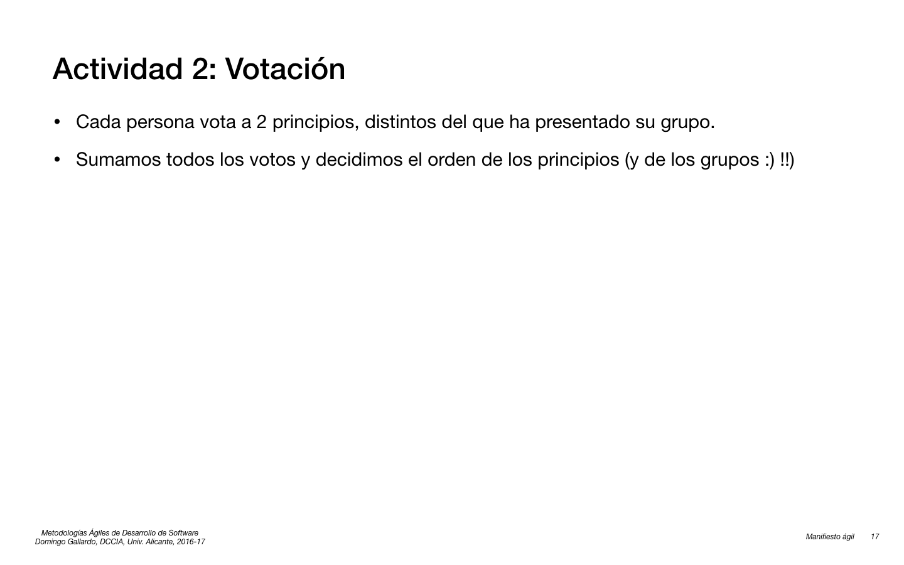

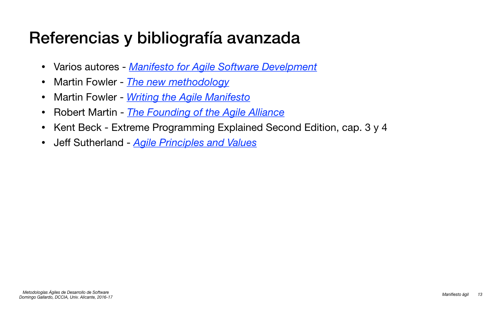

